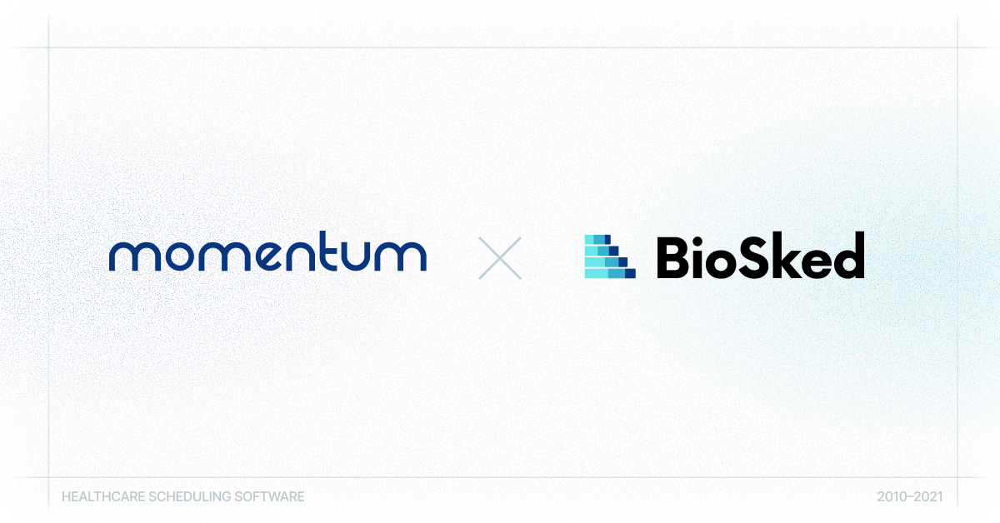

## We are proud to announce that Momentum has been taken over by its employees and a syndicate of private investors through the creation of BioSked, a company entirely dedicated to its development and promotion.

This change of structure results from the team’s will to make customer satisfaction and providing an even more advanced automatic scheduling application at the core of its mission.

**Momentum** has established itself in recent years as the leader in staff scheduling in France and continues to expand elsewhere in Europe and North America.
From the private to public sector and for physicians, other healthcare professionals and staff, BioSked’s ambition is to continue to evolve Momentum as the reference solution for automatic shift planning and activity scheduling for healthcare departments and practices.

## Momentum was created in 2010 to help radiologists optimize their schedules.
With an online and smartphone application, Momentum has evolved to be the primary activity management tool for all healthcare related human resources. Many administrative and personnel tasks can be streamlined thanks to our healthcare scheduling software, including staff schedule management and notification, self-scheduling and shift-swapping, administrative approval, and many others such as staff hours tracking, overtime and time off tracking, robust compliance assurance and standard time-clocking. 

**Moreover, Momentum integrates with a variety of other products to offer your organization a medical practice management application that can improve your department or practice productivity and patient access.**

Real-time, accurate and fair schedules are no longer an option thanks to Momentum, freeing up your time to focus on patient care.

According to Whitney-Miller, at the University of Rochester Medical Center Pathology Department in Rochester, NY (USA), Momentum has been a real time-saver by significantly decreasing schedule build times, gaining the ability to produce accurate reports, and eliminating late requests. “What used to take my secretary and me a whole week now takes less than a day. We can schedule three months at a time; press a button and the schedule is filled in for you.” she says.

**Personalization being another strong point of the tool, the Momentum team’s approach is to be close to its customers, to listen to them and to be responsive to their needs.**

Thus, BioSked will continue to develop Momentum in the healthcare field to better meet the expectations and needs of physicians / healthcare professionals. Agility, transparency and customer satisfaction will always be our marching orders and the creation of BioSked will make his core to our mission.

**BioSked** follows along the path forged by Bio-Optronics as the American and European teams of that company pursue their missions within BioSked.

> *“We are delighted to create our own company, focused on Momentum, for better healthcare human resource organization. We look forward to providing you the best healthcare scheduling solution and helping to improve your workflow,”* — Thomas Le Dall

## About BioSked

BioSked, Inc. was founded in September 2021 and acquired the assets of the Momentum business from Bio-Optronics, Inc. in October, including the company’s European subsidiary, Bio-Optronics Sàrl. The leadership team includes Sarah Mertz (VP, Sales & Marketing), Tim Daly (VP, CTO) and Thomas Le Dall (CEO), along with Dan Kerpelman (Executive Chairman, former CEO of Bio-Optronics).