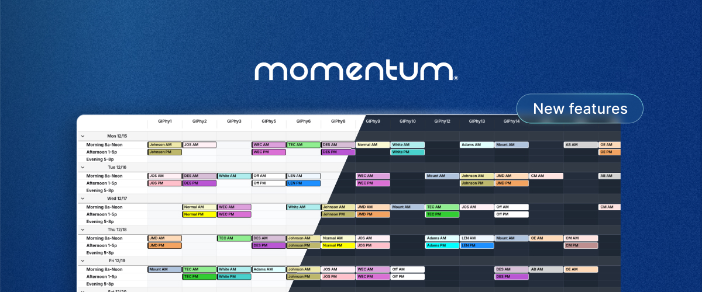

**Momentum gets a fresh new look: dark mode, keyboard shortcuts, and one-click creation**

Fewer clicks, smoother workflows. Here’s what the latest Momentum update changes in your day-to-day. 

**🌙 Dark, light, or automatic mode**
Choose the interface that suits you: dark, light, or automatic based on your system preferences. Less eye strain during long sessions, especially on night shifts. 

**⚡ One-click assignment creation**
Add an assignment directly from the calendar. Date, role, staff, location — everything is pre-filled based on your active filters. What used to take several steps now takes just one. 

**🔍 Instant search**
Type a name, date, or location: Momentum finds the assignment instantly. No more switching between views. 

**✅ Multi-selection**
Publish or unpublish multiple assignments in a single action. Select an entire row or column in one click for bulk edits. 

**⌨️ Keyboard shortcuts**
For advanced users: 

- `N`: Create an assignment 
- `F`: Edit the active filter 
- `Ctrl+K / CMD+K`: Quick search 

**🏥 Already deployed at scale**
Over 1,000 hospital sites use Momentum daily. The result: up to 90% of administrative time saved — freeing up time for quality care and staff well-being. 

→ [Discover how it works](/demo/)