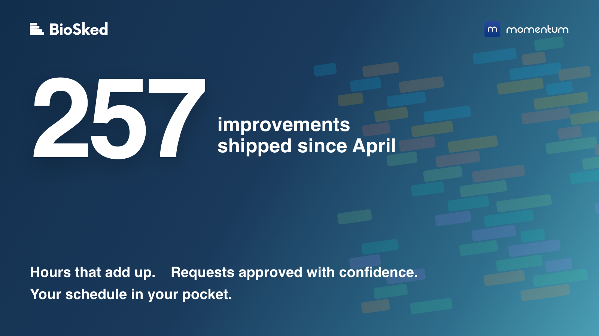
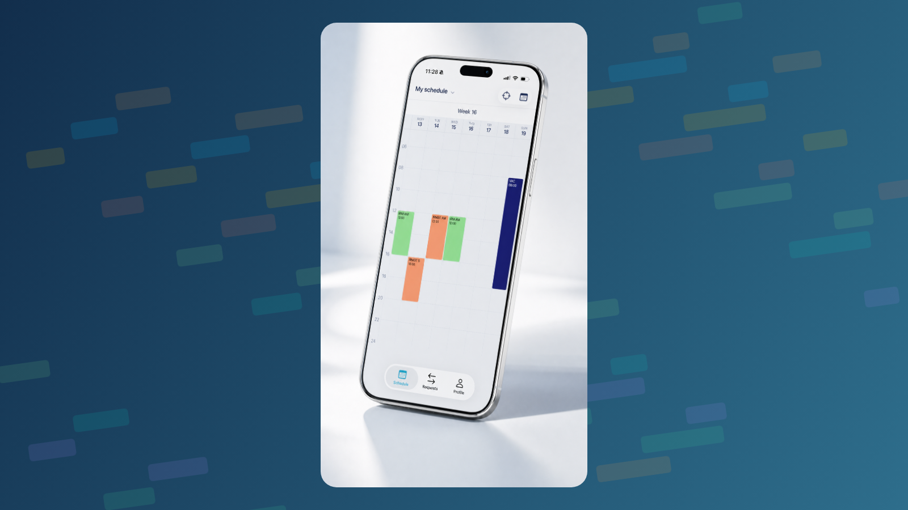

Every morning, thousands of people open Momentum to check one thing: is my schedule right? Between April and September, that question drove most of what we built.

You felt some of it in your own schedule: counts that add up again, a faster build, a new mobile app. Few of you saw the whole picture, because we told you about it one support answer, one webinar and one email at a time. That is not the same as writing it down in one place. So here it is.

## The numbers, and where they come from

Between 1 April and 6 September we deployed 257 improvements to Momentum. We did not round that up. It is the number of items our engineering tracker marks as deployed in that window, from the fixes you can see to the plumbing behind them. Of those:

- 131 were fixes, each one a gain in day-to-day reliability: counts that add up, notifications that reach the right people, complete exports.
- 83 came straight from something one of you told us: a support conversation, a request, a remark after a call.
- 124, nearly half, were raised by our own support and customer team, often on your behalf. Most of the 83 are among them.
- 1,106 code changes were merged to make it happen.

They went out in three main releases (4.5 in April and May, 4.6 in June, 4.7 in August), two patch releases, a brand-new mobile app and, since late August, small releases most weeks. The release-by-release summary is on our [changelog page](/changelog/).

## What we fixed, in plain language

We grouped the highlights by the problem they solve, because that is how you sent them to us.

**Your hours and time-off counts add up.** This is what you told us about most, and what mattered most: a day off valued at 24 hours instead of 7, overlapping time-off counted twice, a time-off allowance you could not track without distorting the hours count. Contract terms now count time-off days separately from worked hours. And when we replaced the counting engine underneath, we made sure it changed none of the numbers you already see: before it went live, the new engine had to reproduce every existing figure exactly, and it did. Zero differences. The fixes are what make the numbers add up; that check is what makes the engine change invisible. If yours still does not add up, tell us.

**Time-off policies live in one place.** Time-off rights used to accrue once a year, and everything else, from seniority days to sick-leave rules, meant manual adjustments. The new Time-off Policy Center holds those rules on one screen, and a contract can point at several policies. It is being rolled out progressively, instance by instance, because it touches numbers that feed payroll, so not every instance has it yet.

**Approve requests with the schedule in front of you.** An approved request is a promise made. Two things changed. Pending requests can now show directly in the date view, next to the assignments they affect. And you can pre-approve a set of requests, run a test build, look at the coverage, then confirm or roll back before anyone is notified. Both are being rolled out progressively, most active instances first, and are not on every instance yet; tell your customer success contact if you want to be early.

**Building schedules is fast again, and repeatable.** On our reference customer build, the classic scheduler went from about 43 minutes to 45 seconds. Identical runs now give identical schedules: where a template has several identical lines for the same role, the order in which they are filled is now fixed. On one schedule, that had meant 245 of 695 assignments moving between two runs. Verified on real schedules. Bulk edits of a whole month now complete in one go: 200 assignments used to take 324 round trips to the database, now they take 6.

**Notifications you can trust.**

- Notifications follow role restrictions.
- "Schedule published" alerts fire only when something was published.
- Admins are told when someone is removed from a published assignment.
- Requests submitted from the mobile app leave a notification and a history entry.
- One unassigned job board post no longer holds up the other notifications.

And admin notifications now respect their checkboxes.

**See more, click less.** In the new date view:

- Auto-width columns.
- Counts per day and per group (assignments or points) without opening a report.
- Hover cards you can read.
- A clearer right-click menu, with "Replace staff" listing eligible candidates only.
- Empty and required assignments in red.
- Unstaffed shifts visible on the timeline.
- Saved filters that open on the range you saved, even when the schedule spans years.

**Exports that export.**

- Excel export from the new date view, and the same file layout as before for list view exports.
- Exports that respect the filter you have open, and CSV files beyond 1,000 lines.
- Scheduled SFTP exports that now contain exactly what a manual run contains, with an explicit port.
- Calendar exports that run every time, and assignments created from approved requests now reaching Outlook calendars.

**A new mobile app.** Rebuilt from scratch and in the App Store and on Google Play since July: a "today" screen, sign-in with Face ID or fingerprint, encrypted offline access to your schedule, one-tap Microsoft sign-in (and SAML for other identity providers), faster push notifications, dark mode, five languages. Your first remarks on it (note visibility settings, submitted requests in your list, custom hours on iPhone) have been taken care of, and updates now go to a small group first, then to everyone.

**Getting in, every time.** Long passwords sign in, activation links work on a second click, and support can now see why a sign-in did not go through, so "I can't get in" gets answered in one exchange.

## How we improve Momentum

The June update rebuilt 250,000 lines of legacy code on modern foundations. The right call for the years ahead, and it made a few weeks bumpier than we wanted for some of you. It also changed how we ship. Big bundled releases are over: since late August we ship small increments, most weeks, to a few active instances first, and the [changelog](/changelog/) shows what went out and when.

## In your words

*“It's a Christmas miracle! It is working. Thank you, thank you, thank you.”* <cite>Imaging supervisor, US medical group, June 2026</cite>

*“I built the schedule out through the end of the year and it was 90% perfect. Now I know what the issues are, so I can easily correct them.”* <cite>Practice manager, community health network, California, May 2026</cite>

*“Since the update, the feature is really quite good, simpler.”* <cite>Momentum user, satisfaction survey, March 2026, translated from French</cite>

The same answer asked for usage notes to know what all the features do. This post, and the [knowledge base](/help/), are our answer.

## What we are working on next

- Request Preview and pre-approval switched on across instances, in stages.
- Time-off policies switched on across instances, with rollover rules the next thing on the list.
- A single Requests page in the new interface: time-off, extra work and swap requests on one screen, with approvals date by date.
- Payroll-ready hours: extra hours by pay rate, cleaner exports.
- And a few things our team would rather show you than describe.

## Come and see it

- **France:** JFR 2026, Paris, 8 to 11 October, stand 126A.
- **North America:** RSNA 2026, Chicago, 29 November to 3 December. [Book a slot](/demo/) with us there.
- **Everyone:** [talk to us](/demo/) for a 20-minute tour of what is new on your instance, or browse the [knowledge base](/help/).

Thank you for your feedback. It is what moves Momentum forward.

David Dudok de Wit, CEO, BioSked
