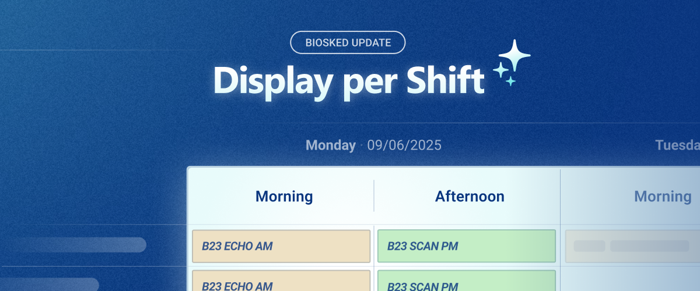

You can now schedule and group assignments using Shifts: Morning, Afternoon, Night, etc. Shifts let you divide each day into familiar time blocks in the date view, making schedules easier to read and more in tune with your organization.

- New **Shift-view** display option
- **Custom shifts** settings to divide days into 2 or more groups