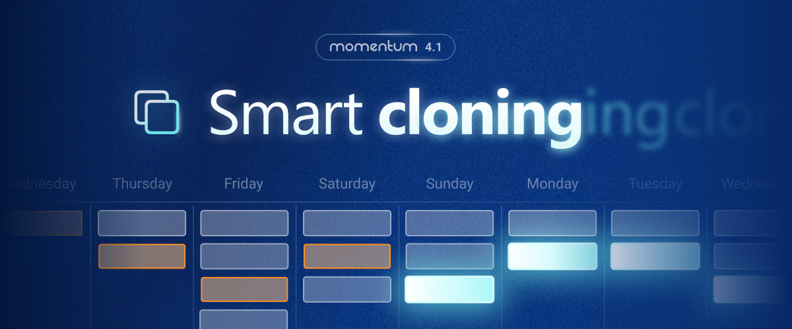

To reduce time spent editing assignments we're introducing new ways to **add and edit in bulk** along with a powerfull cloning assistant. **Staff and role lists** are now also filtered to the current view when editing an assignment.

## 📝 Bulk editing and cloning
- **Select multiple assignments** at once using either `Ctrl + Click` or `Ctrl + A` to select all visible assignments.
- **Apply changes in bulk**: Lock/Unlock, reassign staff or change dates at once for all selected assignments.
- **Smart-cloning**: duplicated selected assignments to specific date, once or on a recurring pattern (e.g. weekly, monthly, ..)
- **Smart-cloning**: choose how assignments are duplicated and which attributes should be kept or overriden.
