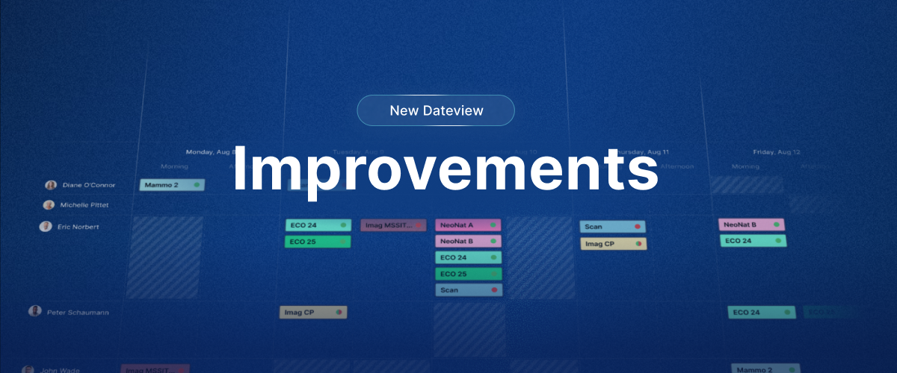

### ✨ New

- **Distinct Work and Time-off counters** — In each contract term, time-off days can now be designated separately and on top of the existing working hours set for each week-day. This allows Momentum and its reports to deduct time-offs independently from the number of hours set for that day.

### 💎 Improvements (new Momentum)

- **Auto-width mode** — Enable auto-width in order to wrap header texts and make each column take as little space as necessary (look for the 📏 button on the right-hand side below the date-grid).
- **Empty & Required assignments** are now highlighted in red (or the color set in your Company's general settings).
- **Clearer context menu** when right-clicking assignments. "Replace Staff" and "Replace All Roles" are now easier to perform, lists are filtered by Candidates and sub-menus more accessible.
- Disabling **Highlighted borders** now fully removes borders around assignments (see Filters → Display settings → Show Highlight Colors).
- **Smart cloning** — Duplicate a schedule at recurring intervals (Pattern mode) using _Days_ as the time unit.
- **Default landing page** can now also be set to a new date view schedule.
- Overall performance has been improved with faster loading times and increased consistency with Momentum Classic.

### 🪲 Recent Fixes

- Fixed assignments overlapping midnight not displaying in the proper Shift section
- Excel exports now respect the currently open schedule filter
- Fixed a case where filtering on a Role-Layer would list Roles not part of that Layer
- Building and publishing a single layer is now possible again
- Fixed notifications not always being triggered when publishing schedules
- Fixed a case where assignment history logs were not being updated
