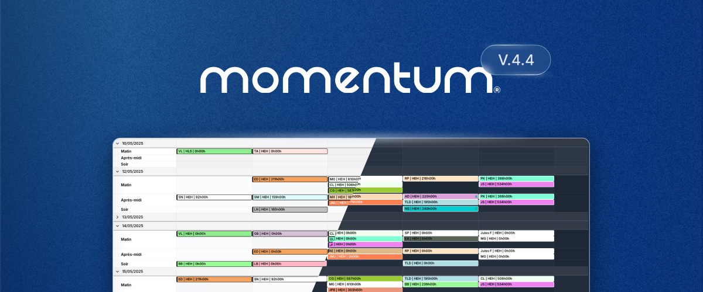

Cette version se concentre sur la nouvelle application Momentum introduite en 2025. Elle inclut une simplification de l'interface utilisateur avec un accès plus clair aux actions principales pour un manipulation plus facile de vos plannings.

Des **analyses instantanées** sont maintenant disponibles directement sur tous les plannings, supprimant le besoin d'exporter manuellement les données. Une nouvelle **vue chronologique** (Timeline) a été ajoutée, spécialement utile pour les plannings à grand volume où la visibilité sur la couverture horaire est importante.

**Momentum Classic** reste disponible et se charge par défaut dès le login. Vous pouvez accéder à la nouvelle version depuis le menu en haut dans _**Planification** → **Voir le planning** → **Vue par date (nouvelle)**_.

## ✨ Améliorations de l'interface utilisateur et de l'ergonomie

- **Mode sombre** : Choisissez entre clair, sombre ou laissez l'interface suivre vos préférences systèmes.
- **Recherche rapide** : met instantanément en surbrillance les affectations recherchées.
- **Création rapide d'affectations** : un clique-droit sur n'importe quelle zone du calendrier lancer la création d'une nouvelle affectation. Les champs sont automatiquement pré-remplis en fonction de la zone cliquée et des filtres actifs (date, rôle, personnel, lieu).
- **Sélection Multi-ligne/Colonne** : Séléction en 1 clique de toutes les affectations d'une colonne ou d'une ligne.
- **Multi-Sélection** : Publier ou Dépublier des affectations individuellement ou en lot.
- **Shift-view** : nouvelles options de mise en page pour plus de flexibilité d'affichage.
- **Raccourcis Clavier** : navigation et actions rapides pour les utilisateurs avancés, par exemple : 
  • `N` pour créer une affectation 
  • `F` pour modifier le filtre actif 
  • `Ctrl + K` pour une recherche rapide (`⌘ + K` sur Mac)

## 🕐 Vue Chronologique

- **Visualisation heure par heure** de la couverture des affectations
- **Mise en évidence des lacunes et chevauchements** pour une identification rapide
- **Affichage multi-fuseaux horaires** pour gérer facilement les équipes réparties entre plusieurs régions.

## 📊 Analyses instantanées

- **Tableau de bord instantanés** basés sur le filtre actif, permettant une analyse rapide des affectations affichées.
- **Analyse par Date ou Groupement**: limitez l'analyse instantanée sur une seul _Date_ ou un seul _Groupement_ (Personne, Role, Group de Rôle, etc.)
- **Carte de chaleur** pour une compréhension de la densité des affectations dans le temps.
- **Graphique de répartition** par rôle, personne et horaire.
- **Chiffres clés**: décompte des affectations non-attribuées, de la moyenne d'heures et du coût total.

## 💎 Améliorations de performance

- Augmentation du nombre d'affectations pouvant être affichées à la fois (plus de limite d'affichage).
- Temps de chargement et rafraîchissements de l'interface utilisateur plus rapides, en particulier pour les grands ensembles de données.
- Optimisation du chargement et de la navigation dans les grands plannings.
