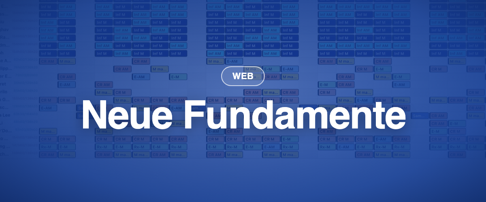

Momentum 4.6 ist die Version, die Sie kaum bemerken sollten. Darunter wurden 250 000 Zeilen Altcode in eine moderne Sprache überführt, und neue Funktionen lassen sich jetzt Instanz für Instanz zuschalten statt für alle auf einmal. Das hat die neue mobile App und die Funktionen von 4.7 erst möglich gemacht.

### ✨ Neu

- **Schalter pro Instanz:** Neue Funktionen werden Instanz für Instanz aktiviert, damit wir sie schrittweise und gemeinsam mit Ihnen ausrollen können.
- **Die neue mobile App** erscheint zusammen mit dieser Version. Sie hat einen eigenen Eintrag weiter unten.

### 🪲 Korrekturen

- Einen Plan nach Ebene aus der neuen Tagesansicht erstellen funktioniert wieder.
- Die neue Tagesansicht respektiert das Recht „Anzeigefilter-Panel anzeigen“.
- Der Notizexport ist in der Anfragenverwaltung zurück.
- Beim Duplizieren eines Plans werden Abwesenheiten nie verdoppelt, und Mitarbeitende werden entfernt, wenn ein Duplikat auf einen Abwesenheitstag fällt.
- Standardfilter und Vertragskopie funktionieren wie erwartet.

### 🩹 Folgekorrekturen über den Sommer

- **Juni:** Einrichtungsseiten (Sicherheitsgruppen, Tätigkeitsprofile, Verträge, Rollengruppen, Personalgruppen, Schnellzugriffe) speichern wieder korrekt; Anmeldung im Zeiterfassungsfenster und benutzerdefinierte Uhrzeit offline; Zuweisung aus der klassischen Tagesansicht anlegen.
- **Juli:** Sortierung der Summen in Berichten; Zeiterfassungsdetails in der Stundenzählung; der Eintrag Duplizieren ist im Menü der klassischen Tagesansicht zurück.
- **August:** einzelnes und massenhaftes Duplizieren über Abwesenheiten; aus Anfragen erstellte Zuweisungen lassen sich veröffentlichen, mit Bestätigung; Tagesnotizen erscheinen nur für ihren Ort; Abwesenheiten anderer Personen erscheinen in der neuen Tagesansicht; Veröffentlichen aus dem Erstellungsfenster funktioniert für Zeiträume mit einem freien Tag; das Verlaufsprotokoll der Zuweisungen ist vollständig.
- **September:** Vertragsinhalte werden auf Instanzen, auf denen Abwesenheitsrichtlinien gerade aktiviert wurden, korrekt angezeigt; das Fenster „Neuer Standort“.
