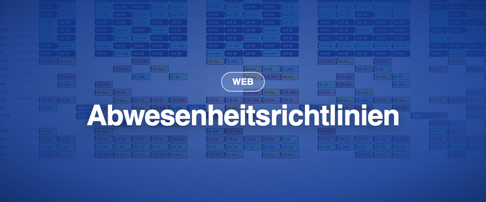

Schrittweise ab dem 17. August und am 25. August 2026 auf allen europäischen Instanzen ausgerollt, gefolgt von kleineren Releases am 26. August und 1. September. Drei der neuen Funktionen liegen hinter einem Schalter pro Instanz: Wir aktivieren sie schrittweise, aktivste Instanzen zuerst. Sagen Sie Ihrer Ansprechperson bei BioSked Bescheid, wenn Sie früh dabei sein möchten.

### ✨ Neu

- **Abwesenheitsrichtlinien:** Ansparregeln liegen an einem Ort, statt nur jährlich zu gelten, und ein Vertragsinhalt kann mehrere Richtlinien nutzen, zum Beispiel Jahresurlaub, Krankheit und Dienstalterstage. Bestehende jährliche Ansparungen werden in eine Richtlinie je Vertragsinhalt überführt. Hinter einem Schalter pro Instanz.
- **Anfragen vorab genehmigen:** Markieren Sie eine Gruppe von Anfragen als vorab genehmigt, starten Sie eine Testerstellung zur Prüfung der Abdeckung, und genehmigen Sie dann endgültig oder machen Sie rückgängig. Mitarbeitende werden erst bei der endgültigen Genehmigung benachrichtigt. Hinter einem Schalter pro Instanz.
- **Anfragen in der Tagesansicht:** Zeigen Sie offene Anfragen neben den betroffenen Zuweisungen an, dem aktiven Filter folgend. Hinter einem Schalter pro Instanz.
- **Anzahlen in der Tagesansicht:** Die Anzeigeoption „Anzahlen anzeigen“ zeigt, wie viele Zuweisungen oder Punkte ein Tag oder eine Gruppe enthält, in beiden Layouts und bei jeder Gruppierung.
- **Unbesetzte Dienste in der Zeitleiste:** Die Zeitleiste kann jetzt die Dienste anzeigen, für die noch jemand fehlt.
- **Tausche werden ohne zweite Genehmigung abgeschlossen,** wenn die annehmende Person bereits das Recht „Änderungsanfragen: genehmigen/ablehnen“ besitzt. Zuerst in der mobilen App; die Anfragenseite im Web folgt.
- **Offene Anfragen behalten ihre Einreichungsreihenfolge,** mit einer neuen Spalte Erstellt zum Sortieren.
- **Administratoren werden benachrichtigt,** wenn jemand aus einer bereits veröffentlichten Zuweisung entfernt wird.

### 💎 Verbesserungen

- **Die klassische Planerstellung ist rund 58-mal schneller:** von 43 Minuten auf 45 Sekunden bei unserem Referenzkunden.
- **Identische Erstellungen ergeben identische Pläne.** Enthielt eine Vorlage mehrere identische Zeilen für dieselbe Rolle, ist die Reihenfolge, in der sie besetzt werden, jetzt fest.
- **Grosse Massenänderungen werden abgeschlossen,** statt auf halbem Weg zu scheitern: 200 Zuweisungen zu verschieben braucht jetzt 6 Datenbankzugriffe statt 324.
- **Hover-Karten im Planungsraster sind lesbar:** grössere Schrift, breitere Karten, umbrechende Kommentare.
- **Gespeicherte Filter öffnen sich im gespeicherten Zeitraum.**
- **Der Support sieht, warum eine Anmeldung fehlgeschlagen ist,** sodass Zugangsprobleme in einem Austausch gelöst werden.
- **Updates der mobilen App erreichen zuerst eine kleine Gruppe,** dann alle.

### 🪲 Korrekturen

- **Stundenzählung und Abwesenheitswerte:** Die moderne Berechnung reproduziert die bisherige jetzt exakt. Vor der Umstellung haben wir sie gegen jeden vorhandenen Wert der Abwesenheitsübersicht geprüft: null Abweichungen. Überlappende Arbeitsperioden wechseln nicht mehr zwischen Bildschirmen, und das Detailfenster der Stundenzählung liefert keinen Fehler mehr.
- Eine Anfrage zweimal zu genehmigen oder vorab zu genehmigen verdoppelt ihre Tage im Plan nicht mehr, und Mitarbeitende erhalten keine zwei Benachrichtigungen mehr.
- Die Summenzeile der Tagesansicht zählt vorab genehmigte Anfragen.
- Das Massenveröffentlichen aus der neuen Tagesansicht scheitert nicht mehr komplett: Zeilen, die nicht veröffentlicht werden können, werden übersprungen, der Rest geht durch.
- Eine leere Ebene zu veröffentlichen veröffentlicht nichts, statt aller Ebenen.
- Veröffentlichen und Veröffentlichung aufheben funktionieren aus der Mehrfachauswahl und der Massenbearbeitung.
- Aus der mobilen App eingereichte Anfragen erzeugen jetzt eine Benachrichtigung und einen Eintrag im Verlaufsprotokoll.
- Administrator-Benachrichtigungen respektieren ihre Kontrollkästchen, und Benachrichtigungen zu gelöschten Rollen enthalten alle Details.
- Einen unbesetzten Dienst im Job Board auszuschreiben unterbricht andere Benachrichtigungen nicht mehr.
- Rollen lassen sich löschen, nachdem ein Gebot im Job Board genehmigt wurde.
- Mitarbeitende sehen öffentliche Notizen in der klassischen Tagesansicht wieder, Tagesnotizen eingeschlossen.
- Die Personalauswahl ist wieder alphabetisch, Trennlinien der Rollengruppen sind wieder sichtbar, und die Spalten der Listenansicht entsprechen Momentum Classic.
- Der Excel-Export zeigt keinen Fehlerdialog mehr, geplante SFTP-Exporte enthalten alles, was ein manueller Export enthält, und der Kalenderexport funktioniert wieder.
- Aus genehmigten Anfragen erstellte Zuweisungen erreichen jetzt verbundene externe Kalender wie Outlook.
- Das Abbrechen der Abfrage „Zeiterfassung vergessen“ löscht keine frühere Buchung mehr.
- Die Validierung von Zuweisungen stoppt bei Zeitüberschreitung, statt minutenlang weiterzulaufen.
- Aktivierungslinks vertragen einen zweiten Klick, und Mitarbeitende mit langen Passwörtern können sich wieder anmelden.
- Eine fehlgeschlagene Massenänderung meldet dies jetzt und behält Ihre Auswahl.
