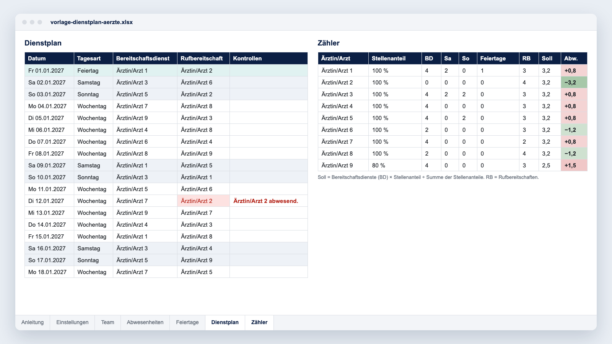

Der Dienstplan ist das meistdiskutierte Dokument einer Abteilung. Ein Dienst zu viel, Weihnachten zwei Jahre hintereinander für dieselbe Person, und das Vertrauen in den ganzen Plan bröckelt.

Dieser Ratgeber fasst zusammen, was wir in Abteilungen sehen, die ihre Dienste mit Momentum planen: den rechtlichen Rahmen in Deutschland, die Zähler, die Fairness überprüfbar machen, eine Methode in sechs Schritten und eine [kostenlose Excel-Vorlage](/modeles/vorlage-dienstplan-aerzte.xlsx).

**Inhalt**

- [Bereitschaftsdienst, Rufbereitschaft, Schichtdienst: drei Arten zu zählen](#bereitschaftsdienst-rufbereitschaft-schichtdienst-drei-arten-zu-zählen)
- [Was Arbeitszeitgesetz und Tarifvertrag vorgeben](#was-arbeitszeitgesetz-und-tarifvertrag-vorgeben)
- [Was „fair“ heißt: fünf Zähler](#was-fair-heißt-fünf-zähler)
- [Den Dienstplan in sechs Schritten erstellen](#den-dienstplan-in-sechs-schritten-erstellen)
- [Die kostenlose Excel-Vorlage](#die-kostenlose-excel-vorlage)
- [Wann die Tabelle nicht mehr reicht](#wann-die-tabelle-nicht-mehr-reicht)
- [Häufige Fragen](#häufige-fragen)

## Bereitschaftsdienst, Rufbereitschaft, Schichtdienst: drei Arten zu zählen

Bevor Sie etwas verteilen, benennen Sie jede Dienstart, ihr Zeitfenster und ihre Form.

| Dienstform | Was die Ärztin oder der Arzt tut | Wie sie zählt |
|---|---|---|
| **Bereitschaftsdienst** | Hält sich an einer vom Arbeitgeber bestimmten Stelle auf, meist im Haus, und arbeitet bei Bedarf. | Vollständig Arbeitszeit im Sinne des Arbeitszeitgesetzes. Das Entgelt folgt Stufen, im TV-Ärzte/VKA 70, 85 oder 100 %. |
| **Rufbereitschaft** | Ist an einem dem Arbeitgeber angezeigten Ort erreichbar und kommt auf Abruf. | Die Einsätze sind Arbeitszeit. Nach TV-Ärzte wird ein Einsatz im Krankenhaus samt Wegezeit für das Entgelt auf eine volle Stunde gerundet. |
| **Schichtdienst** | Arbeitet in festen Schichten rund um die Uhr, etwa in der Notaufnahme oder auf der Intensivstation. | Volle Arbeitszeit. Nach TV-Ärzte bis zu zwölf Stunden je Schicht, mit Grenzen für lange Schichten in Folge. |

Eine Anästhesie kann einen Bereitschaftsdienst im Haus mit einer oberärztlichen Rufbereitschaft im Hintergrund kombinieren, eine radiologische Praxis eine CT-Rufbereitschaft je Standort. Jede Dienstart hat eigene Zeiten, Teilnehmende und Regeln.

## Was Arbeitszeitgesetz und Tarifvertrag vorgeben

Für angestellte Ärztinnen und Ärzte gilt das [Arbeitszeitgesetz (ArbZG)](https://www.gesetze-im-internet.de/arbzg/), zuletzt geändert durch Gesetz vom 23. Oktober 2024; für Chefärztinnen und Chefärzte gilt es nicht (§ 18). Für den Dienstplan zählt vor allem:

- **Acht Stunden werktäglich.** Bis zu zehn sind möglich, wenn im Durchschnitt von sechs Kalendermonaten oder 24 Wochen acht Stunden nicht überschritten werden ([§ 3](https://www.gesetze-im-internet.de/arbzg/__3.html)).
- **Elf Stunden ununterbrochene Ruhezeit** nach dem Ende der täglichen Arbeitszeit. In Krankenhäusern und anderen Behandlungseinrichtungen darf sie bis zu eine Stunde kürzer sein, wenn jede Kürzung innerhalb eines Kalendermonats oder von vier Wochen durch eine Ruhezeit von mindestens zwölf Stunden ausgeglichen wird ([§ 5 Abs. 1 und 2](https://www.gesetze-im-internet.de/arbzg/__5.html)).
- **Kürzungen durch Einsätze in der Rufbereitschaft**, die nicht mehr als die Hälfte der Ruhezeit betragen, dürfen dort zu anderen Zeiten ausgeglichen werden (§ 5 Abs. 3).
- **Dienste über zehn Stunden nur per Tarifvertrag**, wenn regelmäßig und in erheblichem Umfang Bereitschaftsdienst anfällt. Dann gilt eine Grenze von 48 Stunden pro Woche im Durchschnitt von zwölf Kalendermonaten ([§ 7 Abs. 1 und 8](https://www.gesetze-im-internet.de/arbzg/__7.html)).
- **Nach mehr als zwölf Stunden** Arbeitszeit folgt unmittelbar eine Ruhezeit von mindestens elf Stunden (§ 7 Abs. 9).
- **Opt-out.** Eine Verlängerung ohne Ausgleich erlaubt nur ein Tarifvertrag, und nur mit schriftlicher Einwilligung der Ärztin oder des Arztes, widerrufbar mit sechs Monaten Frist (§ 7 Abs. 2a und 7).

<figure class="max-w-2xl mx-auto"><picture><source media="(max-width: 640px)" srcset="/guides/de-dienstplan-timeline-m.webp" width="400" height="476"></picture></figure>

Die konkreten Grenzen stehen im Tarifvertrag. Hier die zwei großen Tarifverträge des Marburger Bundes ([Texte auf marburger-bund.de](https://www.marburger-bund.de/bundesverband/tarifvertraege)):

| Regel | TV-Ärzte/VKA (kommunale Krankenhäuser) | TV-Ärzte/TdL (Universitätskliniken) |
|---|---|---|
| Fassung | Änderungstarifvertrag Nr. 10 vom 13.01.2025, Stand 01.07.2025 | Änderungstarifvertrag Nr. 10 vom 09.06.2026, Stand 01.04.2026 |
| Bereitschaftsdienste | grundsätzlich bis zu vier im Kalendermonat, in einem Monat pro Quartal fünf (§ 10 Abs. 10) | ebenso (§ 7 Abs. 5a); bis zu sieben mit schriftlicher Vereinbarung, nur unbefristet Beschäftigte nach der Wartezeit |
| Rufbereitschaften | höchstens 13 im Kalendermonat (§ 10 Abs. 8); Bereitschaftsdienste werden angerechnet (§ 10 Abs. 12) | keine Monatsgrenze; keine Rufbereitschaft direkt nach einem Dienst über acht Stunden, außer mit schriftlicher Vereinbarung (§ 7 Abs. 4) |
| Wochenenden (Fr 21 Uhr bis Mo 5 Uhr) | Arbeit jeder Art, auch Rufbereitschaft, an höchstens zwei Wochenenden pro Monat, ein weiteres je Quartal; mindestens ein freies pro Monat (§ 8 Abs. 4) | ebenso (§ 6 Abs. 9) |
| Opt-out | bis durchschnittlich 56 Stunden pro Woche über sechs Monate (§ 10 Abs. 5 und 6) | bis 58 Stunden (Stufe I) oder 54 Stunden (Stufe II), Durchschnitt über ein Jahr (§ 7 Abs. 5) |
| Dienstplan | spätestens einen Monat vor dem Planungszeitraum (§ 10 Abs. 11) | ebenso (§ 7 Abs. 6a) |

Darüber hinaus sind Dienste in beiden Tarifverträgen nur zulässig, wenn sonst eine Gefährdung der Patientensicherheit droht. Im TV-Ärzte/VKA sinken die Monatsgrenzen für Teilzeitkräfte anteilig.

Ein Tarifvertrag gilt nur, wo er anwendbar ist: der TV-Ärzte/VKA bei Arbeitgebern in einem Verband der VKA (nicht für Chefärztinnen und Chefärzte mit Einzelvertrag), der TV-Ärzte/TdL an Universitätskliniken, deren Arbeitgeber der Tarifgemeinschaft deutscher Länder angehört. Private Träger wie Asklepios, Helios oder Sana haben eigene Tarifverträge, kirchliche Häuser eigene Regelungen (§ 7 Abs. 4 ArbZG). Eine Reform des Arbeitszeitgesetzes ist angekündigt; bis sie in Kraft tritt, gilt die zitierte Fassung. Lassen Sie Ihre Regeln von Personalabteilung und Betriebsrat, Personalrat oder Mitarbeitervertretung bestätigen.

## Was „fair“ heißt: fünf Zähler

Wo der Dienstplan kein Streitthema mehr ist, finden sich fast immer dieselben Zähler, geführt für jede Person.

- **Die Dienste insgesamt**, bezogen auf den Stellenanteil: Wer auf einer 0,8-Stelle arbeitet, trägt nicht denselben Anteil wie eine Vollzeitkraft.
- **Die Samstage**, **die Sonntage** und **die Feiertage**, jeweils in einem eigenen Zähler: Ein Sonntag zählt nicht wie ein Dienstag, und an diesen Tagen entstehen die Konflikte.
- **Die sensiblen Termine**: Weihnachten, Silvester und Neujahr, Brückentage, Schulferien. Führen Sie sie über die Jahre fort, sonst trifft es immer dieselben.

**Über einen langen Zeitraum.** Führen Sie die Zähler über das Jahr oder rollierend über zwölf Monate: Ein Monat hat nur vier oder fünf Wochenenden. Der Monat dient den tariflichen Grenzen. Dort beginnt das Wochenende am Freitag um 21 Uhr; ein Bereitschaftsdienst in der Nacht auf Samstag zählt also mit.

**Für das ganze Team sichtbar.** Ein Zähler, den nur der Dienstplaner sieht, löst keinen Konflikt.

### Beispiel: neun Ärztinnen und Ärzte, ein Bereitschaftsdienst jede Nacht

Das sind 365 Dienste im Jahr. Der Anteil jeder Person hängt von der Summe der Stellenanteile ab.

| Team | Soll-Anteil pro Person |
|---|---|
| Neun Vollzeitkräfte | 40,6 Dienste |
| Acht Vollzeitkräfte und eine 0,8-Stelle (Summe der Stellenanteile: 8,8) | 41,5 Dienste je Vollzeitkraft, 33,2 für die 0,8-Stelle |

Das sind knapp 3,5 Dienste im Monat je Vollzeitkraft, unter der tariflichen Grenze von vier. Für die 0,8-Stelle liegt die Grenze nach TV-Ärzte/VKA bei drei (4 × 0,8 = 3,2; Bruchteile unter einem halben Dienst entfallen, § 10 Abs. 10); sie kommt auf knapp 2,8 Dienste im Monat.

Die 104 Samstage und Sonntage von 2027 und die Feiertage verteilen Sie genauso.

## Den Dienstplan in sechs Schritten erstellen

<figure class="max-w-2xl mx-auto"><picture><source media="(max-width: 640px)" srcset="/guides/de-dienstplan-steps-m.webp" width="400" height="648"></picture></figure>

### 1. Dienste auflisten

Für jede Dienstart: Beginn und Ende, Bereitschaftsdienst oder Rufbereitschaft, Bereitschaftsdienststufe und wer teilnimmt, etwa Assistenzärztinnen und -ärzte im Vordergrund, Oberärztinnen und Oberärzte im Hintergrund.

### 2. Die Regeln der Abteilung festlegen

Tarifliche Grenzen pro Monat, Ruhezeit nach dem Dienst, kein Dienst vor einem OP-Tag, wenn das Ihre Regel ist, und wer eine Opt-out-Erklärung unterschrieben hat. Schreiben Sie sie auf, bevor Sie das erste Feld füllen: Die Regeln, nicht der Dienstplaner, entscheiden im Streitfall.

### 3. Wünsche und Abwesenheiten sammeln

Legen Sie einen Stichtag fest. Nach beiden Tarifverträgen steht der Dienstplan spätestens einen Monat vor dem Planungszeitraum; ein Stichtag sechs Wochen vorher lässt Zeit zum Planen. Ein Wunsch nach dem Stichtag läuft über einen Tausch.

### 4. In der richtigen Reihenfolge füllen

Zuerst die festen Vorgaben (Abwesenheiten, Ruhezeiten, tarifliche Grenzen), dann Wochenenden und Feiertage, zuletzt die Dienste unter der Woche. Mit ihnen gleichen Sie die Zähler aus.

### 5. Mit den Zählern prüfen

Sehen Sie sich vor der Veröffentlichung die Abweichung jeder Person von ihrem Soll-Anteil an. Sie sollte klein sein oder begründet.

### 6. Veröffentlichen, dann jeden Tausch dokumentieren

Jeder genehmigte Tausch aktualisiert die Zähler. Sonst sagt die Fairness vom Januar im Juni nichts mehr.

## Die kostenlose Excel-Vorlage

**[Vorlage Dienstplan herunterladen](/modeles/vorlage-dienstplan-aerzte.xlsx)** (Excel-Datei .xlsx, ohne Makros, kostenlos).

- **Zwei Dienstarten** zum Benennen, zum Beispiel „Bereitschaftsdienst“ und „Rufbereitschaft“, für ein ganzes Jahr.
- **Team, Abwesenheiten und Feiertage**: Stellenanteil jeder Person, Abwesenheiten (von, bis, Grund), die neun bundesweiten Feiertage 2026 bis 2028. Die Feiertage Ihres Bundeslandes ergänzen Sie selbst.
- **Automatische Kontrollen**: dieselbe Person zwei Tage in Folge in einer Dienstart, am selben Tag in beiden Dienstarten oder während einer Abwesenheit.
- **Zähler pro Person**: Dienste je Dienstart, Samstage, Sonntage, Feiertage, Soll-Anteil nach Stellenanteil und Abweichung.

Die Grenzen sind die einer Tabelle: Sie erstellt den Plan nicht für Sie, deckt eine Abteilung und zwei Dienstarten ab, prüft keine tariflichen Monatsgrenzen, und jeder Tausch wird von Hand nachgetragen.

## Wann die Tabelle nicht mehr reicht

Einige Signale kehren oft wieder:

- mehr als zwei Dienstarten oder mehrere Standorte;
- ein Team von mehr als 15 oder 20 Ärztinnen und Ärzten;
- häufige Tausche, die einzeln nachgeprüft werden müssen;
- Exporte für die Lohnabrechnung, etwa für Bereitschaftsdienstentgelt und Zuschläge;
- Regeln, die vom nächsten Tag abhängen, etwa kein Dienst vor einem langen OP-Tag.

Dafür ist Momentum gebaut: Die Software erstellt den Dienstplan nach den Regeln der Abteilung, hält die Zähler bei jedem Tausch aktuell und veröffentlicht den Plan auf dem Smartphone. Wünsche und Tausch laufen über die App, Exporte gehen in die Lohnabrechnung.

- **Notaufnahme des CHIREC (Braine-l’Alleud, Belgien)**: Der Monatsdienstplan für 25 bis 30 Ärztinnen und Ärzte bei 40.000 Patientenkontakten im Jahr entsteht in 4 bis 5 Stunden statt in 4 Tagen (Fallstudie, Mai 2025).
- **CHU d’Angers (Frankreich)**: Der Dienstplan von 52 Ärztinnen und Ärzten mit geteilter Tätigkeit zwischen Notaufnahme und SAMU ist automatisiert, mit zentralen Stundenkonten und Wünschen per Smartphone (Fallstudie, 2023).

Mehr als 250 Gesundheitseinrichtungen in 9 Ländern planen mit Momentum, Daten europäischer Kunden liegen in der EU. Siehe [Referenzen](/de/referenzen/).

## Häufige Fragen

### Muss nach einem 24-Stunden-Dienst frei sein?

Auf mehr als zwölf Stunden Arbeitszeit folgt unmittelbar eine Ruhezeit von mindestens elf Stunden (§ 7 Abs. 9 ArbZG). Ob der ganze Folgetag frei ist, regeln Ihr Tarifvertrag und Ihre Dienstvereinbarungen.

### Wie viele Bereitschaftsdienste im Monat sind erlaubt?

Das Arbeitszeitgesetz nennt keine Zahl. TV-Ärzte/VKA und TV-Ärzte/TdL sehen grundsätzlich bis zu vier im Kalendermonat vor, in einem Monat pro Quartal fünf, darüber hinaus nur bei drohender Gefährdung der Patientensicherheit. Im TV-Ärzte/TdL sind mit schriftlicher Vereinbarung bis zu sieben möglich. Andere Häuser haben eigene Regeln.

### Zählt Rufbereitschaft als Arbeitszeit?

Nur die Einsätze. Sie verkürzen die Ruhezeit; betragen sie nicht mehr als die Hälfte davon, darf die Kürzung in Krankenhäusern und anderen Behandlungseinrichtungen zu anderen Zeiten ausgeglichen werden (§ 5 Abs. 3 ArbZG). Bereitschaftsdienst ist dagegen vollständig Arbeitszeit.

### Kann eine Software unsere Regeln abbilden?

Das ist das erste Kriterium. In Momentum werden die Regeln der Abteilung (wer welche Dienste macht, Ruhezeiten, Höchstzahlen, Fairness) einmal hinterlegt und bei jeder Planerstellung angewandt. Am einfachsten sehen Sie das an Ihrer eigenen Organisation: [Demo anfragen](/de/demo/?ref=dienstplan-aerzte).
