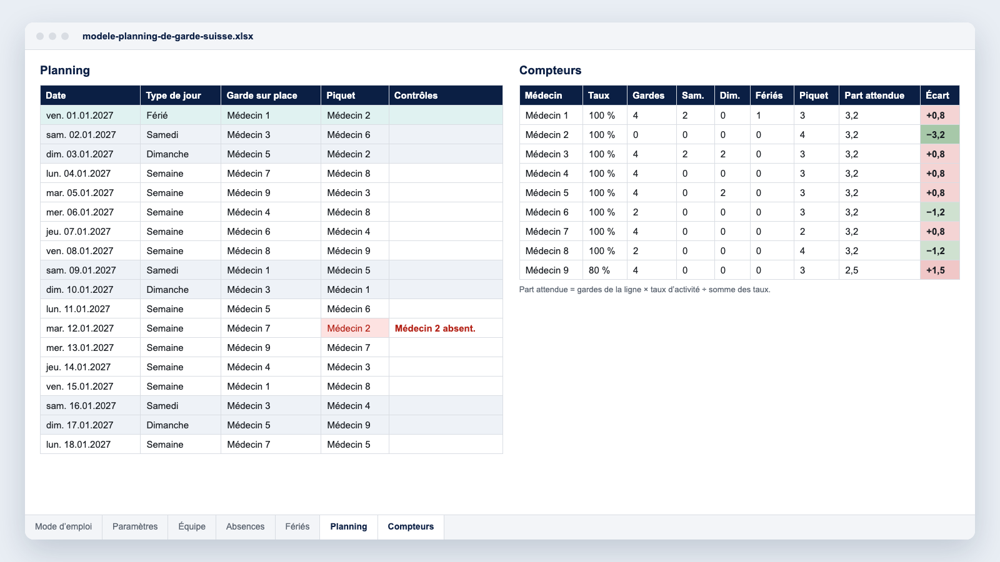

Le planning de garde, ou plan de service, est le document le plus discuté d’un service médical. Une nuit de trop, Noël attribué deux années de suite à la même personne, et c’est la confiance dans tout le planning qui s’effrite.

Ce guide rassemble ce que nous observons dans les services qui planifient leurs gardes avec Momentum : le cadre légal suisse, les compteurs qui rendent l’équité vérifiable, une méthode en six étapes et un [modèle Excel gratuit](/modeles/modele-planning-de-garde-suisse.xlsx).

**Au sommaire**

- [Garde sur place, piquet, travail en équipes : trois façons de compter](#garde-sur-place-piquet-travail-en-équipes-trois-façons-de-compter)
- [Ce que prévoit la loi sur le travail](#ce-que-prévoit-la-loi-sur-le-travail)
- [Ce que veut dire « équitable » : cinq compteurs](#ce-que-veut-dire-équitable-cinq-compteurs)
- [Construire le planning de garde en six étapes](#construire-le-planning-de-garde-en-six-étapes)
- [Le modèle Excel gratuit](#le-modèle-excel-gratuit)
- [Quand le tableur ne suffit plus](#quand-le-tableur-ne-suffit-plus)
- [Questions fréquentes](#questions-fréquentes)

## Garde sur place, piquet, travail en équipes : trois façons de compter

Avant de répartir quoi que ce soit, nommez chaque ligne de garde et sa nature. Une ligne, c’est un besoin de présence ou de disponibilité sur une plage horaire donnée.

| Organisation | Ce que fait le médecin | Comment on la compte (loi sur le travail) |
|---|---|---|
| **Garde sur place** | Il reste à l’hôpital, la nuit ou le week-end. | Ce service de garde compte en entier comme temps de travail, même sans intervention. |
| **Service de piquet** | Il reste joignable chez lui et se déplace si besoin. | Interventions et trajets comptent. Avec un délai d’intervention de moins de 30 minutes, s’ajoutent 10 % du temps inactif. |
| **Travail en équipes** | Le service tourne en continu (urgences, soins intensifs). | Chaque équipe compte en entier. Le travail de nuit a ses propres limites et repos. |

Un service d’anesthésie peut combiner une garde sur place et un piquet de médecin cadre ; un institut de radiologie, un piquet de scanner par site.

## Ce que prévoit la loi sur le travail

Les médecins-assistants relèvent de la [loi sur le travail (LTr)](https://www.fedlex.admin.ch/eli/cc/1966/57_57_57/fr) et de ses ordonnances 1 et 2, avec des dispositions spéciales pour les hôpitaux à l’[art. 15 OLT 2](https://www.fedlex.admin.ch/eli/cc/2000/244/fr). Les repères (état : LTr 1er septembre 2023, OLT 1 1er septembre 2024, OLT 2 1er février 2026) :

- **50 heures par semaine au plus** (art. 9, al. 1, let. b, LTr). Le travail supplémentaire reste exceptionnel, 140 heures par année civile au plus (art. 12, al. 2, LTr).
- **Un repos quotidien de 11 heures consécutives** (art. 15a LTr). À l’hôpital, il peut descendre à 9 heures si la moyenne sur deux semaines atteint 12 heures (art. 9 OLT 2).
- **Une garde de nuit dans un intervalle de 12 heures**, suivie d’au moins 12 heures de repos, avec un endroit pour s’allonger et soit 10 heures de travail au plus, en grande partie du temps de présence, soit 8 heures de travail effectif au plus, les 12 heures comptant alors comme temps de travail (art. 10, al. 2, OLT 2).
- **Sept jours de piquet au plus sur quatre semaines**, puis deux semaines sans piquet (art. 14, al. 2, OLT 1). Si les interventions ne laissent pas 4 heures de repos consécutives, 11 heures de repos suivent la dernière intervention (art. 19, al. 3, OLT 1).
- **Au moins 12 dimanches de congé** par année civile (art. 12, al. 2, OLT 2).

<figure class="max-w-2xl mx-auto"><picture><source media="(max-width: 640px)" srcset="/guides/fr-ch-planning-de-garde-timeline-m.webp" width="400" height="481"></picture></figure>

**Qui est concerné.** Depuis le 1er janvier 2005, la LTr s’applique à tous les médecins-assistants, même dans un hôpital qui n’y est pas soumis par ailleurs ([art. 4a OLT 1](https://www.fedlex.admin.ch/eli/cc/2000/243/fr)). Sont exclus de la loi les hôpitaux intégrés à l’administration cantonale ou communale, ainsi que les établissements de droit public sans personnalité juridique et les corporations de droit public dont la majorité du personnel est engagée en droit public (art. 2 LTr, art. 7 OLT 1). Leurs autres médecins relèvent du droit du personnel cantonal ou communal. Selon le [SECO](https://www.seco.admin.ch/fr/hopitaux-cliniques), les médecins-chefs exercent en général une fonction dirigeante élevée : seules les règles de protection de la santé s’appliquent à eux (art. 3, let. d, et art. 3a LTr).

**Horaire contractuel et indemnités.** Les 50 heures sont un plafond légal, pas un horaire contractuel. L’ASMAC défend une [semaine de 42+4 heures](https://vsao.ch/fr/conditions-de-travail/42plus4-factsheet/) : 42 heures de prestations aux patients et au moins 4 heures de formation postgraduée structurée. L’indemnité de piquet relève du contrat ou de la convention collective de travail (CCT), pas de la LTr. Faites valider votre organisation par les RH ou le service juridique.

## Ce que veut dire « équitable » : cinq compteurs

Dans les services où le planning de garde ne fait plus débat, on retrouve presque toujours les mêmes compteurs, tenus pour chaque médecin.

- **Les gardes au total**, rapportées au taux d’activité : une cheffe de clinique à 80 % n’a pas la même part qu’un collègue à 100 %.
- **Les samedis**, **les dimanches** et **les jours fériés**, chacun dans son compteur : un dimanche ne vaut pas un mardi, et c’est sur ces jours que naissent les tensions. Le compteur des dimanches aide aussi à suivre les 12 dimanches de congé.
- **Les périodes sensibles** : Noël, Nouvel An, les ponts, les vacances scolaires, suivies d’une année sur l’autre.

**Sur une période longue.** Tenez les compteurs sur l’année ou sur douze mois glissants : un mois n’a que quatre ou cinq week-ends.

**Visibles par toute l’équipe.** Un compteur que seul le planificateur voit ne règle aucun conflit.

### Exemple : neuf médecins, une garde sur place chaque nuit

Cela fait 365 gardes par an. La part de chacun dépend de la somme des taux d’activité.

| Équipe | Part attendue de chaque médecin |
|---|---|
| Neuf médecins à 100 % | 40,6 gardes chacun |
| Huit à 100 % et un à 80 % (somme des taux : 8,8) | 41,5 gardes par plein temps, 33,2 pour le médecin à 80 % |

Les 104 samedis et dimanches de 2027 et les fériés de votre canton se répartissent de la même façon.

## Construire le planning de garde en six étapes

<figure class="max-w-2xl mx-auto"><picture><source media="(max-width: 640px)" srcset="/guides/fr-ch-planning-de-garde-steps-m.webp" width="400" height="610"></picture></figure>

### 1. Lister les lignes

Pour chaque ligne : horaires, garde sur place ou piquet, qui peut y participer.

### 2. Écrire les règles du service

Nombre maximal de gardes par mois, repos après une garde de nuit, sept jours de piquet au plus sur quatre semaines, pas de garde la veille d’une journée de bloc si c’est votre règle. Écrivez-les avant de remplir la première case : ce sont ces règles, et non le planificateur, qui arbitreront les désaccords.

### 3. Collecter absences et souhaits

Fixez une date limite, par exemple six semaines avant la publication. Un souhait tardif passe par un échange.

### 4. Remplir dans le bon ordre

D’abord les contraintes fermes (absences, repos), puis les week-ends et jours fériés, enfin les nuits de semaine, qui servent à équilibrer les compteurs.

### 5. Relire avec les compteurs

Avant de publier, regardez l’écart de chaque médecin à sa part attendue. Il doit être faible, ou expliqué.

### 6. Publier, puis tracer les échanges

Chaque échange validé met à jour les compteurs. Sans cela, l’équité affichée en janvier ne veut plus rien dire en juin.

## Le modèle Excel gratuit

**[Télécharger le modèle de planning de garde](/modeles/modele-planning-de-garde-suisse.xlsx)** (fichier Excel .xlsx, sans macro, gratuit).

- **Deux lignes** à nommer, par exemple « Garde sur place » et « Piquet », sur une année complète.
- **L’équipe, les absences et les jours fériés** : taux d’activité, absences (du, au, motif), jours fériés courants de 2026 à 2028. Hormis le 1er août, les fériés sont cantonaux : ajoutez les vôtres, par exemple le Jeûne genevois ou le Lundi du Jeûne.
- **Des contrôles automatiques** : même médecin deux jours de suite sur une ligne, sur les deux lignes le même jour, ou pendant une absence.
- **Des compteurs par médecin** : gardes par ligne, samedis, dimanches, fériés, part attendue et écart.

Ses limites sont celles d’un tableur : il ne génère pas le planning, couvre un service et deux lignes, ne vérifie ni repos ni limites de piquet, et chaque échange se reporte à la main.

## Quand le tableur ne suffit plus

Quelques signaux reviennent souvent :

- plus de deux lignes de garde, ou plusieurs sites ;
- une équipe de plus de quinze ou vingt médecins ;
- des échanges fréquents, à revérifier un par un ;
- des exports vers la paie, pour les indemnités de piquet et les suppléments de nuit ;
- des règles qui dépendent du lendemain, comme pas de garde avant une journée de bloc chargée.

C’est le travail de [Momentum](/fr-ch/) : le logiciel génère le planning à partir des règles du service, tient les compteurs à jour à chaque échange et publie le planning sur mobile.

- **Urgences du CHIREC (Braine-l’Alleud, Belgique)** : pour 25 à 30 médecins et 40 000 passages par an, la construction du planning mensuel est passée de 4 jours à 4 à 5 heures (étude de cas, mai 2025).
- **CHU d’Angers (France)** : le planning de 52 médecins partagés entre les urgences et le SAMU est automatisé, avec des comptes d’heures centralisés et les souhaits saisis sur mobile (étude de cas, 2023).

## Questions fréquentes

### Un repos est-il obligatoire après une garde de nuit ?

Oui. Le repos quotidien est d’au moins 11 heures consécutives (art. 15a LTr). Après une garde de nuit dans un intervalle de 12 heures selon l’art. 10, al. 2, OLT 2, il est d’au moins 12 heures.

### Le service de piquet compte-t-il comme temps de travail ?

À l’hôpital, il compte en entier. À domicile, seuls comptent l’activité effectivement déployée et le trajet (art. 15 OLT 1). Si le délai d’intervention doit être inférieur à 30 minutes, s’ajoute, dans les hôpitaux et cliniques, une compensation en temps de 10 % de la période inactive, et la limite est de sept jours de piquet sur quatre semaines (art. 8a OLT 2).

### La loi sur le travail s’applique-t-elle aux chefs de clinique et aux médecins cadres ?

Dans un hôpital soumis à la LTr, oui, sauf en cas de fonction dirigeante élevée, en général les seuls médecins-chefs selon le SECO. Dans un hôpital exclu de la loi, elle ne vise que les médecins-assistants.

### Un logiciel peut-il respecter nos règles locales ?

C’est le premier critère à vérifier. Dans Momentum, les règles du service (participation par ligne, repos, maximums, équité) sont paramétrées une fois, puis appliquées à chaque génération du planning. Le plus simple est de le voir sur votre propre organisation : [demander une démo](/fr-ch/demo/?ref=planning-de-garde-medecins).
