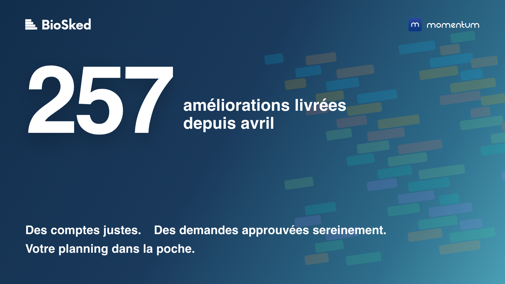
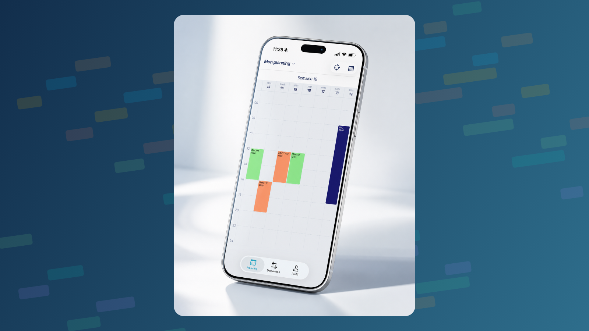

En mars, l'un d'entre vous a répondu à notre enquête de satisfaction avec un 8 sur 10 et une remarque que je n'ai pas oubliée. La mise à jour était bonne, plus simple, mais il manquait « des publications de notes d'utilisation, consultables en cas de besoin, pour connaître toutes les fonctionnalités ».

C'est juste. Nous avons corrigé et livré tout le printemps et tout l'été, et nous vous l'avons dit au fil des réponses du support, d'un webinaire et de quelques emails. Ce n'est pas la même chose que de l'écrire noir sur blanc, au même endroit. Voici donc le bilan.

## Les chiffres, et d'où ils viennent

Entre le 1er avril et le 6 septembre, nous avons déployé 257 améliorations dans Momentum. Le chiffre n'est pas arrondi : c'est le nombre d'éléments que notre outil de suivi marque comme déployés sur cette période, des corrections visibles jusqu'à la tuyauterie qui les rend possibles. Parmi eux :

- 131 sont des corrections de choses cassées ou qui se comportaient mal.
- 83 viennent directement d'un ticket au support ou d'une demande que l'un d'entre vous nous a envoyée.
- 124, près de la moitié, ont été ouverts par notre propre équipe support et succès client, souvent en votre nom, après un échange avec vous. La plupart des 83 en font partie.
- 1 106 modifications de code ont été fusionnées pour y arriver.

Tout cela est sorti en trois versions principales (4.5 en avril et mai, 4.6 en juin, 4.7 en août), deux correctifs intermédiaires, une application mobile entièrement nouvelle et, depuis fin août, de petites mises en production presque chaque semaine. Le détail, version par version, est sur notre [page changelog](/fr/changelog/).

## Ce que nous avons corrigé, en clair

Nous avons regroupé les points marquants par problème résolu, parce que c'est ainsi que vous nous les avez envoyés.

**Vos comptes d'heures et de congés tombent juste.** C'était la plus grosse famille de tickets, et la plus importante : une journée de récupération valorisée 24 h au lieu de 7 h, des congés qui se chevauchent comptés deux fois, un solde de congés impossible à suivre sans fausser le compte d'heures. Les termes de contrat comptent désormais les jours de congé séparément des heures travaillées. Et quand nous avons remplacé le moteur de calcul, nous avons vérifié qu'il ne changeait aucun des chiffres que vous voyez déjà : 4,3 millions de valeurs du rapport de synthèse des absences rejouées sur les 325 bases de production, zéro différence. Les corrections font que les comptes tombent juste ; le rejeu fait que le changement de moteur est invisible. Si le vôtre ne tombe toujours pas juste, dites-le-nous.

**Les politiques de congés sont réunies au même endroit.** Les droits à congés ne s'acquéraient qu'une fois par an, et tout le reste, des jours d'ancienneté aux règles de maladie, passait par des ajustements manuels. Les nouvelles politiques de congés rassemblent ces règles sur un seul écran, et un contrat peut pointer vers plusieurs politiques. C'est derrière un interrupteur par instance, parce que cela touche à des chiffres qui servent à la paie, et nous l'activons instance par instance.

**Approuver les demandes en voyant le planning.** Une demande approuvée est une promesse faite. Deux choses ont changé. Les demandes en attente peuvent maintenant s'afficher directement dans la vue par date, à côté des affectations qu'elles touchent. Et vous pouvez pré-approuver un ensemble de demandes, lancer une construction de test, regarder la couverture, puis confirmer ou revenir en arrière avant que quiconque soit notifié. Les deux sont derrière un interrupteur par instance. Nous les activons par étapes, instances les plus actives d'abord ; dites-le à votre référent BioSked si vous voulez en être tôt.

**Construire un planning redevient rapide, et reproductible.** Sur notre construction client de référence, le moteur classique est passé d'environ 43 minutes à 45 secondes. Nous avons aussi découvert que deux constructions identiques pouvaient donner deux plannings différents, parce que rien ne décidait laquelle de plusieurs lignes identiques d'une trame comptait comme pourvue. Sur un planning, 245 affectations sur 695 bougeaient d'une construction à l'autre. C'est corrigé, et vérifié sur dix bases clients. Les modifications en masse d'un mois entier aboutissent au lieu d'échouer en cours de route : 200 affectations demandaient 324 allers-retours vers la base de données, elles en demandent 6.

**Des notifications fiables.**

- Des notifications qui ignoraient les restrictions par rôle.
- Des alertes « planning publié » déclenchées sans publication.
- Des administrateurs non prévenus quand quelqu'un est retiré d'une affectation publiée.
- Des demandes déposées depuis l'application mobile sans notification ni trace dans l'historique.
- Une seule publication non pourvue dans la bourse aux activités qui bloquait toutes les autres notifications.

Tout est corrigé, et les notifications administrateur respectent désormais leurs cases à cocher.

**Voir plus, cliquer moins.** Dans la nouvelle vue par date :

- Des colonnes en largeur auto.
- Des compteurs par jour et par groupe (affectations ou points) sans ouvrir un rapport.
- Des infobulles lisibles.
- Un menu contextuel plus clair, avec « Remplacer le personnel » limité aux seuls candidats possibles.
- Les affectations vides et obligatoires en rouge.
- Les vacations non pourvues visibles dans la vue Chronologie.
- Des filtres enregistrés qui s'ouvrent sur la période enregistrée. Chez un client, un filtre s'ouvrait sur quatre ans de planning et figeait la page.

**Des exports qui exportent.**

- L'export Excel depuis la nouvelle vue par date, et le même format de fichier qu'avant pour les exports de la vue liste.
- Des exports qui respectent le filtre ouvert, et des fichiers CSV au-delà de 1 000 lignes.
- Des exports SFTP planifiés qui contiennent désormais exactement ce qu'un export manuel contient, avec un port explicite.
- Des exports de calendrier qui ne tombent plus en erreur, et des affectations créées à partir de demandes approuvées qui arrivent maintenant dans les agendas Outlook.

**Une nouvelle application mobile.** Reconstruite de zéro et disponible sur l'App Store et Google Play depuis juillet : un écran « aujourd'hui », la connexion par Face ID ou empreinte, un accès hors ligne chiffré à votre planning, la connexion Microsoft en un geste (et SAML pour les autres fournisseurs d'identité, votre service informatique saura), des notifications push plus rapides, le mode sombre, cinq langues. Vos premiers tickets à son sujet (réglages de visibilité des notes, demandes déposées qui n'apparaissaient pas, horaires personnalisés sur iPhone) sont corrigés, et les mises à jour partent désormais vers un petit groupe d'abord, puis vers tout le monde.

**Se connecter, à tous les coups.** Des mots de passe longs qui ne permettaient plus de se connecter, des liens d'activation qui échouaient au second clic : corrigés. Le support voit désormais pourquoi une connexion a échoué, et « je n'arrive pas à me connecter » se règle en un seul échange.

## Comment nous améliorons Momentum

La version de juin a reconstruit 250 000 lignes de code historique sur des fondations modernes. Le bon choix pour les années à venir, et quelques semaines plus agitées que nous ne l'aurions voulu pour certains d'entre vous. Cela a aussi changé notre façon de livrer. Les grosses versions groupées, c'est terminé : depuis fin août, nous livrons de petits incréments, presque chaque semaine, d'abord sur quelques instances actives, et le [changelog](/fr/changelog/) montre ce qui est sorti et quand.

## Avec vos mots

*« Support très réactif, problème de paramétrage, solution trouvée en moins de 24 h. Top ! »* <cite>Administrateur Momentum, France, enquête support, août 2026</cite>

*« C'est un miracle de Noël ! Ça marche. Merci, merci, merci. »* <cite>Responsable imagerie, groupe médical, États-Unis, juin 2026, traduit de l'anglais</cite>

*« Depuis la mise à jour, la fonctionnalité est plutôt très bonne, plus simple. »* <cite>La personne qui demandait des notes d'utilisation, mars 2026</cite>

Cet article est une première réponse.

## Ce sur quoi nous travaillons ensuite

- La prévisualisation et la pré-approbation des demandes, activées sur les instances par étapes.
- Les politiques de congés activées sur l'ensemble des instances, puis les règles de report.
- Une page Demandes unique dans la nouvelle interface : congés, travail supplémentaire et échanges sur un seul écran, avec des approbations date par date.
- Des heures prêtes pour la paie : heures supplémentaires par taux, exports plus propres.
- Pour les cabinets qui utilisent un agenda de rendez-vous en ligne : un pilote dans lequel un planning Momentum publié alimente cet agenda.
- Et deux ou trois choses que notre équipe préfère vous montrer plutôt que vous décrire.

## Venez le voir

- **JFR 2026**, Palais des Congrès de Paris, du 8 au 11 octobre, stand 126A. [Réservez un créneau](/fr/demo/).
- **Amérique du Nord :** RSNA 2026, Chicago, du 29 novembre au 3 décembre.
- **Pour tous :** [parlez-nous](/fr/demo/) pour un tour de 20 minutes des nouveautés sur votre instance, ou parcourez la [base de connaissances](/fr/help/).

Merci pour vos retours. C'est avec eux que Momentum progresse.

David Dudok de Wit, CEO, BioSked
