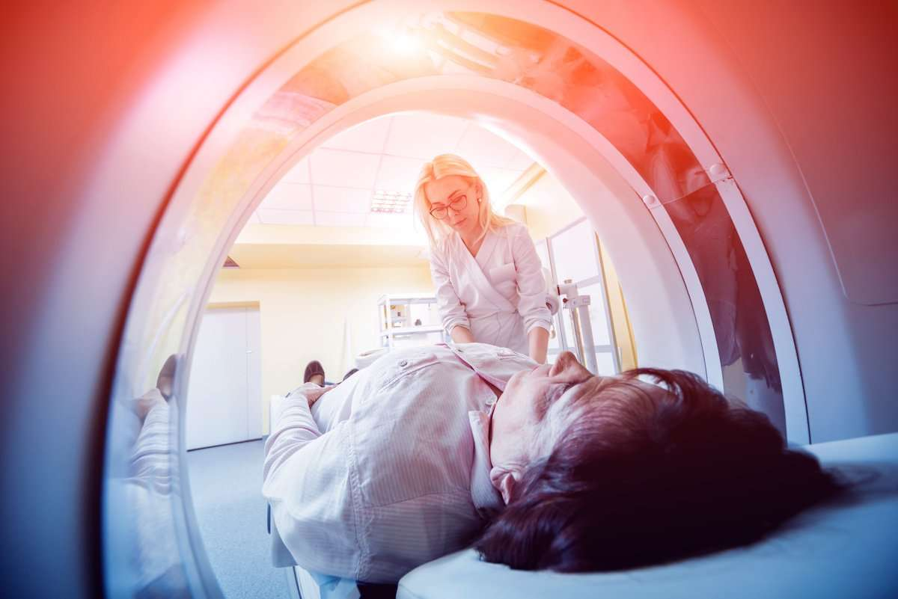
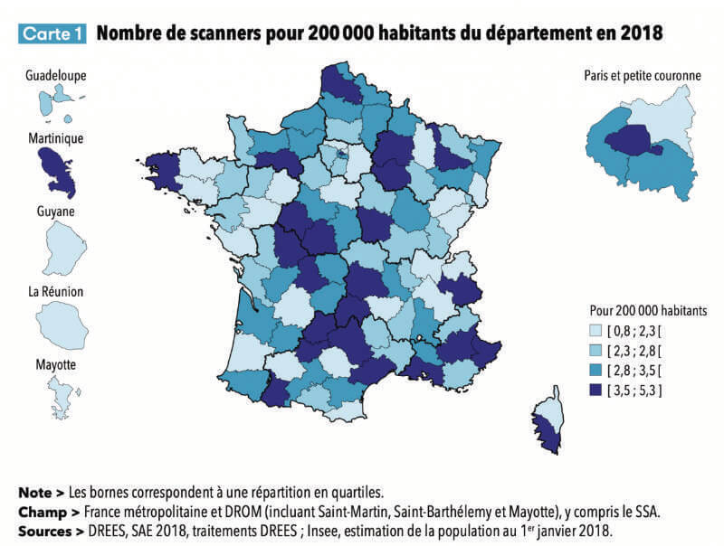

Dans l’univers de la santé, la radiologie occupe une place centrale pour établir les diagnostics, analyser les symptômes et évaluer les traitements chez un patient. Le secteur de l’imagerie médicale représente à lui seul une part prépondérante de ce secteur en France, avec pas moins de 10 % de part de marché de la technologie médicale. Cette spécialité totalise chaque année en France 60 millions d’actes médicaux pour les échographies et radiographies, 5 millions pour les scanners et 3,5 millions d’actes d’IRM.

Si le poids de la radiologie est prépondérant, le secteur présente cependant des disparités importantes sur le territoire national. Démographie, dotation en matériel radiologique … Comment se présente cette spécialité en France, quelles leçons en tirer et quelles perspectives d’évolutions sont à envisager ? Faisons le point ensemble !

<h2>Démographie et densité humaine en radiologie : une répartition inégale</h2>

Selon la DREES, 226 219 médecins exerçaient une activité en France en 2019. Parmi eux, 8 885 professionnels de santé, soit près de 4 %, sont des radiologues en activité. Si l’étude note une surreprésentation des hommes de 54 ans en moyenne, l’âge moyen des professionnels exerçant dans l’univers de la radiologie est de 52 ans, contre 52 ans en moyenne pour l’ensemble du corps médical. Ce constat est complété par une sous-représentation des femmes qui représentent 36 % de la spécialité contre 46 % sur ce même ensemble.

Source: <a href="https://www.profilmedecin.fr/contenu/chiffres-cles-medecin-radiologue/">https://www.profilmedecin.fr/contenu/chiffres-cles-medecin-radiologue/</a>

Par ailleurs, le territoire français compte en moyenne 13,3 radiologues pour 100 000 habitants en 2019, avec des disparités criantes en fonction des régions. Par exemple, la densité moyenne est de 7,6 médecins radiologues dans le Limousin, alors qu’en Île-De-France, on compte 17 radiologues pour 100 000 habitants.

<h2>Quid de la répartition du matériel radiologique sur le territoire ?</h2>

En 2019, la DREES a également publié un nouveau panorama annuel des établissements de santé dans lequel figure une large section concernant les services d’imagerie médicale. 
Il en ressort notamment que les experts ont identifié 2 289 salles de radiologie conventionnelle dans 817 établissements de santé en 2018. Par rapport à l’année précédente, la donnée chiffrée, en légère baisse, accroît la mauvaise répartition des modalités d’imagerie médicale en France. 
Si l’on étudie plus en détail les données fournies, le nombre de scanners varie de manière importante d’une région à l’autre sur le territoire national. Pour 200 000 habitants, la Haute-Loire dénombre en moyenne 0,9 scanners contre 4,9 en Alpes-de-Haute-Provence. La moyenne nationale étant de 2,9 équipements pour 200 000 habitants. 
Source: https://drees.solidarites-sante.gouv.fr

Côté IRM, 0,7 unités ont été recensés dans la Sarthe et 4,2 pour Paris, pour une moyenne de 2,3 dispositifs, sur 200 000 habitants. Une légère hausse par rapport à 2017 donc. 
Ce manque d’accès en soins de radiologie risque de s’intensifier dans des régions peu pourvues en matériels et en professionnels.[RT1] L’essor de l’Intelligence Artificielle (IA) arriverait alors en soutien pour compléter l’offre, augmenter la productivité et, in fine, prendre en charge une part croissante de la patientèle.

Source: <a href="https://drees.solidarites-sante.gouv.fr">https://drees.solidarites-sante.gouv.fr</a>

<h2>L’Intelligence Artificielle : levier essentiel pour pallier ces disparités</h2>

Les solutions connectées et les autres dispositifs digitaux ont le vent en poupe en France. Le pays est notamment l’un des pôles d’excellence mondiaux en termes de recherche et d’innovation en Intelligence Artificielle. 
En effet, ces outils sont devenus incontournables dans de nombreux domaines, comme dans votre profession au quotidien. Logiciel d’automatisation de tâches administratives, outils de planification médicale, aides au diagnostic, à la prévention ou au suivi … Il existe autant de solutions pour fluidifier votre pratique et optimiser le fonctionnement du parc d’équipement radiologique. 
La France a par exemple débloqué 1,5 milliards d’euros afin de soutenir le développement de projets innovants d’entreprises comme Evolucare Labs, Milvue ou Therapixel. 
Avec le développement de toujours plus de systèmes innovants la radiologie est définitivement au cœur de toutes les transformations !

