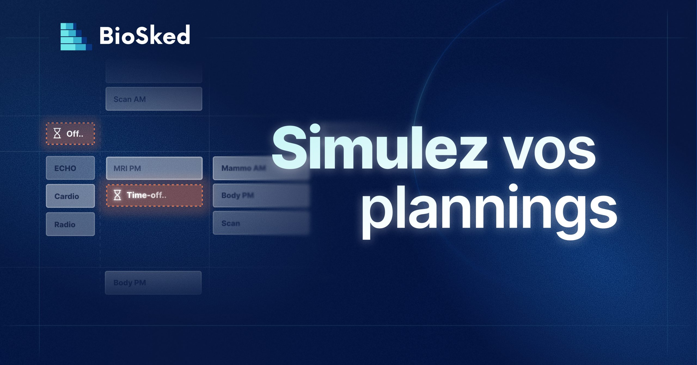

## Un arbitrage quotidien, souvent à l’aveugle

Dans beaucoup de services des urgences, la gestion des demandes de congés et d’échanges de garde repose sur un praticien référent, un médecin qui cumule activité clinique et responsabilité administrative, sans outil conçu pour anticiper les conséquences de ses décisions.

Résultat : on dit oui en espérant que cela tienne. On dit non sans certitude que c’était nécessaire. Les plannings se fragilisent après validation, les remplacements de dernière minute se multiplient, et les refus sans explication factuelle créent des tensions durables au sein des équipes.

## La simulation des plannings : simuler avant de décider

La nouvelle version de Momentum introduit la simulation des plannings. Avant d’approuver une demande, le médecin référent l’intègre dans un scénario de simulation : l’IA génère un planning test en prenant cette demande comme contrainte réelle. En quelques secondes, l’impact est visible : couverture du service, tensions sur les créneaux concernés, conflits avec d’autres demandes en attente.

Si le scénario révèle une fragilité, le périmètre est ajusté et l’IA recalcule instantanément. Les demandes ne sont formellement approuvées, et les praticiens notifiés, qu’une fois un planning viable confirmé.

## Trois situations concrètes

- **Demande isolée en période chargée :** l’IA détecte un créneau de nuit sans couverture suffisante. Le refus s’appuie sur un planning test, pas sur une intuition
- **Deux demandes simultanées pour la même période :** la simulation des plannings montre laquelle est compatible avec le planning. L’arbitrage devient objectif et explicable
- **Échange de garde avec impact en cascade :** l’IA détecte qu’un praticien enchaînerait trois nuits consécutives en infraction avec les règles de repos. L’échange est réaménagé plutôt que refusé

## Ce qui change pour le médecin référent

La simulation des plannings n’élimine pas la décision humaine, elle l’éclaire. Les refus sont justifiables, les validations sont sécurisées, et la charge mentale sur les arbitrages difficiles diminue sensiblement. Pour le chef de service, les décisions sont traçables, les plannings finalisés arrivent avec moins d’imprévus, et la couverture du service est mieux protégée, sans temps de gestion supplémentaire.

## Découvrez la simulation des plannings au Congrès des Urgences 2026 — Stand n°75 | 3-5 juin, Paris

BioSked sera présent du 3 au 5 juin 2026 à Paris (stand n°75). Venez voir la simulation des plannings en démonstration live : soumettez une demande réelle, regardez l’IA générer le planning test en temps réel, et mesurez l’impact avant de valider.

Vous souhaitez voir la simulation des plannings appliquée à votre organisation ? [Demandez une démonstration](/fr/demo/).
