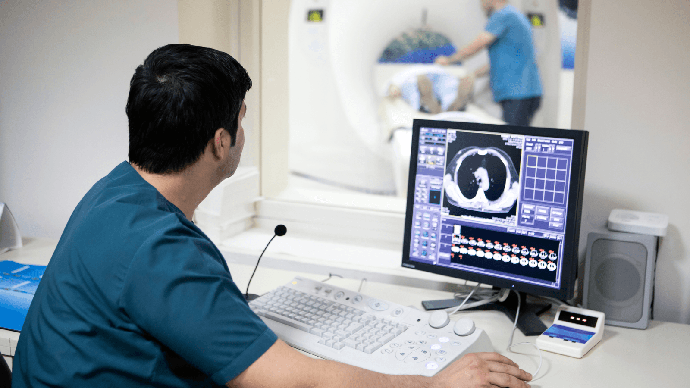
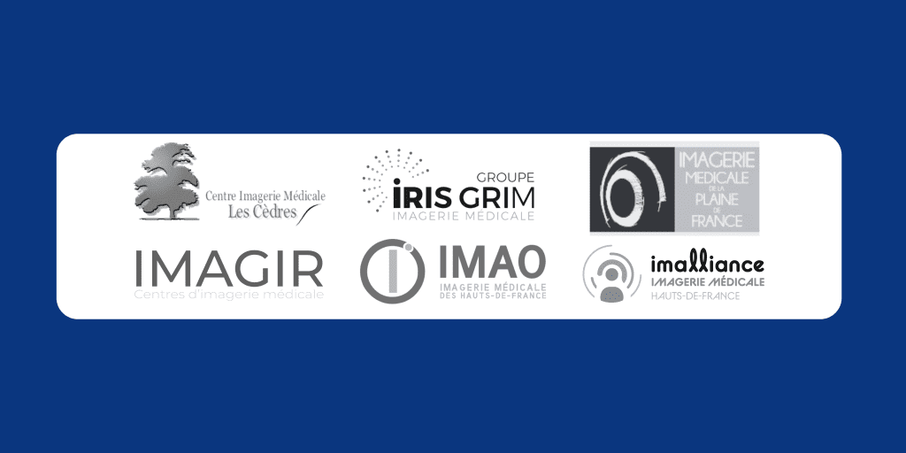

## Momentum se réinvente auprès de ses clients radiologues

BioSked, leader de la planification d’équipe d’imagerie depuis plus de 10 ans, continue de révolutionner la planification médicale, en planifiant des groupes de 5 à 100 radiologues à travers l’Europe et particulièrement en France. Adaptée à chaque équipe, des radiologues au personnel administratif, Momentum garantit une planification optimisée, précise et rapide pour une efficacité opérationnelle maximale.

Actuellement en action aux côtés des équipes radiologiques d’Imagir Bordeaux, d’Imalliance Hauts-de-France, d’Iris Grim, et bien d’autres, Momentum relève les défis de la planification médicale avec brio. Grâce à son approche intuitive et adaptative, les équipes peuvent se concentrer sur l’essentiel : offrir des soins de qualité à leurs patients.

Mettant les besoins et les attentes des radiologues au cœur de son développement, BioSked a prévu de belles nouveautés !

## BioSked aux Journées Francophones de Radiologie (JFR) du 13 au 16 Octobre 2023 au palais des congrès de Paris.

BioSked sera présent aux JFR 2023, un événement incontournable pour les professionnels de l’imagerie médicale rassemblant des entreprises innovantes et des experts du secteur, attirant plus de 12 000 participants chaque année.

Ne manquez pas cette opportunité de découvrir l’avenir de la planification radiologique avec Momentum aux JFR 2023 ! Venez échanger avec nos équipes directement au stand 126A, ou prenez rendez-vous en cliquant [**>>ICI<<**](/fr/ressources/).

Forte de plus de 12 années d’expérience dans la gestion des plannings pour les équipes médicales et paramédicales, l’équipe BioSked vous invite à découvrir lors des JFR comment Momentum peut transformer la gestion de votre service de radiologie.

Pour en savoir plus, contactez-nous sur [info@biosked.com](mailto:info@biosked.com) ou découvrez davantage sur notre page web dédiée aux services de radiologie [**>>ICI<<**](/fr/secteurs-soins/radiologie/).
