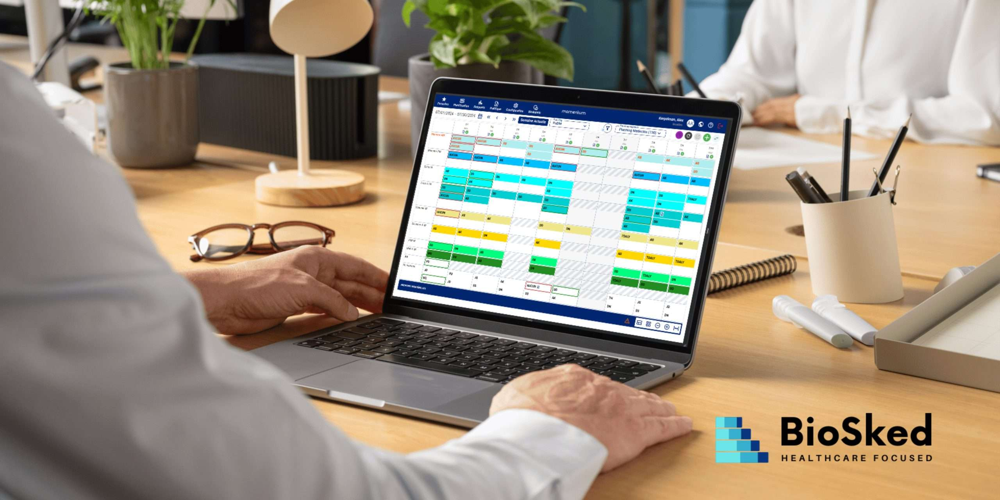

				
				
				
				
				
				
				

				

				
				
				
				
				

				
				
				
				
				
Planifier les équipes médicales est un défi de taille pour les établissements de santé. Les contraintes des gardes, les exigences propres à chaque spécialité et les imprévus rendent la tâche complexe, d’autant plus lorsque les outils à disposition ne répondent pas pleinement aux besoins du terrain. Le résultat ? Un impact des coûts considérable, des équipes insatisfaites, et parfois une qualité de soins impactée.

Chez BioSked, nous avons décidé de relever ce défi. Avec la <strong>refonte de Momentum</strong>, notre solution de gestion des plannings des équipes médicales, nous offrons aux professionnels de santé une nouvelle manière d&rsquo;organiser leur travail, plus simple, plus rapide et plus efficace.

<h3><strong>Optimisez votre quotidien : Une gestion des plannings jusqu’à 10 fois plus rapide</strong></h3>

La nouvelle vue par date redéfinit l’expérience utilisateur grâce à une interface épurée et fonctionnelle. Conçue pour réduire les clics et rationaliser le flux de travail, elle permet aux<strong> administrateurs d’accomplir leurs tâches 10 fois plus rapidement,</strong> réduisant <strong>jusqu’à 80 % le temps</strong> <strong>consacré à l’administration des plannings.</strong> C&rsquo;est du temps précieux récupéré, à consacrer à des tâches à plus forte valeur ajoutée, améliorant directement la qualité des soins.

<em>“Nous allons régulièrement à la rencontre de nos clients pour observer leurs besoins réels et échanger sur leur utilisation de nos outils. Ces retours directs nous permettent d’améliorer nos produits et d’ajuster notre roadmap en temps réel. Parallèlement, nous tirons parti de milliers d&rsquo;années de données de planification pour perfectionner notre moteur grâce à l’intelligence artificielle. Ce mélange unique de proximité terrain et de technologie de pointe nous permet d’offrir une solution inégalée dans la gestion des plannings.” &#8211; <strong>Souligne Alex KERPELMAN &#8211; Développeur logiciel</strong></em>

<h3><strong>Des fonctionnalités pensées pour répondre à vos besoins</strong></h3>

La refonte de Momentum n’est pas qu’une question de rapidité : chaque détail a été pensé pour simplifier l’expérience utilisateur.

<ul>
<li><strong>Navigation intuitive</strong> : Accessible à tous, même aux utilisateurs les moins technophiles.</li>
<li><strong>Expérience unifiée</strong> : Moins de clics, plus d’automatisation des tâches répétitives.</li>
<li><strong>Flexibilité en temps réel</strong> : Modifiez ou consultez vos plannings depuis l’application web ou mobile, où que vous soyez.</li>
</ul>
<h3><strong>L’innovation technologique au service de la santé</strong></h3>

Chez BioSked, nous croyons que la technologie doit être un levier pour améliorer le quotidien des équipes médicales. C’est pourquoi nous intégrons des outils innovants à Momentum :

<ul>
<li><strong>Intelligence artificielle</strong> : Anticipez vos besoins et ajustez vos ressources en fonction des prévisions.</li>
<li><strong>Écoute terrain</strong> : Nos mises à jour sont conçues à partir des retours d’expérience de nos utilisateurs.</li>
<li><strong>Intégration élargie</strong> : Momentum s’intègre avec un large éventail de solutions tierces, pour s’adapter à l’écosystème médical de chaque établissement.</li>
</ul>
<h3><strong>Momentum: un leader de confiance depuis 2010</strong></h3>

Avec plus de 30 000 utilisateurs dans 9 pays et une expertise reconnue dans des spécialités à forte contrainte comme l’imagerie, l’anesthésie et les urgences, <strong>Momentum par BioSked</strong> s’est imposé comme une solution SaaS incontournable pour la gestion des plannings médecins.

Nous sommes fiers de continuer à accompagner les établissements de santé en répondant aux besoins spécifiques de chaque spécialité.

<h3><strong>Essayez dès aujourd’hui la nouvelle version de Momentum</strong></h3>

La nouvelle interface de Momentum est disponible dès maintenant pour tous nos clients, sans frais supplémentaires.

<strong>Prêts à adopter une gestion plus rapide, plus intelligente et plus fluide ? Découvrez dès maintenant tout le potentiel de Momentum et simplifiez votre quotidien.</strong>

&nbsp;

			

				<a class="et_pb_button et_pb_button_0 et_pb_bg_layout_dark" href="/fr/demo/" target="_blank" data-icon="5">Demander une démo</a>
			

			

				
				
				
				
			

				
				
			

