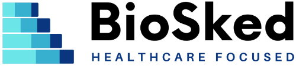

## Momentum, solution de planification automatique des médecins, franchit une nouvelle étape en devenant une entreprise indépendante !

Nous sommes fiers d’annoncer que Momentum vient d’être repris par ses salariés et un syndicat d’investisseurs privés via la création de BioSked, entreprise entièrement dédiée à son développement et à sa promotion. Ce changement de structure implique la volonté des équipes de mettre au cœur de leur missions la satisfaction des clients en fournissant une solution de planification automatique encore plus poussée/pensée/réfléchie.

## Momentum s’est imposé ces dernières années comme le leader de la planification en radiologie en France et poursuit son implantation ailleurs en Europe et en Amérique du Nord, ainsi que dans de nouvelles spécialités médicales.

Du secteur privé au secteur public, pour les spécialités telles que la radiologie, la cardiologie, l’anesthésie, l’ophtalmologie et bien d’autres, BioSked a pour ambition de continuer de faire évoluer Momentum en tant que solution de référence pour la planification automatique de vacations et d’activités pour les services de soins.

## Momentum a vu le jour en 2010 pour venir en aide aux radiologues européens afin d’optimiser leurs plannings.

Avec une application web et smartphone, Momentum est l’outil de pilotage d’activité pour vos ressources humaines. De nombreuses fonctionnalités sont dédiées au secteur médical comme la distribution automatique des affectations en fonction des compétences, contraintes organisationnelles, obligations contractuelles et préférences de chaque membre du personnel et d’autres encore telles que les échanges de vacation, la gestion de requêtes des équipes (congés, désidératas, remplacements) ou la génération de rapports d’activités. Ce qui apporte une réelle satisfaction des équipes et un gain de temps pour tous.

## De plus, des intégrations avec les systèmes de prises de rendez-vous patient, de RIS, de paie, et de gestion des RH sont aussi disponibles pour faciliter l’intégration des plannings dans les workflows d’activité des centres de soins.

Pour Anthony Bagot, Responsable Opérationnel d’IMAGIR Bordeaux, Momentum s’inscrit dans une interopérabilité nécessaire et efficace dans la diffusion et l’affichage des plannings.

> “Je suis très satisfait de l’outil et je le recommande vraiment, notamment pour ses interfaçages avec d’autres outils qui apporte un réel gain de temps interne, allant de 1 à 2 ETP” précise-t-il.

## La personnalisation étant un autre point fort de l’outil, Momentum s’inscrit dans une démarche de proximité et d’écoute envers ses clients.

Ainsi, BioSked va continuer à développer Momentum dans le domaine de la santé pour toujours mieux répondre aux attentes et besoins des professionnels de santé.

Agilité, transparence, satisfaction seront toujours nos mots d’ordre et l’arrivée de BioSked permettra d’y mettre un point d’honneur.

## Déjà référencée Vidi et GAIM dans le domaine de l’imagerie médicale, l’application en ligne de planification optimisée et automatisée Momentum se place ainsi comme un choix de qualité dans la stratégie globale visée par BioSked.

BioSked s’inscrit dans la continuité de Bio-Optronics puisque les équipes Momentum américaines et européennes continuent leurs missions au sein de BioSked.

« Nous sommes ravis de donner à Momentum un nouvel élan, pour une meilleure organisation des ressources humaines de la santé. Nous sommes impatients de fournir la meilleure solution de planification du secteur de la santé, et de participer à l’amélioration des workflows des établissements de soins. Nos équipes sont composées d’experts en développement logiciel, en gestion de projet, en support client, et ont pour but de toujours mieux servir notre clientèle » termine de déclarer **Thomas Le Dall.**

## À propos de BioSked

L’entreprise a été créée en octobre 2021 dans le cadre d’une RES (Reprise d’Entreprise par les Salariés) par Sarah Mertz (VP, Sales & Marketing), Tim Daly (VP, CTO) et Thomas Le Dall (CEO), ainsi que Daniel Kerpelman (Executive Chairman, anciennement CEO de Bio-Optronics). Entreprise à la pointe de la technologie, spécialisée dans l’optimisation des processus dans le domaine de la santé, BioSked rassemble toute l’ancienne équipe Momentum.
