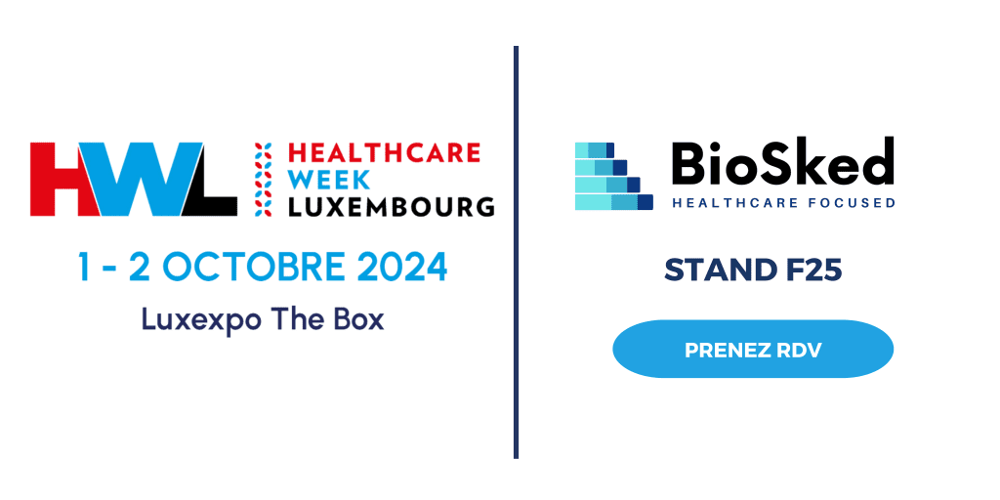

La gestion des plannings dans les établissements de santé est un défi complexe et souvent chronophage. Entre les contraintes organisationnelles, les désidératas des médecins, et la gestion des gardes et des absences, il est facile de se retrouver submergé. Une planification inadéquate peut non seulement perturber le fonctionnement de l’établissement, mais aussi affecter la qualité des soins.

## **Les conséquences d’une mauvaise planification**

Une planification mal adaptée peut entraîner :

1. **Un risque accru de Burnout** : Des plannings mal équilibrés, qui ne tiennent pas compte des besoins individuels, peuvent mener à une surcharge de travail et à un manque de repos.
2. **Une diminution de la qualité de vie au travail (QVT)** : Des horaires imprévisibles ou excessivement chargés peuvent nuire à l’équilibre entre vie professionnelle et personnelle.
3. **Des impacts sur la qualité des soins** : Des équipes fatiguées sont plus susceptibles de commettre des erreurs, mettant en danger la sécurité sur la qualité des soins des patients.

## **Simplifiez votre gestion des plannings avec Momentum**

Un défi commun dans les services des établissements de santé est la complexité de gérer les plannings des équipes, ce qui peut entraîner des déséquilibres dans les charges de travail et des erreurs dans l’allocation des ressources.

Grâce à son algorithme intelligent et son intelligence artificielle avancée, Momentum génère des plannings équilibrés et optimisés en tenant compte des contraintes spécifiques de chaque établissement. Notre application de planification automatique facilite la gestion des horaires en temps réel, améliore la communication et réduit les erreurs humaines, tout en intégrant les compétences et préférences des employés.

Les résultats observés chez les radiologues et médecins de garde du HUB Luxembourg, utilisateurs de Momentum, illustrent l’efficacité de notre solution dans la création de plannings équitables et optimisés.

## **Des avantages pour tous les acteurs de l’établissement de santé**

- **Pour les médecins et assistants** : Une transparence totale sur les plannings, une répartition équitable des tâches, et une meilleure communication.

- **Pour les chefs de service et responsables plannings** : Réduction du temps de création des plannings, optimisation des ressources humaines, et gestion centralisée des demandes.

- **Pour la direction d’établissement** : Moins d’erreurs de planning, meilleure visibilité sur les heures travaillées, et une meilleure rentabilité des services.

- **Pour les patients** : Moins d’absences imprévues, meilleure prise en charge, et réduction des délais d’attente.

## **Rencontrez-nous au Congrès HWL 2024 !**

Nous serons présents au Congrès HWL 2024, un événement incontournable pour les professionnels des établissements de santé. Visitez notre stand F25 pour découvrir comment Momentum peut transformer la gestion des plannings dans votre établissement.

Pourquoi nous rendre visite ?

- **Démonstrations en direct:** Assistez à des démonstrations de notre solution en action.

- **Échanges personnalisés** : Discutez de vos défis en planification avec nos experts.

- **Témoignages clients** : Découvrez les expériences d’autres établissements de santé qui utilisent déjà Momentum avec succès.

Ne manquez pas cette occasion de découvrir une solution innovante qui peut améliorer l’efficacité de votre établissement et la qualité des soins prodigués aux patients. Prenez rendez-vous durant le congrès HWL juste [**ICI**](/fr/ressources/). Pour toutes question contactez-nous à [support@biosked.com](mailto:support@biosked.com) ou découvrez en plus sur notre page web dédiée aux établissements de santé [**ICI**](/fr/secteurs-soins/etablissements-de-sante/).
