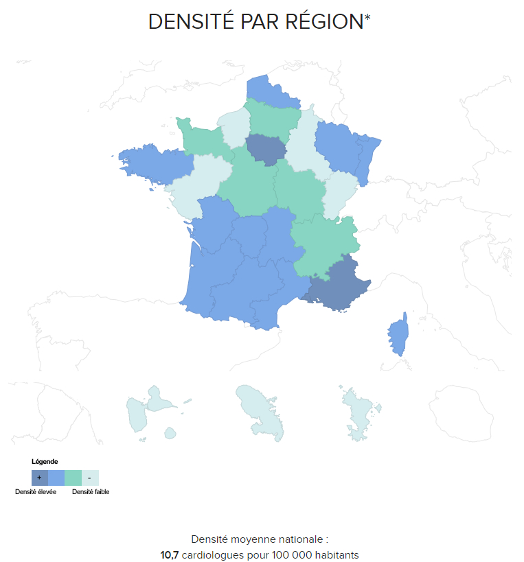

Les maladies cardiovasculaires forment un ensemble de troubles qui affectent le cœur et les vaisseaux sanguins. Infarctus et AVC représentent les premières causes de mortalité dans le monde, avec près de 15 millions de décès chaque année. Quelle est la prévalence des maladies cardiovasculaires et des effectifs médicaux pour prendre en charge une patientèle grandissante en France ?\
Prévalence et causes des pathologies cardio-vasculaires en France

En France, quelque 100 000 personnes sont prises en charge chaque année par l’Assurance Maladie pour un accident vasculaire cérébral aigu, ainsi qu’un demi-million de Français pour ces séquelles. Les dépenses hospitalières de l’Assurance Maladie pour un AVC aigu s’élèvent à environ 1,3 milliard d’euros sur le territoire. Ensemble, AVC et séquelles représentent pour la Sécurité sociale un coût total d’environ 3,5 milliards d’euros.

Dans la plupart des cas, ces maladies cardio-vasculaires peuvent être évitées. Les principaux facteurs de risques sont connus : une mauvaise alimentation, un manque d’activité physique, le tabagisme et une consommation abusive d’alcool. Ces facteurs exogènes peuvent se traduire par une hypertension, une hyperglycémie, une hyperlipidémie, un excès de poids et, in fine, causer des pathologies plus graves.\
Cartographie des effectifs en cardiologie en France\
Tout d’abord, la cardiologie démontre une disparité dans le genre des spécialistes en activité. En effet la DREES et le CNOM avancent que seulement 28 % des spécialistes sont des femmes, dont l’âge moyen d’exercice est de 45 ans (contre 54 ans chez les hommes).\
De plus, en 2019, on dénombre 7 307 cardiologues en France avec une densité moyenne de 10,7 professionnels pour 100 000 habitants. Ces données cachent néanmoins des disparités territoriales, qui témoignent d’un accès inégal aux services de cardiologie en France. En effet, la Haute-Normandie enregistre la répartition la plus faible du territoire (6,15 cardiologues pour 100 000 habitants) tandis que la région PACA dispose en moyenne de 14,8 spécialistes pour 100 000 habitants.

> [Chiffres clés : Cardiologue](https://www.profilmedecin.fr/contenu/chiffres-cles-medecin-cardiologue/)

À l’horizon 2030, selon la DREES et le Conseil National de l’Ordre des Médecins la Haute-Normandie et la Lorraine devraient totaliser une perte de 5% des effectifs en cardiologie, creusant ainsi les disparités observées jusqu’à présent. À l’inverse, la Région Rhône-Alpes devrait renforcer ses effectifs avec un gain de 6 % de cardiologues sur la zone.
