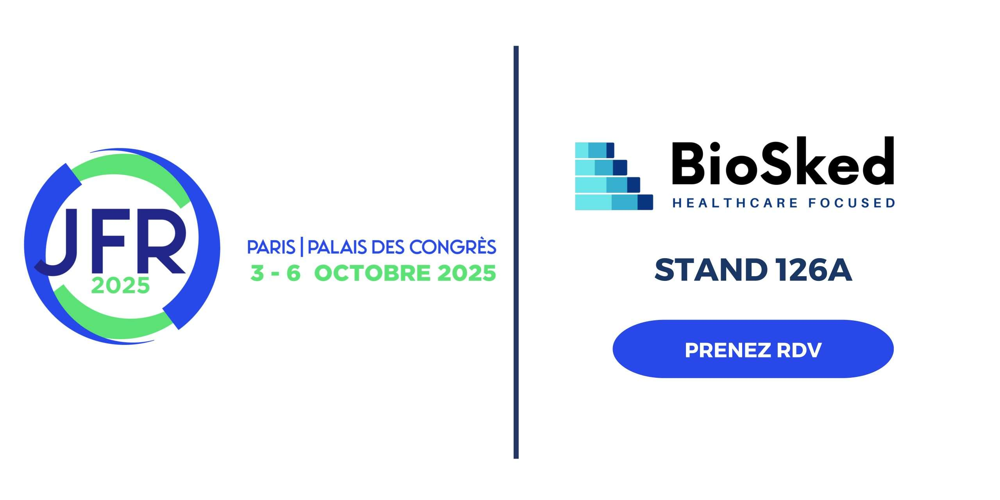

Dans de nombreux services d’imagerie, la planification des équipes reste un défi quotidien. Entre les gardes de nuit, les congés, les absences imprévues et les variations d’activité, les responsables passent encore des heures à jongler avec des tableurs pour équilibrer équité, continuité de service et contraintes légales.

Ces tâches administratives, chronophages et sources de tensions, détournent du temps qui pourrait être consacré à l’essentiel : la prise en charge des patients.

<h3><strong>L’automatisation des plannings : un changement concret</strong></h3>

Des solutions existent aujourd’hui pour transformer cette réalité. Momentum, adopté par plus de <strong>150 services d’imagerie dans le monde</strong>, permet d’automatiser la planification des équipes médicales grâce à l’intelligence artificielle.

Concrètement, cela signifie :

<ul>
<li>D’après les témoignages recueillis auprès de nos utilisateurs, l’adoption de Momentum a conduit à des <strong>gains de temps administratif allant jusqu’à 90%</strong>, un bénéfice mesurable dès les premières semaines d’utilisation.</li>
<li>Plus d’équité dans la répartition des gardes et du temps de travail, réduisant les frustrations.</li>
<li>Agilité opérationnelle : une absence ou une urgence peut être intégrée en <strong>quelques secondes</strong>.</li>
<li>Amélioration de la qualité de vie au travail grâce à plus de transparence et de prévisibilité.</li>
</ul>
<h3><strong>Pourquoi l’IA fait la différence</strong></h3>

Momentum intègre des algorithmes qui prennent en compte en temps réel :

<ul>
<li>les contraintes réglementaires et contractuelles,</li>
<li>les préférences individuelles,</li>
<li>les besoins spécifiques de chaque service.</li>
</ul>

<strong>Résultat : des plannings équilibrés, fiables et prêts en quelques clics.</strong>

<h3><strong>Une solution éprouvée</strong></h3>

Développée depuis <strong>plus de 15 ans</strong>, Momentum s’impose comme une référence du marché, aussi bien dans les grands centres hospitaliers que dans les structures privées. Son succès repose sur trois piliers :

<ul>
<li>Une technologie évolutive intégrant les dernières avancées en IA,</li>
<li>Une expertise métier reconnue auprès des équipes d’imagerie,</li>
<li>Un accompagnement personnalisé pour chaque service.</li>
</ul>
<h3><strong>Venez nous rencontrer aux JFR 2025</strong></h3>

<strong>Du 3 au 6 octobre 2025</strong>, l’équipe BioSked sera présente aux <strong>Journées Francophones de Radiologie</strong>. 
📍 Retrouvez-nous sur le<strong> stand 126A</strong> pour découvrir en direct comment Momentum peut transformer la gestion de vos plannings.

👉 Planifiez dès maintenant votre rendez-vous avec notre équipe juste <a href="/fr/ressources/">ici</a>.

