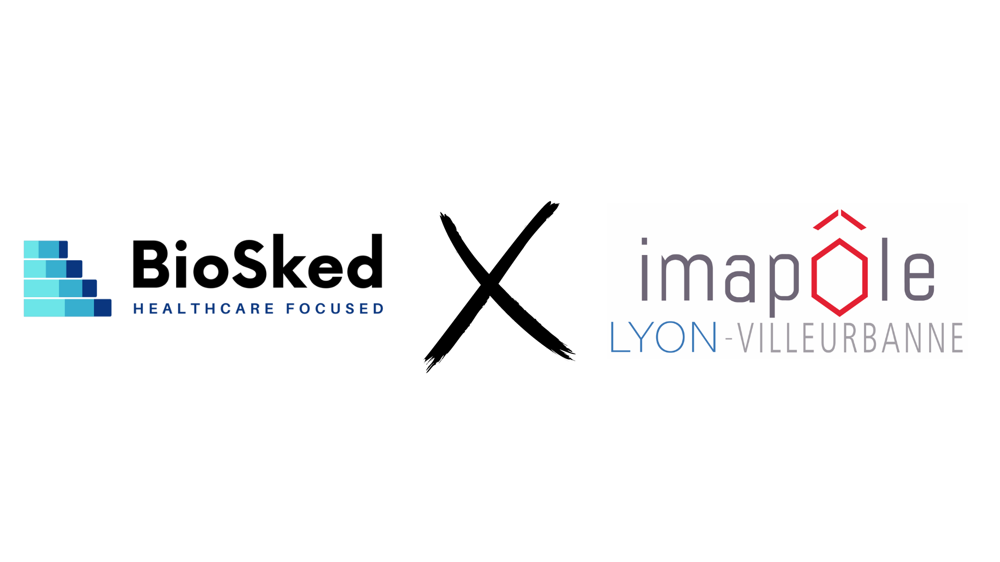

En radiologie, la problématique de la planification des médecins comme du personnel est prépondérante.

Tantôt dans la **construction**, la **gestion** ou encore la **diffusion** aux équipes, le responsable planning perd un temps considérable dans cette mission. Les différentes **attentes** et **règles** selon les sites, les **besoins** et **désidératas** de tous les membres de l’équipe doivent cohabiter pour aboutir à un **planning équitable**. Alors comment optimiser les vacations médicales ?

C’est ainsi qu’avec Mr Samir Lounis, Directeur Exécutif d’Imapôle Lyon-Villeurbanne, nous est venu l’idée d’animer un webinar en collaboration. Sensibiliser et informer sur ce sujet permet de soulever les difficultés auxquelles chaque groupe de radiologie peut faire face dans la planification, que vous soyez médecin, collaborateur, administrateur ou encore responsable planning.

Retrouvez donc en 3 temps notre webinar “La planification dynamique, un outil d’efficience en imagerie” :

1. Un tour d’horizon de la **planification dynamique**
2. L’optimisation des **vacations médicales** grâce à un outil de planification spécialisé dans l’imagerie médicale
3. Les **bénéfices immédiats** à tous les niveaux (médecins, personnel, administration et direction) au sein de l’établissement de santé

Le lien du replay est disponible en cliquant juste [ici](/fr/ressources/). Nous vous souhaitons un bon visionnage !

N’hésitez pas à nous contacter sur info@biosked.com pour plus d’informations.

