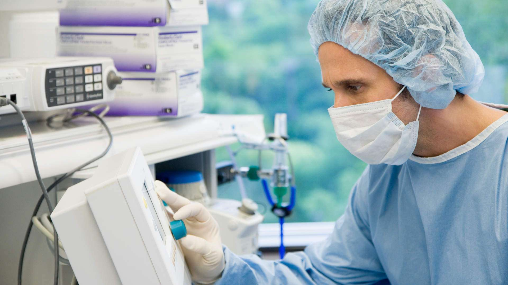
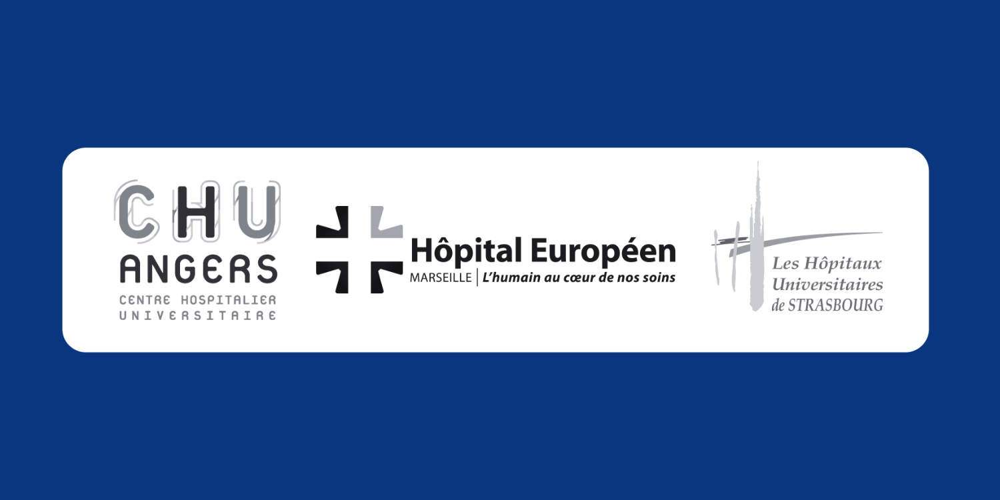
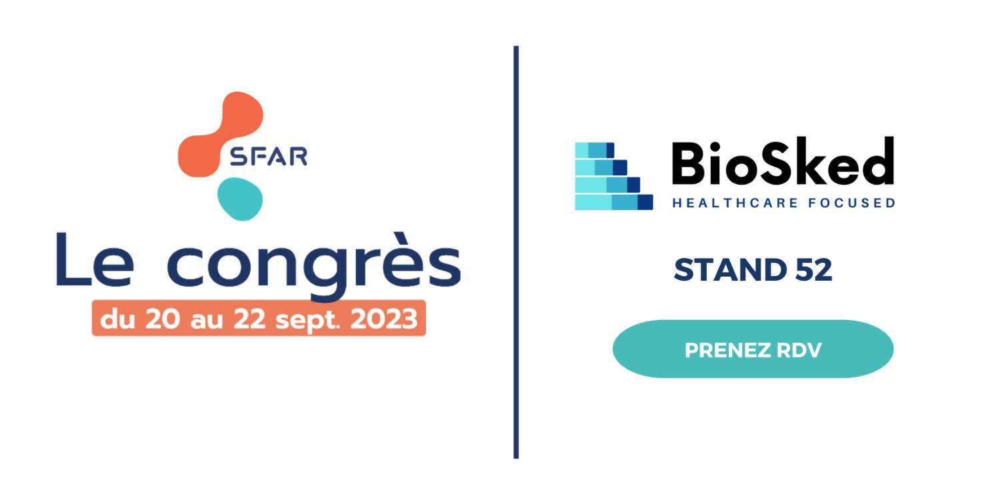

## BioSked continue de marquer son empreinte dans le secteur de la planification médicale, notamment en anesthésie, et sera présent à la SFAR.

Momentum a déjà trouvé sa place au sein de nombreux blocs opératoires

Notre solution de planification automatique et équitable a été conçue pour répondre aux besoins de tous les acteurs du bloc opératoire, de l’anesthésiste au personnel infirmier et aux secrétaires médicales. Elle s’adapte aux spécificités de chaque équipe, garantissant une planification fluide et efficace.

Momentum est actuellement aux côtés des différentes équipes d’anesthésistes-réanimateurs du CHU Strasbourg, du CHU Angers, de l’Hôpital Européen de Marseille, et bien d’autres… pour relever efficacement et rapidement leurs défis en matière de planification.

## BioSked au Congrès National de la Société Française d’Anesthésie et de Réanimation (SFAR) du 20 au 22 Septembre 2023 au palais des congrès de Paris.

Avec près de 6 000 participants chaque année en France, la SFAR offre une plateforme idéale pour mettre en lumière les dernières avancées et les innovations dans le domaine médical. C’est dans ce cadre prestigieux que nous vous invitons à nous rejoindre directement au stand 52 afin d’échanger avec nos équipes ou vous pouvez également prendre rendez-vous en cliquant <strong><a href="/fr/ressources/" target="_blank" rel="noopener noreferrer">&gt;&gt;ICI&lt;&lt;</a></strong>.

Que vous ayez la charge de la planification des blocs opératoires, des consultations, des gardes, des astreintes ou des absences, Momentum simplifie la gestion des plannings au quotidien.

Avec plus de 12 années d’expérience dans la gestion des plannings pour les équipes médicales et paramédicales, découvrez lors de la SFAR comment Momentum peut transformer la gestion de votre service d’anesthésie, améliorer l’efficacité opérationnelle, tout en rehaussant la qualité des soins que vous offrez.

Pour en savoir plus, contactez-nous sur info@biosked.com ou découvrez en plus sur notre page web dédiée aux services d’anesthésies <a href="/fr/secteurs-soins/anesthesie/" target="_blank" rel="noopener noreferrer"><strong>&gt;&gt;ICI&lt;&lt;.</strong></a>
