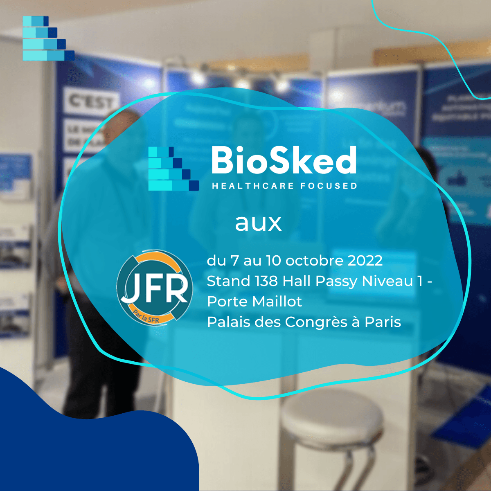

<strong>Les JFR 2022</strong> approchent à grands pas. Cette année, la thématique porte sur le parcours de soins des patients à l’heure du numérique en santé. BioSked vous propose de revenir sur chacune des composantes de ce sujet.

<h3></h3>
<h3><strong>La e-santé</strong></h3>

Dans le domaine de la santé, la digitalisation s’est imposée comme indispensable à différents niveaux : pré-accueil du patient, son admission, ses examens, ses résultats, son suivi…

Cette santé numérique permet ainsi d’avoir une <strong>centralisation de l’information médicale</strong> pour mieux communiquer entre tous les acteurs (patient, médecin, assurance maladie, complémentaire, mutuelle…). 
Il s&rsquo;agit d’un réel <strong>gain de temps</strong> pour chaque partie avec une fiabilité des informations et l’assurance du secret médical, même sous cette forme digitale.

Cependant, il n’existe pas qu’une seule forme de e-santé car elle peut se traduire sous des articles de blog, des podcasts, des articles universitaires, des interviews… à <strong>caractère éducatif</strong> et (re)trouvables facilement en ligne. 
Le but étant de <strong>sensibiliser sur la santé de chacun,</strong> quelle que soit son avancée (ou non) de la maladie.

Le numérique en santé n’en est qu’à son début en termes d’innovations.

<h3></h3>
<h3><strong>L’importance du parcours de soins patients</strong></h3>

À l’image de la e-santé, le parcours de soins patients est lui aussi primordial pour toutes les étapes des personnes recevant des soins médicaux. 
Nous faisons ici référence à la <strong>prévention</strong>, la <strong>consultation</strong>, le <strong>diagnostic</strong>, la <strong>prise en charge</strong> ainsi que le <strong>suivi</strong>.

Un bon parcours de soins patients implique nécessairement une <strong>fluidité de communication</strong> entre les équipes médicales et paramédicales, la<strong> transparence de l’information</strong> pour toutes les parties prenantes, une <strong>rapidité de prise en charge</strong> (passant indéniablement par un <strong>accueil patients irréprochable</strong>). Néanmoins, tous ces attendus ont une solution en commun : <strong>l’automatisation</strong> de ce parcours de soins.

Côté patients, cela donnera l’envie d’être reconnaissant de cette bonne volonté et efficacité. De (très) bons avis pourront être laissés sur votre fiche d’établissement ou donnés à leurs proches, et à vos équipes directement. Mais aussi, une envie de revenir dans votre établissement et in fine, une (très) bonne image.

Côté équipes médicales et paramédicales, la<strong> fluidité et la rapidité de l’exécution des missions de chacun</strong> seront observées. Qui dit parcours de soins de patients optimisé dit digitalisation à certaines étapes de celui-ci. 
Nous pouvons notamment penser à l’accueil patients, la prise en charge, le diagnostic, le suivi qui peuvent être automatisés en partie pour permettre la <strong>diminution de tâches chronophages.</strong>

Ainsi, <strong>bonne réputation (</strong>digitale comme réelle), <strong>bonne entente entre toutes les équipes</strong> avec une <strong>amélioration de la communication et de la productivité</strong> ne sont que des bénéfices pour votre établissement à la suite d’un <strong>parcours de soins patients optimal.</strong>

&nbsp;

<h3><strong>La place de l’intelligence artificielle dans la santé</strong></h3>

Depuis de nombreuses années maintenant, l’intelligence artificielle (IA) n’est plus à présenter. 
Apporteuse d’avantages considérables dans la pratique de nombreux secteurs, sa place centrale dans le domaine de la santé reste toujours impressionnante.

L’imagerie médicale y échappe encore moins en étant très fortement équipée par des appareils et logiciels l’utilisant. IRM, scanner, appareils de radiographie standard, logiciels de compte-rendu, pour ne citer qu’eux, en font partie.

Tout comme la e-santé et la digitalisation du parcours patients, cette innovation technologique qu’est l’IA promet des résultats décisifs. 
Prenons la <strong>diminution drastique du temps de diagnostic</strong>. A elle seule, elle engendre non seulement la <strong>rapidité de prise en charge</strong>, et donc de suivi patients, mais aussi la <strong>productivité du service de radiologie</strong> qui peut travailler plus efficacement, rapidement sans peur de perte d’informations pour eux ni pour le patient. À condition de digitaliser un minimum le parcours de soins patients !

À ces trois niveaux, l’heure du numérique en santé est bien plus que nécessaire pour faciliter l’accès aux informations aux différentes parties prenantes et fluidifier l’ensemble des équipes et du service de radiologie. Rendez-vous aux JFR pour mieux connaître les dernières technologies et innovations en termes de digitalisation pour ce fameux parcours de soins patients.

&nbsp;

<h3><strong>Et BioSked dans tout ça ?</strong></h3>

Quant à BioSked, nous serons présents pour la cinquième fois consécutive aux JFR 2022 pour faire découvrir notre logiciel de <strong>planification automatique pour médecins et collaborateurs.</strong>

Momentum s’inscrit dans ce changement digital par l’optimisation de vos plannings professionnels et l’amélioration de la communication entre vos équipes, en amont du suivi patients. <strong>Profitez ainsi d’un planning vacations optimisé et automatique</strong> pour <strong>améliorer</strong> ensuite le suivi de vos rendez-vous patients.

<strong>Rencontrons-nous au stand 138 !</strong>

<em><strong><a href="/fr/ressources/" target="_blank" rel="noopener">Prendre rendez-vous</a></strong></em>

