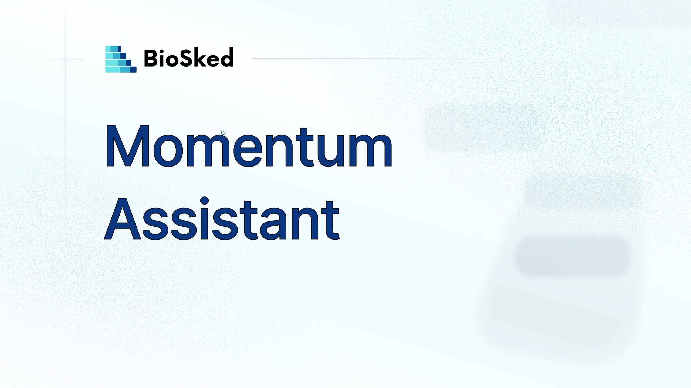

Dans un service des urgences, la gestion du planning ne s’arrête pas à sa construction. Chaque jour, ce sont des dizaines d’interactions informelles : horaires demandés par téléphone, échanges de gardes via WhatsApp, indisponibilités signalées par email. Non tracées, non centralisées, ces sollicitations mobilisent une partie significative du temps du chef de service, pour des questions auxquelles le planning devrait répondre seul.

Les outils de planification ont été conçus pour les administrateurs derrière un bureau. Pas pour les praticiens entre deux consultations.

## Momentum Assistant : le planning accessible depuis le terrain

BioSked lance Momentum Assistant, un assistant IA intégré à l’application mobile Momentum. En langage naturel, par message écrit ou à la voix, chaque praticien accède à son planning, formule ses demandes et reçoit une réponse en temps réel — sans portail, sans appel, sans intermédiaire.

Concrètement :

- **Consulter son planning** : « Est-ce que je travaille ce week-end ? » Réponse immédiate depuis le téléphone
- **Demander un échange de garde** : la demande est formalisée, transmise au circuit de validation et tracée — sans échange WhatsApp informel
- **Vérifier la couverture** : « Qui est disponible demain matin en SMUR ? » L’assistant analyse le planning en temps réel et présente les compétences et les disponibilités
- **Identifier le temps de travail additionnel (TTA) disponible** : liste des quotas restants par praticien, pour une sollicitation équitable et traçable en quelques secondes

## Ce qui change pour le chef de service

Moins d’appels entrants, moins d’interruptions, moins de canaux informels non tracés. Les demandes d’échange, les vérifications de disponibilité, les questions sur les TTA transitent désormais par un canal unique et structuré. Le chef de service reste décisionnaire — l’assistant ne valide rien sans confirmation humaine — mais il n’est plus le passage obligé pour chaque question opérationnelle.

## Un assistant conçu pour le cadre hospitalier

Momentum Assistant est connecté aux données réelles de Momentum, aux droits définis par l’établissement et aux contraintes réglementaires de chaque service. Hébergement dans l’Union européenne, consentement explicite, interactions auditables. L’objectif : rendre les opérations de planning plus accessibles et plus rapides, sans sortir du cadre de contrôle de l’établissement.

Momentum Assistant entre actuellement en phase de bêta contrôlée, au sein de la nouvelle application mobile Momentum qui remplace progressivement l’ancienne.

## Découvrez Momentum Assistant au Congrès des Urgences 2026 — Stand n°75 | 3-5 juin, Paris

Testez l’assistant en démonstration live sur des scénarios de planning d’urgences réels : demande d’échange par message ou à la voix, visualisation des TTA en temps réel.

Envie de voir Momentum Assistant appliqué à votre service ? [Demandez une démonstration personnalisée](/fr/demo/).
