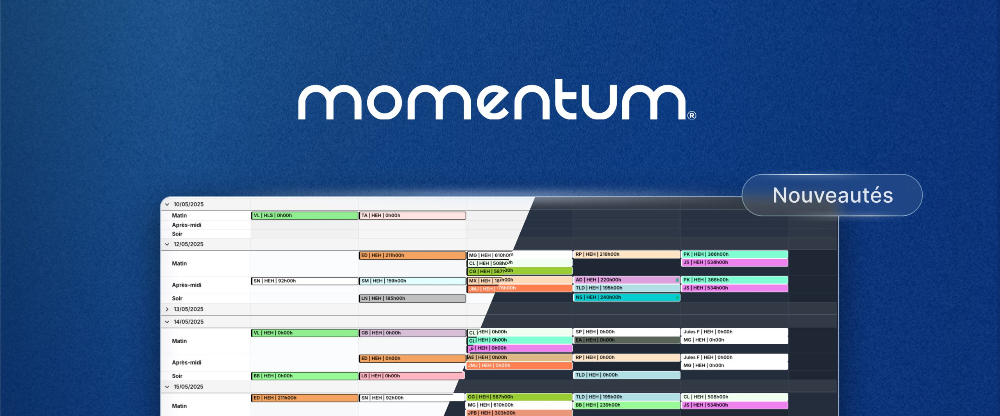

Moins de clics, plus de fluidité. Voici ce que la dernière mise à jour de Momentum change concrètement dans votre quotidien.

<h3>🌙 Mode sombre, clair ou automatique</h3>

Choisissez l’interface qui vous convient : sombre, claire, ou automatique selon vos préférences système. Moins de fatigue visuelle lors des sessions prolongées, surtout en garde de nuit.

<h3>⚡Création d’affectations en un clic</h3>

Ajoutez une affectation directement depuis le calendrier. Date, rôle, personnel, lieu, tout est prérempli selon vos filtres actifs. Ce qui prenait plusieurs étapes n’en prend plus qu’une.

<h3>🔍 Recherche instantanée</h3>

Tapez un nom, une date ou un lieu : Momentum trouve l’affectation immédiatement. Plus besoin de naviguer entre les vues.

<h3>✅ Multi-sélection</h3>

Publiez ou dépubliez plusieurs affectations en une seule action. Sélectionnez toute une ligne ou une colonne en un clic pour les modifications en masse.

<h3>⌨️ Raccourcis clavier</h3>

Pour les utilisateurs avancés :

N : Créer une affectation 
F : Modifier le filtre actif 
Ctrl+K / CMD+K : Recherche rapide

<h3>Déjà déployé à grande échelle</h3>

Plus de 1 000 sites hospitaliers utilisent Momentum au quotidien. 
Résultat : jusqu’à 90 % de temps administratif économisé. Du temps libéré pour la qualité des soins et le bien-être de vos équipes.

&nbsp;

