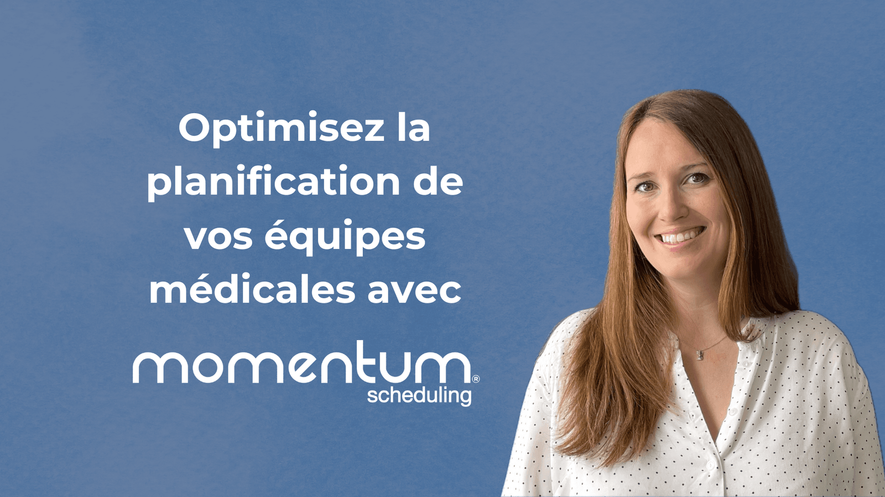

Nous sommes ravis de partager avec vous un <a href="https://www.sih-solutions.fr/momentum-pense-aux-bien-etre-des-medecins">article rédigé par SIH Solutions</a>, un média référence dans le domaine des systèmes d&rsquo;information hospitaliers, qui met en lumière notre solution innovante, Momentum. 

 Depuis plus de 12 ans, Momentum optimise la planification des équipes médicales en Europe et aux Etats-Unis. En 2021, notre solution a été relancée sous l&rsquo;étendard de BioSked, une entreprise en pleine croissance. Voici les grandes lignes de l&rsquo;article de SIH Solution sur Momentum. 

<h2><b>Une solution complète pour une gestion optimisée</b> </h2>
<h3>Algorithmes intelligents et suivi du personnel</h3>

SIH Solution souligne que Momentum se base sur des algorithmes avancés permettant un suivi optimal du personnel médical, une réduction des erreurs de planification, et une optimisation des taux de remplissage des plannings. Cette automatisation de la gestion des imprévus est intégrée dans un planning centralisé accessible via une solution SaaS, permettant ainsi de contrôler le planning plutôt que de le subir, comme l’explique Sarah Mertz, co-fondatrice de BioSked. 

<h3>Gain de temps et réduction du Stress</h3>

L&rsquo;article de SIH Solution met en avant les bénéfices significatifs de Momentum : réduction de 20 % des heures supplémentaires, 80 % du temps passé à construire le planning, et 95 % des absences imprévues. Ces gains se traduisent par une réduction du stress, une meilleure maîtrise des coûts, et un respect accru des réglementations, améliorant la qualité de vie des planificateurs et des équipes médicales. 

<h2><b>Communication simplifiée grâce à l&rsquo;application mobile</b> </h2>
<h3>Une gestion transparente et pratique</h3>

SIH Solutions montre comment l&rsquo;application mobile de Momentum révolutionne la gestion et la communication des plannings médicaux. Les utilisateurs peuvent consulter leur planning, soumettre des demandes d&rsquo;absence, et recevoir des notifications directement sur leur téléphone, offrant une gestion transparente. 

<h3>Fonctionnalités avancées</h3>

L’article souligne les fonctionnalités avancées de l&rsquo;application mobile, comme la gestion des échanges d&rsquo;affectations et l&rsquo;accès en temps réel à la liste de garde. Momentum facilite la communication entre les équipes médicales et administratives, avec des notifications personnalisables et une intégration facile avec les calendriers existants, en faisant un outil indispensable pour la coordination des professionnels de santé. 

<h2><b>Une solution adaptée à toutes les spécialités</b> </h2>
<h3>Développement et adaptation continue</h3>

SIH Solutions raconte comment Momentum, initialement développée pour les radiologues, s&rsquo;est adaptée aux besoins de toutes les spécialités médicales. Intégrée aux systèmes d’information radiologique (RIS), elle affiche la présence des médecins en salles d’examens et optimise la prise de rendez-vous des patients. Franck Dechildres, utilisateur de Momentum dans son groupe de radiologie à Lille, témoigne des avantages de cette intégration. 

<h3>Une Évolution Permanente</h3>

Utilisée par plus de 100 groupes en France, Momentum évolue constamment pour inclure l&rsquo;ensemble des ressources humaines en lien avec l’activité médicale. BioSked suit de près les opportunités numériques, faisant de Momentum une solution en constante évolution pour répondre aux besoins organisationnels des professionnels de santé, tant dans les groupes privés que publics. 

Nous remercions SIH Solutions pour cet article sur Momentum. En soulignant les avantages de notre solution SIH Solutions démontre comment Momentum transforme la planification des équipes médicales. Les bénéfices mesurables en termes de temps, de réduction de stress et de respect des réglementations confirment que Momentum est bien plus qu’un simple outil de planification : c’est une véritable alliée pour les établissements de santé en quête d’efficacité et d’innovation. 

