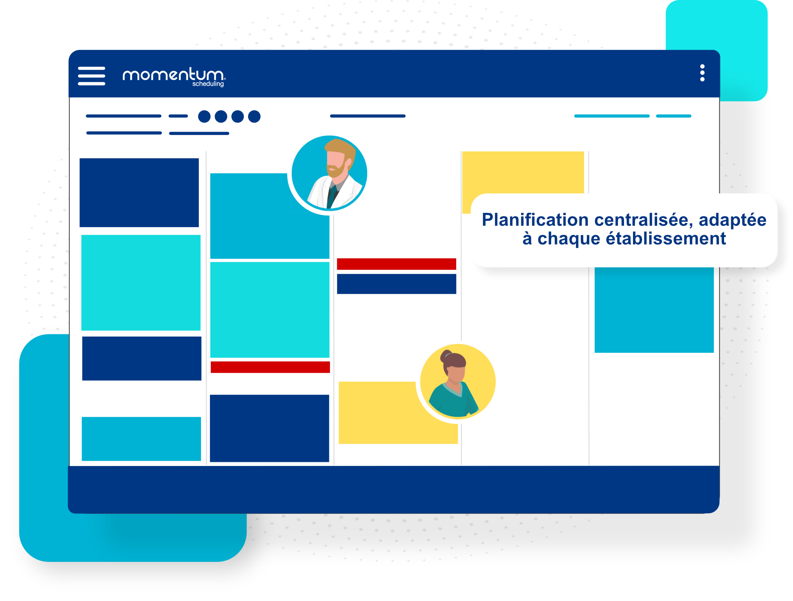

				
				
				
				
				
				
				

				

				
				
				
				
				

				
				
				
				
				
<h3>C’est officiel : nous lançons notre offre de planification automatique Momentum dédiée aux services d’anesthésie !</h3>

Depuis fin 2021, notre application de planification optimisée Momentum rencontre un grand succès auprès de nos premiers clients anesthésistes en clinique et en centre hospitalier.

			

				
				
				
				
				

Notre <strong>solution de planification automatique et équitable</strong> dédiée à tous les anesthésistes-réanimateurs, IADES et secrétaires, s’adapte désormais à toutes les contraintes des blocs opératoires. En quelques clics, vous pourrez désormais satisfaire l’ensemble des contraintes de vos équipes, et faciliter la gestion aux administrateurs plannings.

Avec Momentum de BioSked, il est désormais temps d’améliorer la diffusion et la visibilité de vos plannings, en plus d’<strong>optimiser la construction de vos plannings en fonction de l’activité chirurgicale</strong>, des ressources disponibles, et des objectifs et compétences de chacun.

Planifiez votre activité de bloc, ainsi que vos consultations, vos gardes et astreintes, et vos absences directement sur notre application en ligne accessible depuis vos mobiles.

			

				
				
				
				
				
				
				

					

				
				
				
				
				
				
				

					
            

                
            

				

			

				

			

				
				
				
				
				

C’est avec plus de 10 ans d’expérience dans la gestion des plannings pour les équipes médicales et paramédicales en imagerie médicale notamment, que nous poursuivons notre développement dans le secteur de l&rsquo;anesthésie privée et publique.

<strong>Afin de fêter ce lancement officiel, profitez d’une offre préférentielle jusqu’au 31 décembre 2022 pour toute nouvelle commande en anesthésie.</strong>

Pour en savoir plus, contactez-nous sur info@biosked.com ou demandez votre démonstration personnalisée.

			

				<a class="et_pb_button et_pb_button_1 et_pb_bg_layout_dark" href="/fr/ressources/" target="_blank" data-icon="5">Demandez votre démo personnalisée</a>
			

			

				
				
				
				
			

				
				
			

