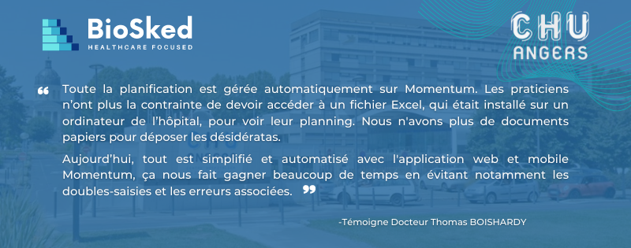

## Momentum, une solution désormais dédiée pour les services d’urgences

Notre solution de planification automatique et équitable, conçue pour les médecins spécialistes (Radiologie, Cardiologie, Anesthésie…) et leurs équipes, est maintenant dédiée aux contraintes spécifiques des services d’urgences. En quelques clics, la solution Momentum s’adapte aux problématiques d’organisation et d’horaire pour relever les nombreux défis auxquels sont confrontés les services d’urgences.

Grâce à Momentum par BioSked, il est maintenant temps de faciliter la gestion des plannings d’urgentistes, d’améliorer la diffusion et la visibilité des plannings tout en optimisant la construction en fonction des médecins disponibles, ainsi que des désidératas, objectifs et contrats de chacun.

La gestion des gardes et des différentes activités, ainsi que la nécessité de respecter l’équité entre les médecins pour les jours fériés, les week-ends… font de Momentum la solution idéale pour construire automatiquement des plannings d’équipes accessible depuis vos appareils mobiles.

## Ce sont nos clients qui en parlent le mieux !

Aujourd’hui, BioSked aide des équipes d’urgentistes qui font désormais face à leurs défis de planification avec Momentum, notamment le CHU d’Angers, utilisateur de Momentum depuis 2022.

Déjà présent dans le service d’Anesthésie, Momentum a su répondre également aux problématiques des services d’Urgences du CHU d’Angers. L’objectif principal était de mettre en place une application de planification permettant d’automatiser la création des plannings, afin de réduire au minimum les interventions humaines nécessaires pour les générer.

Momentum a permis de nombreux changement dans la pratique quotidienne du service d’urgences, avec des fonctionnalités clés et un gain de temps considérable qui évite les multiples saisies manuelles.

C’est avec plus de 10 ans d’expérience dans la gestion des plannings pour les équipes médicales et paramédicales en imagerie médicale notamment, que nous poursuivons notre développement dans le secteur des urgences.

Pour en savoir plus, contactez-nous sur [info@biosked.com](mailto:info@biosked.com) ou découvrez en plus sur notre site web dédié aux urgences [Cliquez **ICI**](/fr/secteurs-soins/urgences/)
