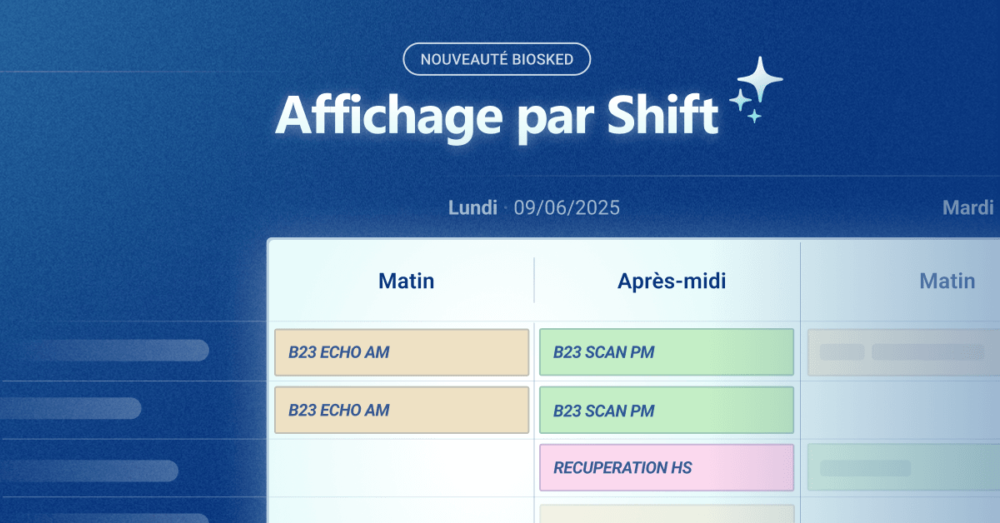

Pensée pour tous les établissements de santé, quelle que soit leur spécialité, **Momentum** est la solution intelligente de planification conçue pour optimiser les plannings, améliorer la visibilité en temps réel et faciliter la coordination des services. Intuitive et puissante, elle s’adapte aux contraintes de plus de **30 000 utilisateurs** quotidiens répartis dans plus de **1 000 établissements** de santé à travers **9 pays**.

Qu’il s’agisse d’un hôpital public, d’un centre d’imagerie ou d’un bloc opératoire, la réalité opérationnelle impose une organisation par **shifts** :\
☀️ Matin – 🌤 Après-midi – 🌙 Soir / Nuit.

Pour répondre encore mieux aux besoins des équipes de terrain, **Momentum** innove et propose désormais **une nouvelle vue des plannings par shift**, directement alignée avec le fonctionnement quotidien des structures de soins.

*“Nous sommes très satisfaits : c’est exactement ce que nous attendions. Cela nous offre une meilleure visibilité et réduit considérablement les erreurs liées aux modifications manuelles. Le processus est bien plus rapide, et la visualisation des paramètres d’affectation dans un bandeau latéral lorsqu’on clique sur une case est un vrai plus. On garde une excellente lisibilité du planning” – Témoigne Axelle Braun, Administratrice de planning en radiologie au sein du CHU Brugmann.*

## Une vue plus intuitive, pensée pour le quotidien hospitalier

Fini les plannings linéaires difficilement lisibles en pleine activité. Grâce à cette mise à jour, les équipes accèdent en un coup d’œil à une vision claire et structurée :

- **Quel radiologue est présent ce matin ?**
- **Qui prend le relais au bloc cet après-midi ?**
- **Quelles ressources seront en récupération demain matin ?**

Cette nouvelle fonctionnalité facilite la lecture des plannings, améliore la coordination entre les équipes, et réduit les risques d’erreurs ou de doublons.

## Les bénéfices concrets pour les utilisateurs

✅ **Lisibilité renforcée** : la répartition par shift reflète fidèlement le rythme du terrain.\
✅ **Meilleure réactivité** : les équipes savent instantanément qui est présent à quel moment.\
✅ **Expérience utilisateur optimisée** : la navigation dans l’outil devient plus fluide et intuitive.

## Déjà disponible pour de nombreux établissements

Cette nouvelle vue est d’ores et déjà accessible pour :

🏥 Hôpitaux publics & privés\
📸 Services d’imagerie médicale\
🚑 Services d’urgence\
💉 Blocs opératoires\
… et bien d’autres structures utilisant Momentum au quotidien.

Comme toujours, ces nouvelles fonctionnalités sont développées en étroite collaboration avec les professionnels de santé, dans un seul but : **faciliter l’accès aux soins** et **alléger la charge administrative**.

Chez BioSked, **nous développons des solutions de planification intelligentes**, pensées pour **s’adapter aux contraintes du terrain**, **valoriser le temps humain** et **répondre aux réalités propres à chaque établissement**. Notre approche allie innovation technologique et expertise métier.

## Vous souhaitez découvrir cette fonctionnalité ?

Nos équipes se tiennent à votre disposition pour l’activer ou vous proposer une démonstration personnalisée.\
Contactez-nous directement via votre interlocuteur habituel, ou faites votre demande directement [ici](/fr/demo/).
