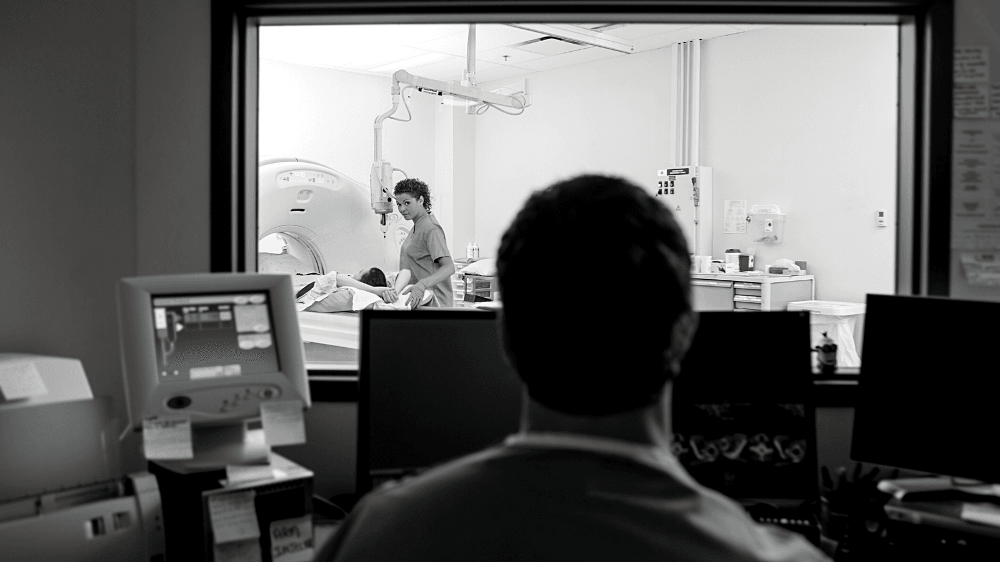

La radiologie est une discipline médicale cruciale, souvent au cœur du processus diagnostique. Pourtant, la gestion efficace de la planification peut être un défi. C’est là qu’intervient Momentum, une solution innovante qui vise à simplifier et à améliorer la planification des équipes en radiologie.

### **Un Planning Juste et Équilibré**

L’un des défis majeurs dans la radiologie est de garantir une répartition équitable des tâches entre les radiologues. Momentum offre une planification automatisée qui prend en compte les contraintes individuelles et les besoins du service. Cela se traduit par un planning plus juste et équilibré pour l’ensemble de l’équipe.

### **Gain de Temps Précieux**

La gestion manuelle des plannings peut être une tâche fastidieuse et chronophage. Avec Momentum, cette charge est allégée grâce à l’automatisation. Les radiologues peuvent ainsi consacrer plus de temps à leur expertise, à l’interprétation des images et à la prise en charge des patients.

### **Adaptabilité aux Flux de Travail**

Chaque service de radiologie a ses propres flux de travail spécifiques. Momentum se distingue par sa capacité à s’adapter parfaitement à ces processus. Il offre une flexibilité inégalée dans la création de plannings sur mesure, permettant ainsi une utilisation optimale des ressources.

### **Intégration Transparente**

L’intégration de Momentum dans l’écosystème informatique d’un service de radiologie est fluide. Il peut se connecter à des systèmes tels que le RIS, la prise de rendez-vous patient, le badgeage, et la gestion de paie. Cela se traduit par des gains de temps substantiels, pouvant aller jusqu’à 1 à 2 ETP.

## Le groupe IMAGIR a déjà adopté Momentum et en a constaté les bénéfices. Les radiologues y ont trouvé une solution qui répond à leurs besoins spécifiques, découvrez comment !

<a href="/fr/cas-clients/imagir-bordeaux/" target="_blank" rel="noopener noreferrer">Téléchargez l'étude de cas</a>

 Momentum représente une avancée significative dans l’optimisation de la planification en radiologie. En offrant un planning plus équitable, une automatisation efficace, une adaptabilité aux workflows et une intégration transparente, cette solution promet d’améliorer significativement la qualité des soins radiologiques.

## Pourquoi utiliser une application de planning automatique dans le service de radiologie?

[Lire la suite](/fr/secteurs-soins/radiologie/)
