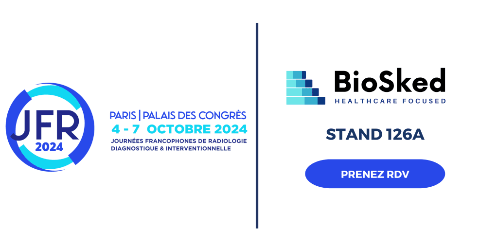

Entre les contraintes horaires, les préférences du personnel et la nécessité de garantir une couverture continue dans la gestion des plannings en radiologie, il n’est pas surprenant que de nombreux services recherchent des solutions plus efficaces. Momentum est la réponse à ces défis.

## **Dites adieu aux ajustements manuels et aux conflits horaires !**

Momentum, notre application de planification automatique, révolutionne la gestion des plannings en radiologie. Grâce à un algorithme intelligent, Momentum génère des plannings optimisés en quelques clics, prenant en compte les besoins spécifiques, la disponibilité et les compétences des radiologues pour une répartition équitable des tâches. Ce que Momentum vous offre :

- **Planification équilibrée** : Répartition équitable des tâches selon les besoins et préférences de chaque radiologue.

- **Accès facile** : Consulter et modifier les plannings en temps réel depuis votre mobile, avec des notifications automatiques pour les mises à jour.

- **Gestion améliorée** : Réduction des absences imprévues et meilleure prise en charge des patients grâce à une planification précise et fiable.

## **Notre expertise dans le secteur de la radiologie**

Aujourd’hui, Momentum est largement adopté par la majorité des groupes de radiologues, y compris par des établissements au sain de regroupement comme notamment Vidi Capital, Oradianse, Simago, et IMdev. Notre solution de planification s’adapte aussi bien aux petites structures, comprenant seulement 3 radiologues, qu’aux grands établissements comptant plus de 150 spécialistes, dans le public comme dans le privé, répartis en France, en Belgique, au Luxembourg et en Suisse (si nous parlons que des prays francophones). De plus, notre référencement au Resah pour les achats publics atteste de notre engagement envers l’excellence et la qualité des services que nous offrons dans le secteur de la santé.

## **Rencontrez-nous aux JFR 2024 !**

Nous serons présents aux Journées Francophones de Radiologie (JFR) au stand 126A. Venez découvrir comment Momentum peut transformer la gestion des plannings de votre service avec :

- **Des démonstrations en direct** : Voyez par vous-même comment Momentum optimise les plannings en temps réel.

- **Des échanges personnalisés** : Posez vos questions à nos experts et obtenez des conseils adaptés à votre service de radiologie.

- **Des témoignages clients** : Découvrez les expériences d’autres centres de radiologie qui utilisent déjà Momentum avec succès.

Ne manquez pas cette opportunité de (re)découvrir une solution innovante qui peut simplifier votre quotidien et améliorer l’efficacité de votre service.

Prenez rendez-vous durant les JFR juste [**ICI**](/fr/ressources/). Pour toutes question contactez-nous à [support@biosked.com](mailto:support@biosked.com) ou découvrez en plus sur notre page web dédiée aux services de radiologie **[ICI](/fr/secteurs-soins/radiologie/)**.
