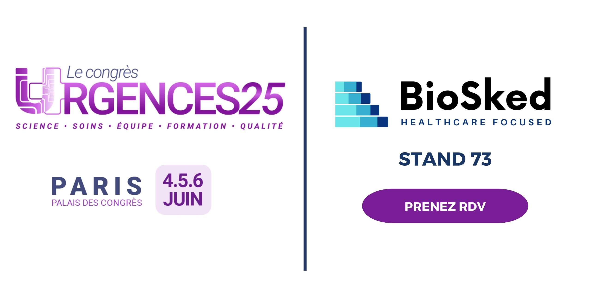

Dans les établissements de santé, assurer une organisation fluide des équipes, surtout en service d’urgence, reste un véritable défi au quotidien. Entre imprévus, pics d’activité, exigences individuelles et contraintes réglementaires, construire des plannings efficaces demande du temps et une grande agilité. Pour accompagner les équipes face à ces enjeux, BioSked continue de développer **Momentum**, une solution intelligente qui depuis plus de 15 ans automatise la planification grâce à la puissance de **l’intelligence artificielle**.

Grâce à Momentum, la création de plannings devient plus simple, plus rapide et plus équitable. Notre technologie analyse les disponibilités, les contraintes réglementaires et les préférences des professionnels de santé pour générer automatiquement des plannings optimisés.\
**Résultat :** un allègement allant jusqu’à 90% du temps consacré à la charge administrative et une amélioration tangible de la qualité de vie au travail.

Pensé pour répondre aux enjeux spécifiques des services d’urgence, Momentum permet de :

- **Réduire le stress organisationnel** lié aux absences et aux modifications de planning de dernière minute
- **Garantir une meilleure répartition des charges** entre les équipes pour une équité optimale
- **Optimiser l’efficacité opérationnelle** sans compromettre la qualité des soins.

Notre mission ? Concilier les contraintes et les préférences individuelles de chaque urgentiste, pour une prise en charge des patients en continue et une satisfaction de vos équipes.

## BioSked au Congrès des Urgences 2025 : rendez-vous stand n°73 au palais des congrès de Paris

Cette année, BioSked participera une nouvelle fois au **Congrès des Urgences 2025**, l’événement de référence pour les professionnels des soins d’urgences. Nous serons présents du 04 au 06 Juin 2025 sur le **stand 73** pour vous faire découvrir toutes les innovations de Momentum ainsi que les bénéfices que notre solution peut vous apporter.

Envie d’optimiser vos plannings tout en renforçant l’engagement de vos équipes ? Venez nous rencontrer !

Nous serons ravis d’échanger avec vous et de vous montrer comment Momentum peut transformer votre quotidien. Vous pouvez dès à présent prendre rdv avec notre équipe lors du Congrès des Urgences 2025 juste [ici](/fr/ressources/).

