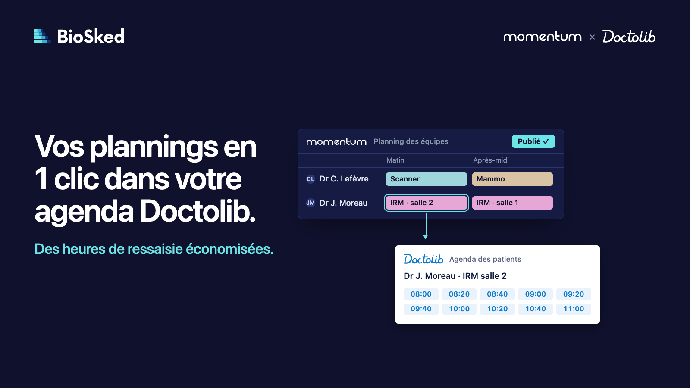
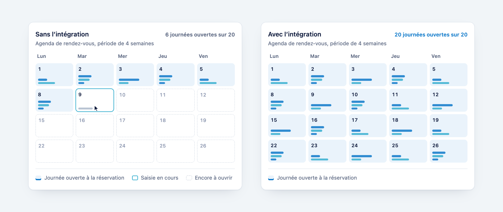

Aux JFR 2026, nous avons annoncé notre partenariat avec Doctolib. Derrière l’annonce, une idée simple que nous défendons depuis longtemps : l’agenda des patients doit découler du planning des équipes. Chaque heure planifiée devient alors un rendez-vous possible.

## Deux outils, une double saisie

Dans un centre d’imagerie, le planning des équipes se construit d’un côté, l’agenda des patients de l’autre. Entre les deux, le secrétariat ressaisit : à chaque nouvelle période, il reporte le planning dans les agendas, journée par journée, praticien par praticien, salle par salle. Quand une vacation occupe plusieurs salles à la fois, le travail se multiplie d’autant.

Ce sont des heures qui ne vont pas à l’accueil des patients, et autant d’occasions de se tromper d’un outil à l’autre.

## Ce que fait l’intégration

Vos trames d’ouverture se gèrent dans Momentum, à partir du planning des équipes. Une trame découpe une vacation en plages d’ouverture, chacune avec ses motifs de consultation. Vous la créez une fois, rattachée à un poste et à une personne, et vous la modifiez simplement quand votre organisation change. Vos journées types Doctolib peuvent servir de base.

Ensuite, à chaque nouvelle période, vous publiez le planning dans Momentum comme d’habitude. Momentum applique les trames, et les plages d’ouverture arrivent dans Doctolib : le bon praticien, dans la bonne salle, avec les bons motifs de consultation. Vos patients réservent en ligne, comme avant.

À chaque nouvelle période, il suffit donc de publier le planning dans Momentum pour ouvrir les agendas Doctolib. Le détail, schémas compris, est sur notre [page consacrée à l’intégration Doctolib](/fr/fonctionnalites/integration-doctolib/).

## Ce qui change pour chacun

**Pour le secrétariat**, il n’y a plus d’agendas à ouvrir journée par journée. Le temps gagné revient à l’accueil des patients.

**Pour le responsable du planning**, les trames se définissent une fois. À chaque période, il construit et publie le planning, comme aujourd’hui, et les agendas suivent.

**Pour la direction**, les agendas s’ouvrent sur toute la période planifiée, dès la publication, sans dépendre d’une ressaisie.

**Pour les patients**, rien ne change : ils prennent rendez-vous dans Doctolib, comme avant.

## Construite avec le terrain

Cette intégration est née des demandes des centres d’imagerie que nous accompagnons. Merci aux équipes de Doctolib et de BioSked, et aux établissements qui y ont travaillé avec nous.

## Comment démarrer

Vous utilisez déjà Momentum et Doctolib ? Notre équipe la met en place avec vous : vos agendas Doctolib, la correspondance des praticiens, des salles et des motifs, puis vos trames.

Vous utilisez Doctolib, mais pas encore Momentum ? Momentum construit d’abord le planning de vos équipes. À chaque publication, vos agendas Doctolib s’ouvrent.

Vous n’utilisez pas Doctolib ? Contactez-nous : nous trouvons toujours une solution, le plus souvent par une intégration avec votre outil de prise de rendez-vous ou votre RIS.

Dans tous les cas, le plus simple est d’en parler à partir de votre organisation : [demandez une démo](/fr/demo/).
