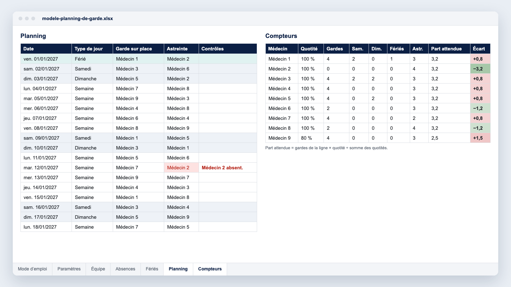

Le planning de garde est le document le plus discuté d’un service médical. Une nuit de trop, un réveillon attribué deux années de suite à la même personne, et c’est la confiance dans tout le planning qui s’effrite. Ce guide rassemble ce que nous observons dans les services qui planifient leurs gardes avec Momentum : le cadre réglementaire à connaître, les compteurs qui rendent l’équité vérifiable, une méthode en six étapes et un [modèle Excel gratuit](#le-modèle-excel-gratuit) pour démarrer.

## Garde sur place, astreinte, temps continu : trois façons de compter

Avant de répartir quoi que ce soit, il faut nommer chaque ligne de garde et sa nature. Une ligne correspond à un besoin de présence ou de disponibilité sur une plage horaire donnée.

- **Garde sur place** : le médecin reste dans l’établissement, la nuit ou sur 24 heures.
- **Astreinte à domicile** : le médecin reste joignable et se déplace si besoin. Le temps d’intervention sur place et le temps de trajet comptent comme du temps de travail effectif.
- **Temps continu** : dans les services organisés en continu, comme les urgences ou la réanimation, le temps de travail se décompte en heures plutôt qu’en demi-journées.

Un service d’anesthésie peut ainsi combiner une garde sur place de 24 heures et une astreinte de deuxième ligne ; un groupe d’imagerie, une astreinte de scanner par site. Chaque ligne a ses horaires, ses participants et ses règles : c’est la base de tout le reste.

## Ce que dit le Code de la santé publique pour les praticiens hospitaliers

Pour les praticiens hospitaliers des établissements publics, l’[article R6152-27 du Code de la santé publique](https://www.legifrance.gouv.fr/codes/article_lc/LEGIARTI000045138028) (version en vigueur depuis le 7 février 2022) fixe les repères suivants :

- la durée de travail ne peut excéder 48 heures par semaine, en moyenne sur une période de quatre mois ; une nuit de travail compte pour deux demi-journées ;
- lorsque l’activité est organisée en temps continu, l’obligation de service est calculée en heures, en moyenne sur quatre mois, et ne peut dépasser 48 heures ;
- au-delà de ses obligations de service, le praticien peut accomplir, sur la base du volontariat, du temps de travail additionnel, récupéré ou indemnisé ;
- il bénéficie d’un repos quotidien minimal de onze heures consécutives par période de 24 heures, garanti après le dernier déplacement survenu au cours d’une astreinte ;
- en cas de nécessité de service, il peut travailler en continu jusqu’à 24 heures ; il bénéficie alors, immédiatement après, d’un repos d’une durée équivalente. C’est ce que l’on appelle couramment le repos de sécurité.

Les autres statuts relèvent d’autres textes ou de règles propres à l’établissement : internes et docteurs juniors, praticiens contractuels, médecins libéraux en clinique ou en groupe d’imagerie. Le nombre maximal de gardes et d’astreintes qu’un praticien peut être tenu d’assurer est fixé par arrêté, et ce texte a été modifié en 2025. Vérifiez la version en vigueur sur Légifrance et faites valider votre organisation par la direction des affaires médicales.

## Ce que veut dire « équitable » : cinq compteurs à suivre

Dans les services où le planning de garde ne fait plus débat, on retrouve presque toujours les mêmes compteurs, tenus par médecin :

1. **Le nombre total de gardes**, rapporté à la quotité de chacun. Un praticien à 80 % n’a pas la même part qu’un temps plein.
2. **Les samedis.**
3. **Les dimanches.**
4. **Les jours fériés.** Ces trois compteurs restent séparés : un dimanche ne vaut pas un mardi, et c’est sur ces jours que les tensions naissent.
5. **Les périodes sensibles** : Noël, le Nouvel An, les ponts, les vacances scolaires. Elles se suivent d’une année sur l’autre, sinon les mêmes personnes y reviennent.

Deux règles rendent ces compteurs crédibles. D’abord, les tenir sur une période longue, l’année ou douze mois glissants, et non sur le mois : un mois n’a que quatre ou cinq week-ends. Ensuite, les montrer à toute l’équipe. Un compteur que seul le planificateur voit ne règle aucun conflit.

**Exemple.** Un service de neuf médecins assure une garde sur place chaque nuit, soit 365 gardes par an. Si les neuf sont à temps plein, chacun en assure environ 40,6. Si l’un d’eux passe à 80 %, la somme des quotités tombe à 8,8 : sa part attendue est d’environ 33 gardes, et celle de chacun de ses huit collègues monte à 41,5. Les 104 samedis et dimanches et les 11 jours fériés de l’année se répartissent de la même façon, compteur par compteur.

## Construire le planning de garde en six étapes

1. **Lister les lignes** avec leurs horaires de début et de fin et leur nature (sur place ou astreinte).
2. **Écrire les règles du service** avant de remplir la première case : qui participe à quelle ligne, nombre maximal de gardes par mois, repos après une garde, pas de garde la veille d’une vacation de bloc si c’est votre règle. Ce sont ces règles, et non le planificateur, qui arbitreront les désaccords.
3. **Collecter les absences et les souhaits** avec une date limite, par exemple six semaines avant la publication. Un souhait arrivé après la date limite passe par un échange.
4. **Remplir dans le bon ordre** : d’abord les contraintes fermes (absences, repos), puis les week-ends et les jours fériés, enfin les nuits de semaine. Les nuits de semaine servent d’ajustement pour équilibrer les compteurs.
5. **Relire avec les compteurs** avant de publier : l’écart de chaque médecin à sa part attendue doit être faible, ou expliqué.
6. **Publier, puis tracer les échanges.** Chaque échange validé met à jour les compteurs ; sans cela, l’équité affichée en janvier ne veut plus rien dire en juin.

## Le modèle Excel gratuit

Pour un service qui démarre ou qui veut remettre de l’ordre dans son tableur, nous avons préparé un [modèle de planning de garde au format Excel](/modeles/modele-planning-de-garde.xlsx) (fichier .xlsx, sans macro). Il contient :

- deux lignes de garde à nommer, par exemple « Garde sur place » et « Astreinte », sur une année complète ;
- l’équipe avec la quotité de chaque médecin, les absences (du, au, motif) et les jours fériés de 2026 à 2028 ;
- une colonne de contrôles qui signale un même médecin deux jours de suite sur une ligne, un même médecin sur les deux lignes le même jour, ou une garde posée pendant une absence ;
- les compteurs par médecin : gardes par ligne, dont samedis, dimanches et fériés, part attendue selon la quotité et écart.

Ses limites sont celles d’un tableur : il ne génère pas le planning à votre place, il couvre un service et deux lignes, et chaque échange se reporte à la main.

## Quand le tableur ne suffit plus

Quelques signaux reviennent souvent : plus de deux lignes de garde ou plusieurs sites, une équipe de plus de quinze ou vingt médecins, des échanges fréquents qu’il faut revérifier un par un, des exports vers la paie pour les indemnités de garde et le temps de travail additionnel, des règles qui dépendent du lendemain (pas de garde avant une vacation lourde, par exemple).

C’est le travail de [Momentum pour les plannings de garde](/fr/fonctionnalites/plannings-de-garde-centralises/) : le logiciel génère le planning à partir des règles du service, tient les compteurs à jour à chaque échange et publie le planning sur mobile. Aux urgences du CHIREC à Braine-l’Alleud, la construction du planning mensuel est passée de 4 jours à 4 à 5 heures (étude de cas, mai 2025). Au CHU d’Angers, le planning de 52 praticiens partagés entre les urgences et le Samu est automatisé, avec des comptes d’heures centralisés et les souhaits saisis sur mobile (étude de cas, 2023).

Voir aussi : [le planning des urgences](/fr/secteurs-soins/urgences/) et [le planning des anesthésistes et des IADE](/fr/secteurs-soins/anesthesie/).

## Questions fréquentes

### Le repos de sécurité est-il obligatoire après une garde ?

Pour les praticiens hospitaliers, l’article R6152-27 prévoit, après une période de travail continue de 24 heures, un repos immédiat d’une durée équivalente. Il garantit aussi le repos quotidien de onze heures après le dernier déplacement d’une astreinte.

### Comment compter une nuit de garde ?

Quand les obligations de service se comptent en demi-journées, une nuit compte pour deux demi-journées. En temps continu, le décompte se fait en heures, en moyenne sur quatre mois.

### Faut-il équilibrer les gardes sur le mois ou sur l’année ?

Sur l’année, ou sur douze mois glissants. Le mois sert à vérifier les contraintes (repos, maximums) ; l’année sert à juger l’équité.

### Un logiciel peut-il respecter nos règles locales ?

C’est le premier critère à vérifier. Dans Momentum, les règles du service (participation par ligne, repos, maximums, équité) sont paramétrées une fois, puis appliquées à chaque génération du planning. Le plus simple est de le voir sur votre propre organisation : [demander une démo](/fr/demo/).
