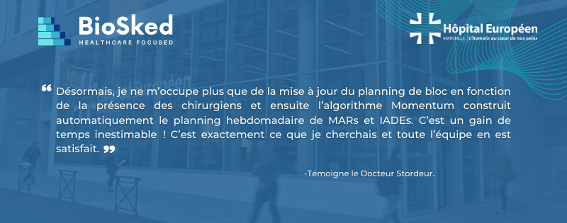

Notre solution de planification intelligente et équitable, conçue pour les médecins permet de faciliter la gestion des plannings d’anesthésistes-réanimateurs et IADES, d’améliorer la diffusion et la visibilité des plannings tout en optimisant la construction en fonction des médecins disponibles, ainsi que de leurs désidératas, les contraintes de chacun et des ouvertures de blocs.

## Ce sont nos clients qui en parlent le mieux !

Aujourd’hui, BioSked avec Momentum aide des équipes d’anesthésistes-réanimateurs, comme le CHU Strasbourg, le CHU Angers, l’Hôpital Européen de Marseille, et bien d’autres… à faire face rapidement et automatiquement à leurs défis de planification grâce à notre intelligence artificielle (IA) dédiée aux contraintes des équipes médicales.

L’objectif principal des anesthésistes de l’Hôpital Européen de Marseille était de mettre en place une application de planning médical permettant un gain de temps et une équité pour les équipes. L’intelligence artificielle Momentum a pu répondre à leurs objectifs comme en témoigne le Docteur Stordeur.

C’est avec plus de 12 ans d’expérience dans la gestion des plannings pour les équipes médicales et paramédicales, que nous poursuivons notre développement dans le secteur des anesthésistes.

Pour en savoir plus, contactez-nous sur [info@biosked.com](mailto:info@biosked.com) ou découvrez en plus sur notre page web dédiée aux anesthésistes [**ICI**](/fr/secteurs-soins/anesthesie/)
