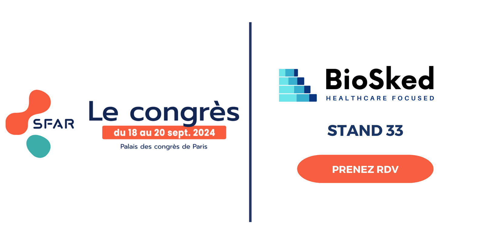

BioSked continue d’innover dans le domaine de la gestion médicale, notamment en anesthésie, et sera présent une nouvelle fois au congrès de la SFAR 2024.

### **Momentum : La Solution avancée de planification automatique**

Grâce à son intelligence artificielle, Momentum prend en considération les compétences spécifiques, les préférences individuelles et les règles prédéfinies pour optimiser la répartition des tâches au sein du service d’anesthésie en prenant en compte les contraintes liées à la gestion des équipes anesthésistes, des blocs opératoires, des médecins de gardes… Voici quelques-uns des avantages clés :

- **Planification équitable et personnalisée** : Momentum garantit une équité dans la répartition des activités des équipes, en tenant compte des besoins et des préférences individuelles des anesthésistes.

- **Accessibilité et agilité** : Accessible via mobile, l’application permet aux équipes de gérer facilement leurs plannings, d’accéder directement à la liste de garde, et de s’adapter rapidement aux changements de dernière minute grâce à des notifications en temps réel.

- **Centralisation des informations** : Essentielle dans les environnements hospitaliers, Momentum centralise les données pour une gestion efficace des internes et des spécialisations.

- **Gestion RH simplifiée** : Automatisation des tâches administratives telles que le suivi des heures, des absences et des vacations spéciales, permettant aux médecins de se concentrer pleinement sur les soins aux patients.

### **BioSked au congrès de la Société française d’anesthésie et de réanimation (SFAR).**

BioSked sera présent au Congrès de la Société Française d’Anesthésie et de Réanimation (SFAR) 2024, offrant une occasion unique d’en apprendre davantage sur Momentum et ses avantages pour la gestion des services d’anesthésie. Rejoignez-nous au stand 33 pour discuter avec notre équipe ou prenez directement rendez-vous pour une démonstration personnalisée juste [**ICI**](/fr/ressources/).

Pour en savoir plus, contactez-nous sur [info@biosked.com](mailto:info@biosked.com) ou découvrez en plus sur notre page web dédiée aux services d’anesthésies **[ICI](/fr/secteurs-soins/anesthesie/)**.
