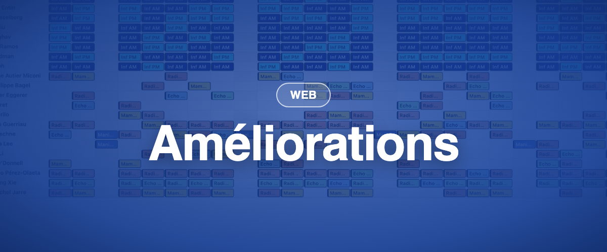

### ✨ Nouveau

- **Compteurs distincts pour le travail et les congés :** dans chaque terme de contrat, les jours de congé peuvent désormais être définis séparément, en plus des heures de travail fixées pour chaque jour de la semaine. Momentum et ses rapports décomptent ainsi les congés indépendamment du nombre d'heures prévu ce jour-là.

### 💎 Améliorations (nouveau Momentum)

- **Mode largeur automatique :** activez la largeur auto pour que les en-têtes passent à la ligne et que chaque colonne prenne le moins de place possible (bouton 📏 à droite, sous la grille).
- **Les affectations vides et obligatoires** sont désormais surlignées en rouge (ou dans la couleur définie dans les paramètres généraux de votre établissement).
- **Menu contextuel plus clair** au clic droit sur une affectation. « Remplacer le personnel » et « Remplacer tous les rôles » sont plus faciles à utiliser, les listes sont filtrées sur les candidats et les sous-menus plus accessibles.
- Désactiver les **bordures de surlignage** retire désormais complètement les bordures autour des affectations (Filtres → Paramètres d'affichage → Afficher les couleurs de surlignage).
- **Smart cloning :** dupliquez un planning à intervalles réguliers (mode Motif) en choisissant _Jours_ comme unité de temps.
- **La page d'accueil par défaut** peut désormais être un planning de la nouvelle vue par date.
- Les performances générales ont été améliorées : chargements plus rapides et cohérence renforcée avec Momentum Classic.

### 🪲 Corrections récentes

- Les affectations à cheval sur minuit s'affichent dans la bonne section de la vue par vacation.
- Les exports Excel respectent le filtre de planning ouvert.
- Un filtre sur une couche de rôles ne liste plus de rôles hors de cette couche.
- Construire et publier une seule couche fonctionne à nouveau.
- Les notifications sont bien déclenchées à la publication d'un planning.
- Le journal d'historique des affectations se met à jour correctement.
