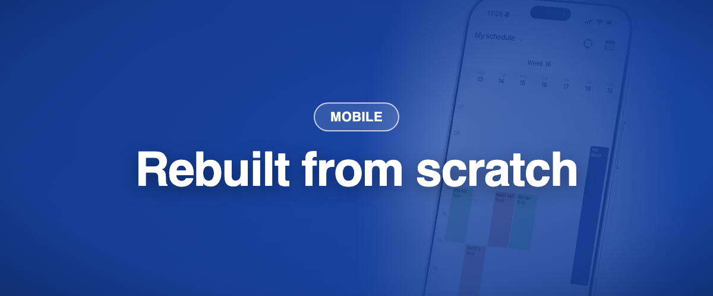

L'application mobile Momentum a été reconstruite de zéro sur la plateforme Momentum moderne. Même compte, même connexion, une application plus rapide et plus claire. Elle remplace l'application précédente sur iOS et Android et est disponible sur l'App Store et Google Play.

### ✨ Nouveau

- **Aujourd'hui, en un coup d'œil :** votre prochaine vacation et ce qui se passe maintenant, dès l'ouverture.
- **Connexion par Face ID ou empreinte,** et connexion Microsoft en un geste si votre établissement l'utilise. Les autres fournisseurs d'identité sont pris en charge via SAML.
- **Accès hors ligne :** votre planning reste consultable sans connexion, stocké chiffré sur l'appareil.
- **Notifications push plus rapides** sur iOS et Android.
- **Mode sombre,** et cinq langues : français, anglais, allemand, néerlandais et italien.

### 💎 Tout ce que vous aviez, toujours là

- Vues jour, semaine, mois et agenda, pour vous et pour votre équipe.
- Donner, échanger, reprendre, publier et postuler à des vacations, et la bourse aux activités.
- Demandes de congés et souhaits, avec notifications.
- Comptes multi-sites et changement de mot de passe.

### 🪲 Améliorations depuis le lancement (juillet à septembre)

- Les demandes déposées apparaissent dans votre liste, et les horaires personnalisés des demandes fonctionnent sur iPhone.
- Les affectations sans visite sont de nouveau visibles, et vos filtres web sont repris dans l'application.
- Android : les lignes de filtre réagissent au toucher, et les longues listes défilent dans leur panneau.
- iOS : la page des notifications s'ouvre de façon fiable, et la barre de recherche du planning d'équipe est de retour.
- La vue semaine affiche le numéro de semaine et le nom du rôle, et les vacations de nuit ne sont plus coupées.
- Les demandes envoyées affichent le rôle, l'année et le code couleur, et peuvent être supprimées.
- Les souhaits proposent à nouveau la périodicité et le choix libre des dates.
- Le bouton Appeler est de retour, et Face ID est demandé moins souvent au retour dans l'application.
- Modifier un souhait n'échoue plus sans explication.
- Les mises à jour atteignent d'abord un petit groupe, puis tout le monde.
