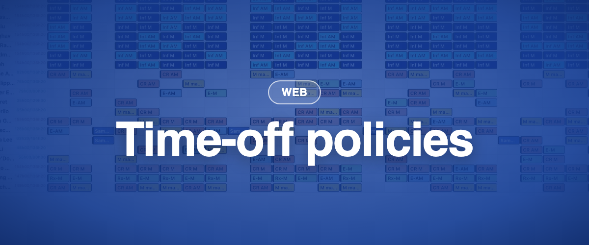

Déployée par étapes à partir du 17 août et sur toutes les instances européennes le 25 août 2026, suivie de mises en production plus petites les 26 août et 1er septembre. Trois des nouveautés sont derrière un interrupteur par instance : nous les activons par étapes, instances les plus actives d'abord. Dites-le à votre référent BioSked si vous voulez en être tôt.

### ✨ Nouveau

- **Politiques de congés :** les règles d'acquisition sont réunies au même endroit au lieu d'être annuelles uniquement, et un terme de contrat peut utiliser plusieurs politiques, par exemple congés annuels, maladie et jours d'ancienneté. Les acquisitions annuelles existantes migrent vers une politique par terme de contrat. Derrière un interrupteur par instance.
- **Pré-approuver les demandes :** marquez un ensemble de demandes comme pré-approuvées, lancez une construction de test pour vérifier la couverture, puis approuvez définitivement ou revenez en arrière. Le personnel n'est notifié qu'à l'approbation finale. Derrière un interrupteur par instance.
- **Les demandes dans la vue par date :** affichez les demandes en attente à côté des affectations qu'elles touchent, selon le filtre actif. Derrière un interrupteur par instance.
- **Comptages dans la vue par date :** l'option d'affichage « Afficher les comptages » montre combien d'affectations, ou de points, contient un jour ou un groupe, dans les deux dispositions et quel que soit le groupement.
- **Vacations non remplies dans la vue Chronologie :** la chronologie peut désormais afficher les vacations qui attendent encore quelqu'un.
- **Les échanges aboutissent sans seconde approbation** quand la personne qui accepte a déjà le droit « Requêtes de changements : approuver/refuser ». Application mobile d'abord ; la page de requêtes web suit.
- **Les demandes en attente gardent leur ordre de dépôt,** avec une nouvelle colonne Créé le pour trier.
- **Les administrateurs sont notifiés** quand quelqu'un est retiré d'une affectation déjà publiée.

### 💎 Améliorations

- **Le moteur de construction classique est environ 58 fois plus rapide :** de 43 minutes à 45 secondes sur notre construction client de référence.
- **Deux constructions identiques donnent le même planning.** Quand une trame contient plusieurs lignes identiques pour un même rôle, l'ordre dans lequel elles sont remplies est désormais fixe.
- **Les grandes modifications en masse aboutissent** au lieu d'échouer en cours de route : décaler 200 affectations demande désormais 6 allers-retours vers la base de données au lieu de 324.
- **Les infobulles de la grille de planning sont lisibles :** texte plus grand, cartes plus larges, commentaires qui passent à la ligne.
- **Les filtres enregistrés s'ouvrent sur la période enregistrée.**
- **Le support voit pourquoi une connexion a échoué,** ce qui règle les problèmes d'accès en un seul échange.
- **Les mises à jour de l'application mobile atteignent d'abord un petit groupe,** puis tout le monde.

### 🪲 Corrections

- **Compte d'heures et valeurs de congés :** le moteur de calcul moderne reproduit désormais exactement le précédent. Avant de basculer, nous avons rejoué 4,3 millions de valeurs du rapport de synthèse des absences sur 325 bases de production : zéro différence. Les périodes de travail qui se chevauchent ne changent plus d'un écran à l'autre, et le détail du compte d'heures ne renvoie plus d'erreur.
- Approuver ou pré-approuver deux fois une demande ne duplique plus ses jours sur le planning, et le personnel ne reçoit plus deux notifications.
- La ligne des totaux de la vue par date compte les demandes pré-approuvées.
- La publication en masse depuis la nouvelle vue par date n'échoue plus en bloc : les lignes qui ne peuvent pas être publiées sont ignorées, les autres passent.
- Publier une couche vide ne publie rien, au lieu de toutes les couches.
- Publier et dépublier fonctionnent depuis la sélection multiple et la modification en masse.
- Les demandes déposées depuis l'application mobile créent désormais une notification et une entrée dans le journal d'historique.
- Les notifications administrateur respectent leurs cases à cocher, et les notifications de suppression de rôle contiennent tous les détails.
- Publier une vacation non attribuée dans la bourse aux activités n'interrompt plus les autres notifications.
- Un rôle peut être supprimé après l'approbation d'une candidature dans la bourse aux activités.
- Le personnel voit à nouveau les notes publiques dans la vue par date classique, notes du jour comprises.
- La liste déroulante du personnel est de nouveau alphabétique, les lignes de séparation des groupes de rôles sont visibles, et les colonnes de la vue liste correspondent à Momentum Classic.
- L'export Excel n'affiche plus de message d'erreur, les exports SFTP planifiés contiennent tout ce qu'un export manuel contient, et l'export de calendrier fonctionne à nouveau.
- Les affectations créées à partir de demandes approuvées arrivent désormais dans les calendriers externes connectés, comme Outlook.
- Annuler l'invite « pointage oublié » ne supprime plus un pointage précédent.
- La vérification des affectations s'arrête à l'expiration du délai au lieu de continuer pendant de longues minutes.
- Les liens d'activation supportent un second clic, et le personnel avec un mot de passe long peut à nouveau se connecter.
- Une modification en masse qui échoue le dit désormais et conserve votre sélection.
