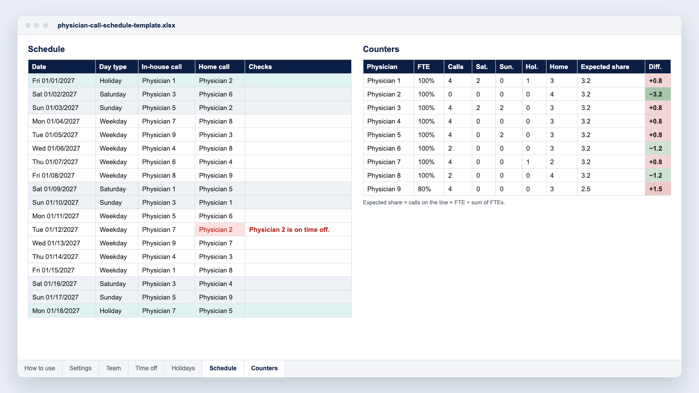

The call schedule is the most debated document in any department or physician group. One extra night, or Christmas given to the same physician two years running, and trust in the whole schedule starts to wear thin.

This guide sums up what we see in departments that build their call schedules with Momentum: the rules that apply, the counters that make fairness visible, a six-step method and a [free Excel template](/modeles/physician-call-schedule-template.xlsx).

**In this guide**

- [In-house call, home call and shifts: three ways to count](#in-house-call-home-call-and-shifts-three-ways-to-count)
- [What the rules say: ACGME duty hours and local limits](#what-the-rules-say-acgme-duty-hours-and-local-limits)
- [What “fair” means: five counters](#what-fair-means-five-counters)
- [Building the call schedule in six steps](#building-the-call-schedule-in-six-steps)
- [The free Excel template](#the-free-excel-template)
- [When a spreadsheet is no longer enough](#when-a-spreadsheet-is-no-longer-enough)
- [Frequently asked questions](#frequently-asked-questions)

## In-house call, home call and shifts: three ways to count

Before you assign anything, name each call line and its type. A line is a need for presence or availability over a set period, such as overnight ED coverage or weekend home call for interventional radiology.

| Coverage | What the physician does | How it counts for residents and fellows (ACGME) |
|---|---|---|
| **In-house call** | Stays in the hospital overnight or for 24 hours. | Every hour counts toward the 80-hour week. No more often than every third night, averaged over four weeks. |
| **Home call (pager call)** | Stays reachable and comes in when needed. | Only time spent on patient care counts, including calls and EHR work from home. Not subject to the every-third-night limit. |
| **Shifts** | The service runs around the clock (ED, ICU, hospitalists). | Every hour counts. Night float must fit within the 80-hour and one-day-off-in-seven limits. |

For attendings, how call is counted and paid (shifts, call units, call pay) is set by the group agreement or the employment contract.

An anesthesia group may combine 24-hour in-house call with a backup home call line; a radiology group, one overnight home call line per site. Each line has its own hours, its own call pool and its own rules: everything else builds on that.

## What the rules say: ACGME duty hours and local limits

For residents and fellows in ACGME-accredited programs, the [ACGME Common Program Requirements](https://www.acgme.org/globalassets/pfassets/programrequirements/2026-prs/cprresidency_2026.pdf) (version effective July 1, 2026, requirements 6.20 to 6.28) set these limits.

- **80 hours per week at most**, averaged over a four-week period, including all in-house clinical and educational activities, clinical work done from home, and all moonlighting.
- **24 hours of continuous scheduled clinical assignments at most.** Up to four more hours may be used for transitions of care and education, with no new patient care responsibilities.
- **At least 14 hours free** of clinical work and education after 24 hours of in-house call. Per the ACGME FAQ, the 14 hours start when the resident has completed all required work, not at the scheduled end.
- **Eight hours off** between scheduled clinical work and education periods. Here the text says “should”, not “must”.
- **One day in seven free** of clinical work and required education, averaged over four weeks. At-home call cannot be assigned on these free days.
- **In-house call no more often than every third night**, averaged over a four-week period.

Averaging is done per rotation, not on a rolling basis, and vacation or leave days are left out of the calculation. Specialty requirements can go further. In emergency medicine, residents may not work longer than 12 continuous scheduled hours in the emergency department, must have at least an equivalent period of continuous time off between scheduled work periods, and may not work more than 60 scheduled hours per week seeing patients in the department, or 72 hours in total ([Emergency Medicine requirements 6.17.a](https://www.acgme.org/globalassets/pfassets/programrequirements/2026-prs/110_emergencymedicine_2026.pdf)).

<figure class="max-w-2xl mx-auto"><picture><source media="(max-width: 640px)" srcset="/guides/en-call-schedule-timeline-m.webp" width="400" height="459"></picture></figure>

These rules may change. A proposed major revision, posted for comment on September 8, 2026 with a proposed effective date of July 1, 2028, would among other changes lower the 14 hours to 12 and drop the eight-hours-off line. Check acgme.org for the version in force.

**Attending physicians** have no general federal limit on hours. The [Department of Labor](https://www.dol.gov/agencies/whd/overtime) states that the Fair Labor Standards Act sets no limit on the hours employees aged 16 and older may work in a workweek. Licensed physicians who practice medicine, and residents, are exempt professionals under that Act, so its overtime rules do not apply to them, whatever their pay ([29 CFR 541.304](https://www.ecfr.gov/current/title-29/subtitle-B/chapter-V/subchapter-A/part-541/subpart-D/section-541.304)). State wage laws can differ.

Limits for attendings come from elsewhere: state rules, medical staff bylaws, group agreements and employment contracts. New York, for example, limits attending physicians and residents to 12 consecutive hours per on-duty assignment in the emergency service of hospitals with over 15,000 unscheduled emergency visits a year; the state may approve up to 15 hours for attendings ([10 NYCRR 405.4](https://regs.health.ny.gov/content/section-4054-medical-staff)). Check your state’s rules and your bylaws, and have your call policy reviewed by your medical staff office or counsel.

## What “fair” means: five counters

Groups where the call schedule no longer causes arguments keep the same counters for every physician.

- **Total calls**, scaled to each physician’s FTE: a physician at 0.8 FTE does not carry the same share as a full-time colleague.
- **Saturdays**, **Sundays** and **holidays**, each in its own counter: a Sunday is not a Tuesday, and these are the days that cause friction.
- **Key holiday periods**: Thanksgiving, Christmas, New Year’s, the Fourth of July, spring break. Track them from one year to the next, or the same people keep landing on them.

**Over a long period.** Keep the counters over the year or a rolling twelve months, not by month: a month has only four or five weekends.

**Visible to the whole group.** A counter that only the scheduler can see settles no dispute.

### Example: nine physicians, one in-house night call line

In 2027, that is 365 nights to share. Each physician’s share depends on the sum of FTEs.

| Group | Expected share per physician |
|---|---|
| Nine full-time physicians | 40.6 nights each |
| Eight full-time and one at 0.8 FTE (sum of FTEs: 8.8) | 41.5 nights per full-time physician, 33.2 for the physician at 0.8 FTE |

The 104 Saturdays and Sundays of 2027 and the holidays your group observes (11 federal holidays, three of them on a weekend) are shared the same way, counter by counter.

## Building the call schedule in six steps

<figure class="max-w-2xl mx-auto"><picture><source media="(max-width: 640px)" srcset="/guides/en-call-schedule-steps-m.webp" width="400" height="605"></picture></figure>

### 1. List the call lines

For each line: start and end times, in-house or home call, and who is in the call pool.

### 2. Write down the group’s rules

Maximum calls per month, time off after call, no call the night before an OR day if that is your rule. Write them down before you fill the first cell: these rules, not the scheduler, will settle disagreements.

### 3. Collect time off and requests

Set a deadline, for example six weeks before publication. A request that arrives after the deadline goes through a swap.

### 4. Fill in the right order

Hard constraints first (PTO, CME, required time off), then weekends and holidays, then weeknights. Weeknights are what you use to balance the counters.

### 5. Review with the counters

Before you publish, look at each physician’s difference from their expected share. It should be small, or explained.

### 6. Publish, then track swaps

Every approved swap updates the counters. Without that, the fairness shown in January means nothing by June.

## The free Excel template

**[Download the call schedule template](/modeles/physician-call-schedule-template.xlsx)** (Excel .xlsx file, no macros, free).

- **Two call lines** you can rename, for example “In-house call” and “Home call”, over a full year.
- **Team, time off and holidays**: each physician’s FTE, time off (from, to, reason), US federal holidays from 2026 to 2028.
- **Automatic checks**: same physician two days in a row on a line, on both lines the same day, or during time off.
- **Counters per physician**: calls per line, Saturdays, Sundays, holidays, expected share based on FTE, and the difference.

It has the limits of a spreadsheet: it does not build the schedule for you, it covers one department and two lines, every swap is entered by hand, and it does not check duty hours.

## When a spreadsheet is no longer enough

A few signals come up often:

- more than two call lines, or several sites;
- a group of more than fifteen or twenty physicians;
- frequent swaps that have to be rechecked one by one;
- exports to payroll, for call pay and extra shifts;
- rules that depend on the next day, such as no call before a heavy OR day.

That is the job of Momentum: the software generates the call schedule from the group’s rules, keeps the counters up to date with each swap, publishes the schedule on mobile, handles requests and swaps, and exports to payroll. More than 250 healthcare organizations in 9 countries use it.

- **CHIREC emergency department (Braine-l’Alleud hospital, Belgium)**: 25 to 30 physicians and 40,000 visits a year. Building the monthly schedule went from 4 days to 4 to 5 hours (case study, May 2025).
- **CHU d’Angers (France)**: the schedule of 52 physicians shared between the emergency department and the SAMU, the French emergency medical service, is automated, with centralized hour accounts and requests entered on mobile (case study, 2023).

See also: [understanding equity in scheduling](/blog/posts/2022-05-15-understanding-equity/) and [a request system that works](/blog/posts/2023-08-09-scheduling-requests/).

## Frequently asked questions

### Do residents need time off after 24-hour call?

Yes. Under the ACGME Common Program Requirements, residents and fellows must have at least 14 hours free after 24 hours of in-house call, counted from when they complete all required work. Home call does not trigger this rest period.

### Are there duty-hour limits for attending physicians?

Not at the federal level. They come from state rules, such as New York’s 12-hour limit in busy emergency departments, and from bylaws, group agreements and contracts.

### Does home call count toward the 80 hours?

Only the time spent on patient care: phone calls, EHR work from home and time in the hospital after being called in. Reading and studying do not count.

### Should call be balanced by month or by year?

By year, or over a rolling twelve months. Duty-hour limits are checked over each rotation or four-week period; fairness is judged over the year.

### Can software follow our group’s own rules?

That is the first thing to check. In Momentum, the group’s rules (call pool per line, time off, maximums, fairness) are set up once, then applied every time the schedule is generated. The simplest way to judge is on your own setup: [book a demo](/demo/?ref=physician-call-schedule).
