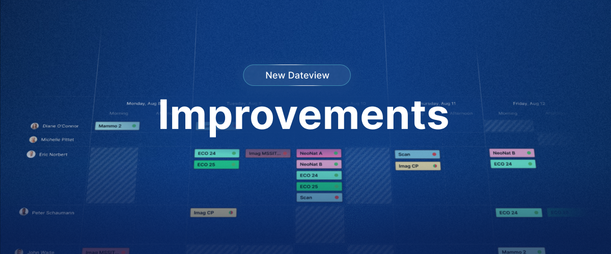

### ✨ Novità

- **Contatori distinti per lavoro e ferie:** in ogni termine di contratto i giorni di ferie possono ora essere definiti separatamente, oltre alle ore di lavoro fissate per ciascun giorno della settimana. Momentum e i suoi report scalano così le ferie indipendentemente dalle ore previste per quel giorno.

### 💎 Miglioramenti (nuovo Momentum)

- **Larghezza automatica:** attivala per mandare a capo le intestazioni e far occupare a ogni colonna il minimo spazio necessario (pulsante 📏 a destra, sotto la griglia).
- **Gli incarichi vuoti e obbligatori** sono ora evidenziati in rosso (o nel colore impostato nelle impostazioni generali della tua struttura).
- **Menu contestuale più chiaro** con il clic destro su un incarico. "Sostituisci il personale" e "Sostituisci tutti i ruoli" sono più facili da usare, gli elenchi sono filtrati sui candidati e i sottomenu più accessibili.
- Disattivare i **bordi di evidenziazione** rimuove ora completamente i bordi intorno agli incarichi (Filtri → Impostazioni di visualizzazione → Mostra colori di evidenziazione).
- **Smart cloning:** duplica una pianificazione a intervalli regolari (modalità Schema) usando i _Giorni_ come unità di tempo.
- **La pagina iniziale predefinita** può ora essere anche una pianificazione nella nuova Panoramica data.
- Prestazioni generali migliorate: caricamenti più rapidi e maggiore coerenza con Momentum Classic.

### 🪲 Correzioni recenti

- Gli incarichi a cavallo della mezzanotte compaiono nella sezione corretta della vista per turno.
- Le esportazioni Excel rispettano il filtro di pianificazione aperto.
- Un filtro su un livello di ruoli non elenca più ruoli esterni a quel livello.
- Costruire e pubblicare un singolo livello funziona di nuovo.
- Le notifiche vengono inviate in modo affidabile alla pubblicazione di una pianificazione.
- Il registro cronologico degli incarichi si aggiorna correttamente.
