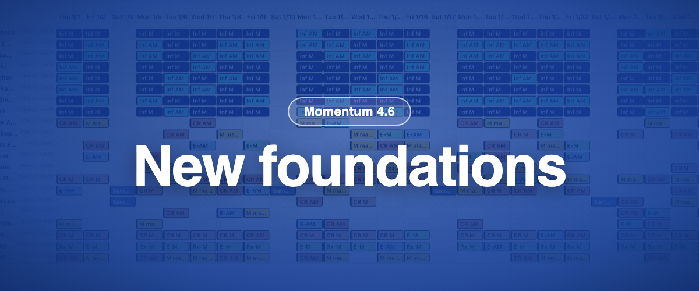

Momentum 4.6 è la versione che avresti dovuto quasi non notare. Sotto la superficie, 250 000 righe di codice storico sono state convertite in un linguaggio moderno, e le nuove funzionalità possono ora essere attivate istanza per istanza invece che per tutti in una volta. È ciò che ha reso possibili la nuova app mobile e le funzionalità della 4.7.

### ✨ Novità

- **Interruttori per istanza:** le nuove funzionalità si attivano istanza per istanza, così possiamo distribuirle per gradi e insieme a te.
- **La nuova app mobile** esce insieme a questa versione. Ha la sua voce qui sotto.

### 🪲 Correzioni

- Costruire una pianificazione per livello dalla nuova Panoramica data funziona di nuovo.
- La nuova Panoramica data rispetta il diritto "Visualizza pannello filtri di visualizzazione".
- L'esportazione delle note è tornata nella gestione delle richieste.
- Duplicare una pianificazione non duplica mai le ferie, e il personale viene rimosso quando un duplicato cade su un giorno di ferie.
- Filtro predefinito e copia del contratto funzionano come previsto.

### 🩹 Correzioni successive durante l'estate

- **Giugno:** le pagine di configurazione (gruppi di sicurezza, schemi di lavoro, contratti, gruppi di ruoli, gruppi di personale, collegamenti rapidi) si salvano di nuovo correttamente; accesso nella finestra di timbratura e ora personalizzata offline; creazione di un incarico dalla Panoramica data classica.
- **Luglio:** ordinamento dei totali nei report; dettagli di timbratura nel conteggio orario; la voce Duplica è tornata nel menu della Panoramica data classica.
- **Agosto:** duplicazione singola e massiva sopra le ferie; gli incarichi creati dalle richieste possono essere pubblicati, con conferma; le note del giorno compaiono solo per la loro sede; le ferie degli altri compaiono nella nuova Panoramica data; pubblicare dalla finestra di costruzione funziona su periodi che contengono un giorno libero; il registro cronologico degli incarichi è completo.
- **Settembre:** i termini di contratto vengono visualizzati correttamente sulle istanze in cui le politiche per le ferie sono appena state attivate; la finestra "Nuova sede".
