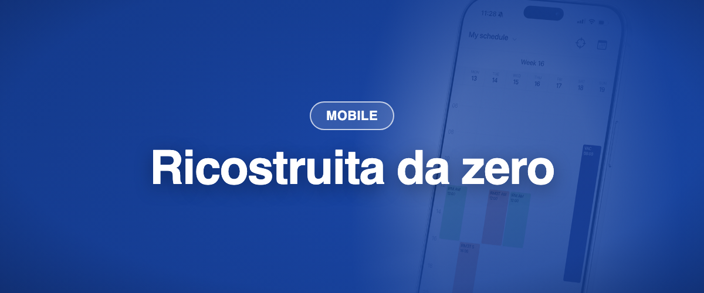

L'app mobile Momentum è stata ricostruita da zero sulla piattaforma Momentum moderna. Stesso account, stesso accesso, un'app più veloce e più pulita. Sostituisce l'app precedente su iOS e Android ed è disponibile su App Store e Google Play.

### ✨ Novità

- **Oggi a colpo d'occhio:** il tuo prossimo turno e cosa sta succedendo adesso, subito sullo schermo.
- **Accesso con Face ID o impronta digitale,** e accesso Microsoft con un tocco se la tua struttura lo usa. Gli altri identity provider sono supportati tramite SAML.
- **Accesso offline:** la tua pianificazione resta disponibile senza connessione, salvata cifrata sul dispositivo.
- **Notifiche push più rapide** su iOS e Android.
- **Modalità scura,** e cinque lingue: francese, inglese, tedesco, olandese e italiano.

### 💎 Tutto quello che avevi, c'è ancora

- Viste giorno, settimana, mese e agenda, per te e per il tuo team.
- Cedere, scambiare, prendere, pubblicare e candidarsi ai turni, e il Job Board.
- Richieste di ferie e di preferenza, con notifiche.
- Account multi-sede e cambio password.

### 🪲 Miglioramenti dal lancio (da luglio a settembre)

- Le richieste inviate compaiono nel tuo elenco, e le ore personalizzate per le richieste funzionano su iPhone.
- Gli incarichi senza visita sono di nuovo visibili, e i tuoi filtri web vengono ripresi nell'app.
- Android: le righe dei filtri rispondono al tocco, e gli elenchi lunghi scorrono dentro il loro pannello.
- iOS: la pagina delle notifiche si apre in modo affidabile, e la barra di ricerca della pianificazione del team è tornata.
- La vista settimana mostra il numero della settimana e il nome del ruolo, e i turni di notte non vengono più tagliati.
- Le richieste inviate mostrano ruolo, anno e codice colore, e possono essere eliminate.
- Le richieste di preferenza offrono di nuovo periodicità e scelta libera delle date.
- Il pulsante Chiama è tornato, e Face ID viene richiesto meno spesso quando torni nell'app.
- Modificare una richiesta di preferenza non fallisce più senza spiegazione.
- Gli aggiornamenti raggiungono prima un piccolo gruppo, poi tutti.
