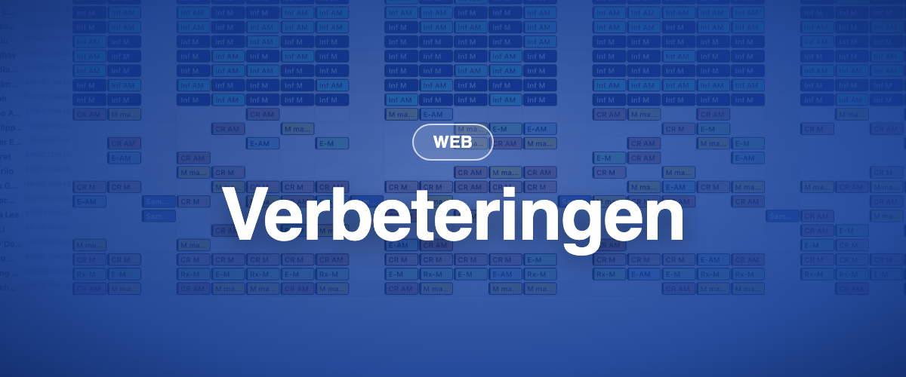

### ✨ Nieuw

- **Aparte tellers voor werk en verlof:** in elke contractbepaling kunnen verlofdagen nu apart worden vastgelegd, naast de werkuren per weekdag. Momentum en zijn rapporten trekken verlof zo af onafhankelijk van het aantal uren voor die dag.

### 💎 Verbeteringen (nieuwe Momentum)

- **Automatische breedte:** schakel automatische breedte in zodat koppen afbreken en elke kolom zo weinig mogelijk ruimte inneemt (knop 📏 rechts onder het raster).
- **Lege en verplichte taken** worden nu rood gemarkeerd (of in de kleur uit de algemene instellingen van uw organisatie).
- **Duidelijker contextmenu** bij rechtsklikken op een taak. "Personeel vervangen" en "Alle opdrachten vervangen" zijn eenvoudiger te gebruiken, de lijsten zijn gefilterd op kandidaten en de submenu's beter bereikbaar.
- Het uitschakelen van **markeerranden** verwijdert de randen rond taken nu volledig (Filters → Weergave-instellingen → Markeerkleuren tonen).
- **Smart cloning:** dupliceer een planning met vaste tussenpozen (patroonmodus) met _Dagen_ als tijdseenheid.
- **De standaard startpagina** kan nu ook een planning in de nieuwe datumweergave zijn.
- Betere algemene prestaties: snellere laadtijden en meer consistentie met Momentum Classic.

### 🪲 Recente correcties

- Taken die over middernacht lopen verschijnen in de juiste sectie van de dienstweergave.
- Excel-exports respecteren het geopende planningfilter.
- Een filter op een laag toont geen opdrachten meer buiten die laag.
- Eén laag aanmaken en publiceren werkt weer.
- Kennisgevingen worden betrouwbaar verstuurd bij het publiceren van een planning.
- Het geschiedenislogboek van taken wordt correct bijgewerkt.
