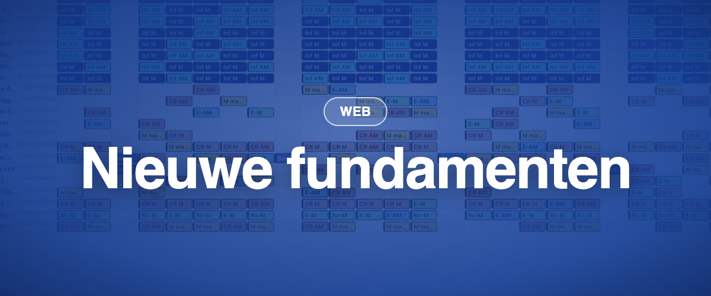

Momentum 4.6 is de versie die u nauwelijks hoorde te merken. Onder de motorkap zijn 250 000 regels oude code omgezet naar een moderne taal, en nieuwe functies kunnen nu per instantie worden ingeschakeld in plaats van voor iedereen tegelijk. Dat maakte de nieuwe mobiele app en de functies van 4.7 mogelijk.

### ✨ Nieuw

- **Schakelaars per instantie:** nieuwe functies worden instantie voor instantie ingeschakeld, zodat we ze stapsgewijs en samen met u kunnen uitrollen.
- **De nieuwe mobiele app** verschijnt samen met deze versie. Ze heeft hieronder haar eigen vermelding.

### 🪲 Correcties

- Een planning per laag aanmaken vanuit de nieuwe datumweergave werkt weer.
- De nieuwe datumweergave respecteert het recht "Weergavefilterpaneel bekijken".
- De notitie-export is terug in het verzoekbeheer.
- Een planning dupliceren verdubbelt nooit verlof, en personeel wordt losgekoppeld wanneer een duplicaat op een verlofdag valt.
- Standaardfilter en contract kopiëren werken zoals verwacht.

### 🩹 Vervolgcorrecties in de zomer

- **Juni:** configuratiepagina's (beveiligingsgroepen, werkpatronen, contracten, opdrachtgroepen, personeelsgroepen, snelkoppelingen) slaan weer correct op; aanmelden in het klokvenster en aangepaste tijd offline; een taak aanmaken vanuit de klassieke datumweergave.
- **Juli:** sorteren van totalen in rapporten; klokdetails in de urentelling; de optie Dupliceren is terug in het menu van de klassieke datumweergave.
- **Augustus:** enkel en in bulk dupliceren over verlof heen; taken die uit verzoeken ontstaan kunnen worden gepubliceerd, met bevestiging; dagnotities verschijnen alleen voor hun locatie; verlof van anderen verschijnt in de nieuwe datumweergave; publiceren vanuit het aanmaakvenster werkt voor periodes met een vrije dag; het geschiedenislogboek van taken is volledig.
- **September:** contractbepalingen worden correct getoond op instanties waar verlofbeleid net is ingeschakeld; het venster "Nieuwe site".
