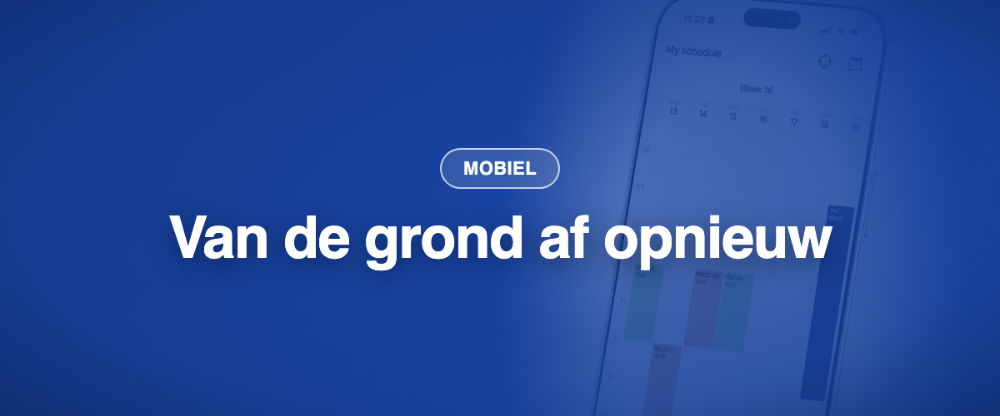

De mobiele Momentum-app is van de grond af opnieuw gebouwd op het moderne Momentum-platform. Zelfde account, zelfde aanmelding, een snellere en overzichtelijkere app. Ze vervangt de vorige app op iOS en Android en is beschikbaar in de App Store en op Google Play.

### ✨ Nieuw

- **Vandaag in één oogopslag:** uw volgende dienst en wat er nu speelt, als eerste op het scherm.
- **Aanmelden met Face ID of vingerafdruk,** en Microsoft-aanmelding met één tik als uw organisatie die gebruikt. Andere identity providers worden via SAML ondersteund.
- **Offline toegang:** uw planning blijft beschikbaar zonder verbinding, versleuteld opgeslagen op het toestel.
- **Snellere pushmeldingen** op iOS en Android.
- **Donkere modus,** en vijf talen: Frans, Engels, Duits, Nederlands en Italiaans.

### 💎 Alles wat u had, is er nog

- Dag-, week-, maand- en agendaweergave, voor u en voor uw team.
- Diensten weggeven, wisselen, overnemen, aanbieden en erop bieden, en de vacaturebank.
- Verlof- en voorkeurverzoeken, met kennisgevingen.
- Accounts voor meerdere sites en wachtwoord wijzigen.

### 🪲 Verbeteringen sinds de lancering (juli tot september)

- Ingediende verzoeken verschijnen in uw lijst, en aangepaste uren voor verzoeken werken op iPhone.
- Taken zonder bezoek zijn weer zichtbaar, en uw webfilters worden overgenomen in de app.
- Android: filterrijen reageren op tikken, en lange lijsten scrollen binnen hun paneel.
- iOS: de pagina met kennisgevingen opent betrouwbaar, en de zoekbalk in de teamplanning is terug.
- De weekweergave toont het weeknummer en de opdrachtnaam, en nachtdiensten worden niet meer afgekapt.
- Verzonden verzoeken tonen de opdracht, het jaar en de kleurcode, en kunnen worden verwijderd.
- Voorkeurverzoeken bieden weer periodiciteit en vrije datumkeuze.
- De knop Bellen is terug, en Face ID wordt minder vaak gevraagd wanneer u naar de app terugkeert.
- Een voorkeurverzoek bewerken mislukt niet meer zonder melding.
- Updates bereiken eerst een kleine groep, daarna iedereen.
