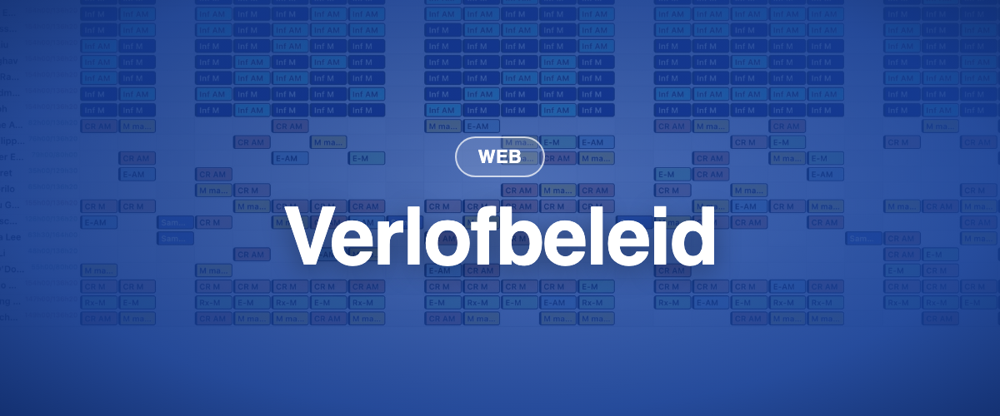

Stapsgewijs uitgerold vanaf 17 augustus en op 25 augustus 2026 naar alle Europese instanties, gevolgd door kleinere releases op 26 augustus en 1 september. Drie van de nieuwe functies zitten achter een schakelaar per instantie: we schakelen ze stapsgewijs in, meest actieve instanties eerst. Laat het uw BioSked-contactpersoon weten als u er vroeg bij wilt zijn.

### ✨ Nieuw

- **Verlofbeleid:** opbouwregels staan op één plek in plaats van alleen per jaar, en een contractbepaling kan meerdere beleidsregels gebruiken, bijvoorbeeld jaarlijks verlof, ziekte en anciënniteitsdagen. Bestaande jaarlijkse opbouw migreert naar één beleidsregel per contractbepaling. Achter een schakelaar per instantie.
- **Verzoeken vooraf goedkeuren:** markeer een set verzoeken als vooraf goedgekeurd, voer een testopbouw uit om de bezetting te controleren en keur daarna definitief goed of draai terug. Personeel krijgt pas bij de definitieve goedkeuring een kennisgeving. Achter een schakelaar per instantie.
- **Verzoeken in de datumweergave:** toon openstaande verzoeken naast de taken die ze raken, volgens het actieve filter. Achter een schakelaar per instantie.
- **Aantallen in de datumweergave:** de weergaveoptie "Aantallen tonen" laat zien hoeveel taken, of punten, een dag of een groep bevat, in beide lay-outs en bij elke groepering.
- **Onbezette diensten op de tijdlijn:** de tijdlijn kan nu de diensten tonen waarvoor nog iemand nodig is.
- **Wissels worden zonder tweede goedkeuring afgerond** wanneer de persoon die accepteert al het recht "Aanvragen wijzigen: goedkeuren/afwijzen" heeft. Eerst in de mobiele app; de verzoekenpagina op het web volgt.
- **Openstaande verzoeken behouden hun indieningsvolgorde,** met een nieuwe kolom Aangemaakt om op te sorteren.
- **Beheerders krijgen een kennisgeving** wanneer iemand uit een al gepubliceerde taak wordt verwijderd.

### 💎 Verbeteringen

- **De klassieke planningsopbouw is ongeveer 58 keer sneller:** van 43 minuten naar 45 seconden bij onze referentieklant.
- **Identieke opbouwen geven identieke planningen.** Als een sjabloon meerdere identieke regels voor dezelfde opdracht bevatte, ligt de volgorde waarin ze worden ingevuld nu vast.
- **Grote bulkbewerkingen worden afgerond** in plaats van halverwege te mislukken: 200 taken verschuiven kost nu 6 databaseaanroepen in plaats van 324.
- **Zweefkaarten in het planningsraster zijn leesbaar:** grotere tekst, bredere kaarten, opmerkingen die afbreken.
- **Opgeslagen filters openen op de opgeslagen periode.**
- **Support ziet waarom een aanmelding mislukte,** zodat toegangsproblemen in één keer worden opgelost.
- **Updates van de mobiele app bereiken eerst een kleine groep,** daarna iedereen.

### 🪲 Correcties

- **Urentelling en verlofwaarden:** de moderne berekening reproduceert de vorige nu exact. Vóór de overstap hebben we ze getoetst aan elke bestaande waarde uit het verlofoverzicht: nul verschillen. Overlappende werkperiodes wisselen niet meer tussen schermen, en het detailvenster van de urentelling geeft geen fout meer.
- Een verzoek twee keer goedkeuren of vooraf goedkeuren verdubbelt de dagen in de planning niet meer, en personeel krijgt niet meer twee kennisgevingen.
- De totaalrij van de datumweergave telt vooraf goedgekeurde verzoeken mee.
- Bulkpublicatie vanuit de nieuwe datumweergave mislukt niet meer in zijn geheel: rijen die niet gepubliceerd kunnen worden, worden overgeslagen, de rest gaat door.
- Een lege laag publiceren publiceert niets, in plaats van alle lagen.
- Publiceren en publicatie ongedaan maken werken vanuit multiselectie en bulkbewerking.
- Verzoeken die vanuit de mobiele app worden ingediend, maken nu een kennisgeving en een vermelding in het geschiedenislogboek aan.
- Beheerderskennisgevingen respecteren hun selectievakjes, en kennisgevingen over verwijderde opdrachten bevatten alle details.
- Een onbezette dienst op de vacaturebank plaatsen onderbreekt andere kennisgevingen niet meer.
- Opdrachten kunnen worden verwijderd nadat een bod op de vacaturebank is goedgekeurd.
- Personeel ziet openbare notities in de klassieke datumweergave weer, dagnotities inbegrepen.
- De personeelskeuzelijst is weer alfabetisch, scheidingslijnen van opdrachtgroepen zijn weer zichtbaar, en de kolommen van de lijstweergave komen overeen met Momentum Classic.
- De Excel-export toont geen foutmelding meer, geplande SFTP-exports bevatten alles wat een handmatige export bevat, en de agenda-export werkt weer.
- Taken die uit goedgekeurde verzoeken ontstaan, bereiken nu gekoppelde externe agenda's zoals Outlook.
- Het annuleren van de melding "vergeten te klokken" verwijdert geen eerdere registratie meer.
- De validatie van taken stopt bij een time-out in plaats van minutenlang door te lopen.
- Activatielinks verdragen een tweede klik, en personeel met lange wachtwoorden kan zich weer aanmelden.
- Een mislukte bulkbewerking meldt dit nu en behoudt uw selectie.
